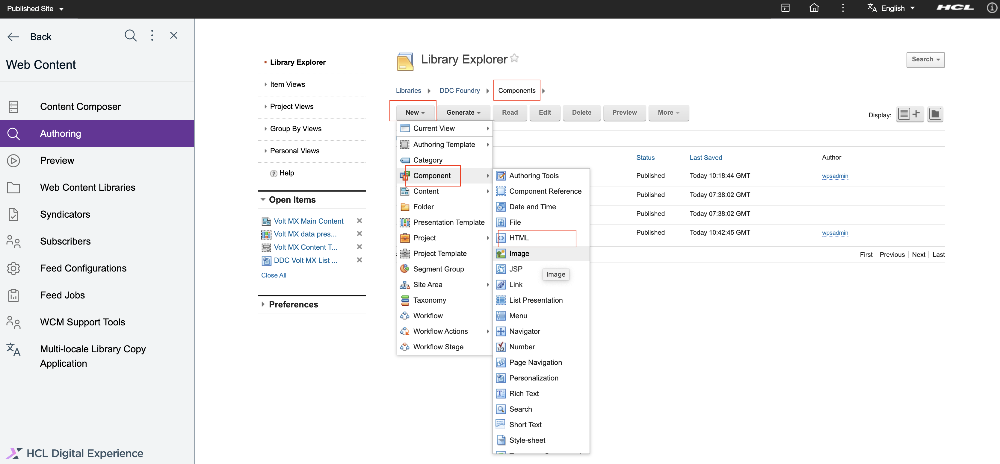

# Connecting to HCL VoltMX Foundry through Digital Data Connector (DDC)

This section provides the steps on using DDC for HCL Portal framework to integrate data from HCL VoltMX Foundry (integrated external data sources) on your portal pages by using HCL Web Content Manager presentation components.

## Prerequisite

You must have access to the Volt MX Foundry Console via Volt MX Cloud or On-Premise instance. You may consult this link for the [cloud service](https://opensource.hcltechsw.com/volt-mx-docs/docs/documentation/Foundry/voltmx_foundry_user_guide/Content/Accessing_VoltMX_MBaaS_Portal.html) and [on-premise service](https://opensource.hcltechsw.com/volt-mx-docs/docs/documentation/Foundry/voltmx_foundry_user_guide/Content/How_to_access_VoltMX_Foundry_Portal_on-Prem.html). In this sample, we will use the cloud service that Volt MX offers.

## Defines the set of attributes available in the beans that are contained in bean lists that a DDC plug-in generates in List-rendering profile
Refer to [Technical concepts | HCL Digital Experience](https://help.hcltechsw.com/digital-experience/9.5/social/plrf_tech_concepts.html)

- Following API end point and response are used to create this sample document.
    
    

Steps to create the profile are as follows:

1. Login to the WAS console.
 
    

2. Click **Resources** from side navigation. Then, click **Resource Environment**, then **Resource environment providers**.

    

3. From the list of resources, find **WP ListRenderingProfileService** and click.

    

4. Click **Custom properties** From the **Additional Properties** on right side.

    

5. Click on **New** and add your unique profile (say - ddcDemo) and it's properties by entering name-value pairs like in the sample below. Click **Apply** then **OK**

    

    | Name                                   | Value                                       | Type              |
    | ---------------------------------------| ------------------------------------------- | ------------------|
    | ddcDemo.Name                           | ddcDemo.profile.json                        | String            |
    | ddcDemo.BeanListProviderID             | ibm.portal.ddc.json                         | String            |
    | ddcDemo.ItemAttribute.id               | id                                          | Integer           |
    | ddcDemo.ItemAttribute.fullname         | name                                        | String            |
    | ddcDemo.ItemAttribute.email            | email                                       | String            |
    | ddcDemo.ItemAttribute.username         | username                                    | String            |
    | ddcDemo.ListItemSelection              | .                                           | String            |
    | ddcDemo.Type                           | BasicJSONSelection                          | String            |

In the sample above,
- {profile}.Name would indicate the unique name of the list-rendering profile
- {profile}.BeanListProviderID refers to the plugin plovider and this could be generic `ibm.portal.ddc.json` or `ibm.portal.ddc.xml` or the id of a custom plugin created by a business user
- {profile}.ItemAttribute.id is always required but it could point to any attribute from the external data. In the sample above, the hclvoltmx account API used having an id for every account so we're using the id attribute in the id. In real-world use though, being an id in a list might need to be unique so this is where using {profile}.ComputedItemAttribute.{any} can be used. However, the generic DDC plugins don't support this out of the box and you can create and deploy your own DDC plugin best suited for business needs (https://help.hcltechsw.com/digital-experience/9.5/social/plrf_crt_dply_cust_beanlst_prvdr.html)
- {profile}.ItemAttribute.{any} refers to the available attributes in the bean list returned by the plugin from external data. For example, in the external JSON response data: the attribute key is `name` but in the bean list you want it mapped to the key `fullname` therefore your custom property name-value pair is: `ddcDemo.ItemAttribute.fullname` => `name`.
- {profile}.ListItemSelection is the user-defined root of where you want to get the item attributes in the external data response especially in cases where it is nested, if it's not the case simple put . in the value.
- {profile}.Type basically tells how the plugin is going to access the data. In this sample, BasicJSONSelection just tells it to use dot notation with name, index, and attribute filtering.

6. Review and save the changes in master configuration.

    

## HTTP Outbound Proxy and Signer Certificate

This allows WCM to trust the external data source and send HTTP requests to it.

Steps to setup the outbound proxy are as follows:

1. Login to the WAS console.
 
    

2. Click **Resources** from side navigation. Then, click **Resource Environment**, then **Resource environment providers**.

    

3. From the resources, find and go inside `WP ConfigService` and click on `Custom Properties`. Add **New** .

    

4. Add your unique policy by entering name-value pair like in the sample below.

  | Name                                                                | Value                                                         | Type              |
  | --------------------------------------------------------------------| --------------------------------------------------------------| ------------------|
  | wp.proxy.config.urlreplacement.digital_data_connector_policy.ddcDemo| https://hcl-dx-dev.hclvoltmx.net/services/account/*           | String            |

    

5. Review and save the changes in master configuration.

    

**if the external data source URI uses https, proceed below:**

6. Go back to the sidenav, click on `Security` Then, click `SSL certificate and key management` then `Key stores and certificates`

    

7. Click on `NodeDefaultTrustStore`.

    

8. Click on `Signer certificates` and add your external URI's certificate by clicking on `Retrieve from port`.

    

9. Enter the host, alias and port 443 and click on `Retrieve signer information`.

     port and retrieves the signer from the server during the handshake.")

10. Review and save the changes in master configuration.

    

## WCM presentation components

You may create your components under a new library with default items such as site area and workflow. Once the library is ready (new or existing), you will have to create WCM artefacts under 4 folders: Content, Components, Authoring Templates and Presentation Templates.

**Note:** Refer to [Creating web content libraries](https://help.hcltechsw.com/digital-experience/9.5/panel_help/wcm_config_wcmlibraries.html)

**At first create List Appearance -**

1. Go to the Library Explorer, here you will see default items `Content`, `Categories`, `Components`, `Authoring Templates`, `Presentation Templates`,`Workflow Items` and `Segments`

    

2. Create an Appearances folder under Components. This is only so that your personalization components that uses the DDC selection rule Select pluggable resources can be found easily in one place.

    

3. Under Appearances folder, create a new Personalization component.
    - Click on `New` button. Then, click `Component`, then `Personalization` component

        

    - Enter the name and title. Suggested name: `DDC Volt MX List Appearances`

        

    - Under `Personalization Element`, click `New`. As a `New Rule`, instead of `Select Web Content`, click on the `Web Content` phrase and select `Pluggable Resources` instead and click `Save`.

        
 
    - In the List Presentation Markup, add the following:
        - Header: `<ul>`
        - Body: 
        `<li>[AttributeResource attributeName="fullname" separator=","]<li>[AttributeResource attributeName="username" separator=","]<li>[AttributeResource attributeName="email" separator=","]`
        - Footer: `<\ul>`

        

    - Click `Save and Close`.

**Create Reload Profiles under Components:**

This is a easy way of making sure the List Rendering Profile custom properties you have added or may have updated since are reflected without restarting the server. Although, if all else fails, restart server is always there as an option.

1. Under Components, click on `New` button. Then, click `Component`, then `HTML` component.

        

2. Enter the name `Reload Profiles`and in the markup, add the following: `[Plugin:ListRenderingContext key="id" action="reloadProfiles"]`

        

3. Click `Save and Close`.

4. Preview. **This rendering step is the one that triggers the reload of the profiles**

**Create Presentation Template**

This is where we are setting the context of the DDC content.

Steps to create Presentation Template are as follows-

1. Create a new presentation template with suggested name `Volt MX data presentation template` and under presentation template options, add the following:
    ```
    [Plugin:ListRenderingContext action="set" attribute="source=[Element context='current' type='content' key='sourceuri']" profile="[Element context='current' type='content' key='profile']" extension-id="[Element context='current' type='content' key='provider']"]
    [Component name="ddc foundry/appearances/ddc volt mx list appearances" compute="always"]
    ```

        
 
    - Under `attribute`, we are defining the data `source` endpoint. The content field we have set in this example is `sourceuri` where we saved the **endpoint** in the content item.
    - `profile` refers to the List-Rendering Profile we saved earlier in WAS console. The content field we have set in this example is also `profile` which we will save in the content item with value `ddcDemo.profile.json`.
    - `extension-id` is the DDC plugin id. The content field we have set in this example is `provider` which we will save in the content item with value `ibm.portal.ddc.json`.
2. Save and close.

**Create Content Template**
Under Authoring Templates, we will create a Content Template.

1. Click on `New` button. Then, click `Authoring Template`, then `Content Template` component

        
 
2. Add `Name`, `Display title` and `Description` with suggested name `Volt MX Content Template`. Then select the presentation template we created earlier as default presentation template `Volt MX data presentation template`.

        

3. Click on `Manage Element` and add the following elements to the content template as follows.

    | Element type                   | Name                                       | Display title              |
    | ------------------------------ | ------------------------------------------ | ---------------------------|
    | Component Reference            | appearance                                 | Appearance                 |
    | Short Text                     | sourceuri                                  | Data Source URI            |
    | Short Text                     | profile                                    | List Rendering Profile     |
    | Short Text                     | provider                                   | DDC Plugin                 |

        


4. Click on `Default Content Properties` and add `Express workflow`.

        

5. Save and close.

**The last artefact we need to create is the Content item.**

1. Under your library's click on `Content`. Then click on `Articles` and create a new **Content** from the Content Template we created earlier `Volt MX Content Template`.

        

2. Add `Name`, `Display title` and `Description` with suggested name `Volt MX Main Content` and in the content fields / elements, input the following:

    | Content field title            | Value                                                        |
    | ------------------------------ | ------------------------------------------                   |
    | Appearance                     | appearance                                                   |
    | Data Source URI                | https://hcl-dx-dev.hclvoltmx.net/services/account/id?id=1    |
    | List Rendering Profile         | ddcDemo.profle.json                                          |
    | DDC Plugin                     | ibm.portal.ddc.json                                          |

        
 
3. Save and close.

### Use in Portal Page

Now we can use all the WCM artefacts we created in a portal page.

1. Under `Administration` > `Site Management` > `Manage Pages`, create a new page under `Content Root` (e.g. `Volt MX DDC` page).

2. Go to the page `Volt MX DDC` and enable `Edit mode`.

        

3. Choose the `layout` and `style` of the page.

        

4. Click on `plus` icon in left navigation panel. Then click on `Applications` and add a `Web Content Viewer` on the page.

        

5. Inside the `Web Content Viewer`, click on the upper right dropdown button and select `Edit Shared Settings`.

        

6. Under Content, change the mapped content to the Content Item we created above.

        

7. Click `OK`and the following output page will be displayed.

        