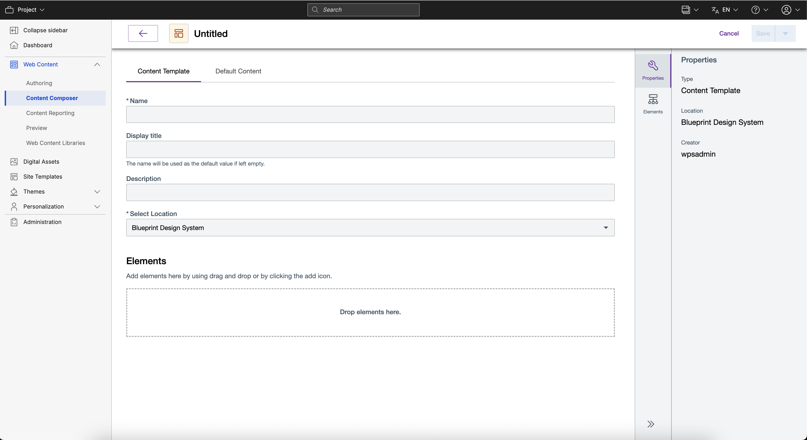

# Author Content Templates

This section provides the steps on how to author a content template using HCL Content Composer.

## Prerequisite

Content Composer should be installed and configured to HCL Digital Experience 9.5 container release update CF181 or higher. See instructions to install to supported container environments in the [Install HCL Digital Experience 9.5 Components](../../installation/install_config_cc_dam.md) topic.

Content Composer is accessible from the Practitioner Studio interface (after image configuration to your HCL Digital Experience 9.5 CF181 and higher deployment).

## Create a content template using Content Composer

Content authors can create repeatable template patterns used to model the content to publish to end user audiences.

Follow these steps to create a new content template using Content Composer:

1.  From the HCL Digital Experience 9.5 Content Composer interface, click the drop-down arrow of the **Create** button to select the **Create Content Template** option.

    

2.  Complete the fields on the **Content Template** tab, of which the content author will be directed to by default. Add a **Name**, **Display Title**, and (optional) **Description** for the new content template.

    

3.  In **Select Location**, select the site location to present the content template when completed and ready for publication.

    

4.  To add content elements to the content template for use, add an element of choice by either dragging any of the **Text**, **Media**, **Selection**, and **Include** element items from the **Elements** list displayed on the right or by clicking the plus (+) icon of the selected element as shown below:

    

    **Note:** As per HCL Digital Experience 9.5 CF184, the HTML and JSP elements are not accessible via HCL Content Composer. However, you can add the two elements via Web Content Manager.

5.  Click **Properties** to define the properties for the Image element type selected such as *Required Field*, and *Maximum size of image*, *Hide Field* when working with the content Image element. Select **Apply** when completed.
6.  Select **Default Content** tab to set default content values for title, elements, information, or workflow.

    !!!note
        In the **Workflow** section on the right, ticking **Enable workflow for items created with this authoring template** will require content authors to select a workflow when selecting the newly created content template.

        

7.  Follow the steps on how to honor to configure a selected Element's Default Content to honor the properties in the Content Template.

    !!!note
        The **Default Content** in Content Template supports the following element types:
            |Text Elements|Media Elements|Selection Elements|Include Elements|
            |-------------|--------------|------------------|----------------|
            |Rich Text|File|Date and Time|Component Reference|
            |Short Text|Image|Option Selection|Link|
            |Numeric| |User Selection| |

    1.  From the **Default Content** tab, click **Properties** located on the upper part of the selected Element's default content as shown in the example below for the Text Element:

        

    2.  Fill out the fields of the selected element's **Properties**, then click **Apply** to save changes.

        

        !!!note
            If you close the **Properties** modal window without saving the changes, a confirmation will prompt to discard all the changes. The same will also happen if you click anywhere outside the **Properties** modal window without saving the changes.

    3.  Fill out the selected element's default content. Make sure that you follow the field requirements as indicated below:

        

        **General Guidelines when filling in properties for **Default Content**:

            1.  Setting both the Required and Hidden properties to true will make the element's default content a required field.
            2.  Minimum property should always be less than or equal to the maximum property.
            3.  Maximum property should always be greater than or equal to the minimum property.
            4.  Dimension property such as Height and Width should always be greater than 1.
            5.  Numeric fields do not accept alphabet letters and special characters except for scientific notation (Example: *3.14e2*).

        **Specific Guidelines for Text Elements**:

            1.  When the Required property is set to true, the minimum and maximum for characters and words should be greater than 1. If not, it should be greater than 0.
            2.  Minimum words must be less than half the maximum characters.
            3.  For ShortTextComponent, maximum characters must be 250 or less.
        
        **Specific Guidelines for Numeric Element only**:

            1.  The Minimum and maximum value are ranging from -999999999999999999 to 999999999999999999.
            2.  When whole numbers only property is set to true, minimum and maximum value must not have a decimal.
            3.  The Maximum characters must be 250 or less.

8.  When done, select **Save** to save your settings and create your new content template, or **Save and Close**, which will create your new content template with the saved settings and will redirect you to the new content template's location in the Content Composer dashboard.

## Create new content template with auto-populate location

Follow the steps to create a new content template with auto-populated location from the Dashboard view:

1.  From the HCL Digital Experience 9.5 Content Composer Dashboard, select a Content Library or a Content Folder.
2.  Click **Create** then select **Content Template**.

    

3.  The location will auto-populate to the selected Content Library or Content Folder as shown below.

    

4.  Complete the fields on the **Content Template** tab, of which the content author will be directed to by default.
5.  When done, select **Save** to save your settings and create your new content template, or **Save and Close** which will create your new content template with the saved settings and will redirect you to the new content template's location in the Content Composer dashboard.

## View Content overview

Content users can view a light preview of uploaded content and more using HCL Content Composer.

1.  Access the content item you wish to edit. In this example, the content item example above (**Image**) is obtained from **Web Content > Content > Articles** site area location. Select **Open Content**.
2.  On the content item editor interface, select the **More** drop down as shown below and select **Overview**.

    

3.  The light preview of the selected content will be shown in a new window. It will display:

    -   Content title
    -   Content type
    -   For images, a preview of the content in its original size; and
    -   Published link of the content

4.  User can also add a preview image of the content file. In **Edit Mode**, user can select **Show hidden content** and **Upload using file browser** or **HCL DAM** the preview image file.

5.  If done, select **Save** to save your settings and create your new content template, or **Save and Close**, which will create your new content template with the saved settings and will redirect you to the new content template's location in the Content Composer Dashboard.

## Content authoring actions in Search Results view

The **Search Results** view allows users to perform content authoring actions.

1.  Selecting the search result row will enable display of **Edit** and **Delete** options from the Content Composer search results view.

    Ticking the checkbox (beside **Title**) for the content item presented in the **Search Results** will also enable context-specific **Edit** and **Delete** options for the content item to optionally proceed to the content item's details in **Edit mode**.

    

2.  Column item results can also be sorted by clicking **Title**, **Date Created** or **Date Modified**. The **Status** column shows whether the content item is *Published* or *Draft*. Search Result columns can also be resized for convenience. 

## Content authoring actions in Dashboard view

The **Dashboard** view allows users to perform content authoring actions.

1.  Selecting the avatar icons of the content template items will enable display of **Edit** and **Delete** options from the Content Composer Dashboard view.

    Ticking the checkbox (beside the **Content Title**) presented in the **Content Collections** column also enables context-specific **Edit** and **Delete** options for the content item to optionally proceed to the content item's details in **Edit mode**.

    

<!--
## HCL Digital Experience Solution Feedback

HCL Digital Experience is interested in your experience and feedback working with HCL Digital Experience 9.5 release software. To offer comments or issues on your findings, please access the [HCL Digital Experience 9.5 Feedback Reporting application](https://www.hclleap.com/apps/secure/org/app/158bbc7c-f357-4ef0-8023-654dd90780d4/launch/index.html?form=F_Form1). -->