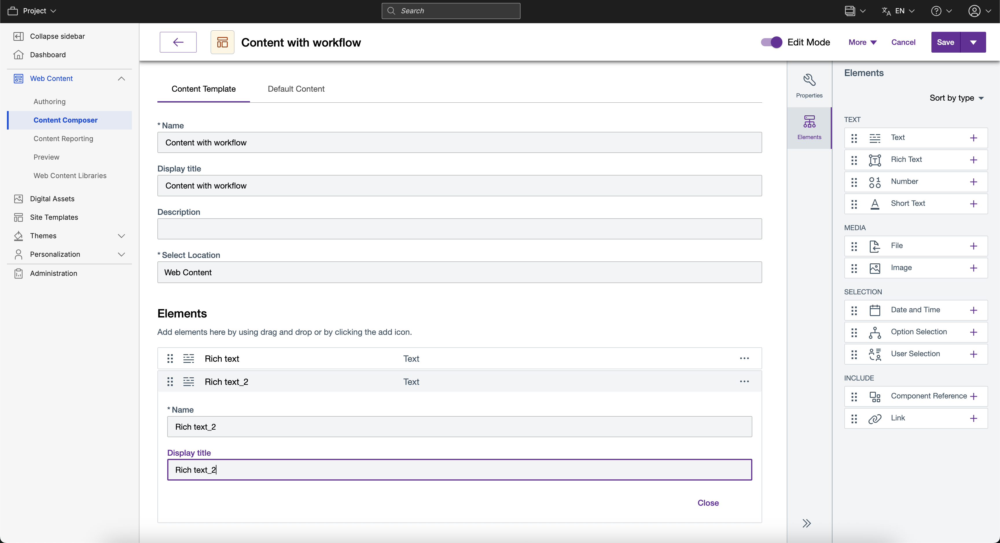
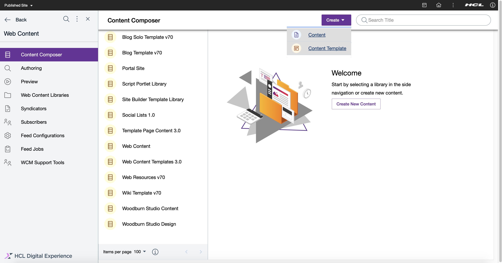
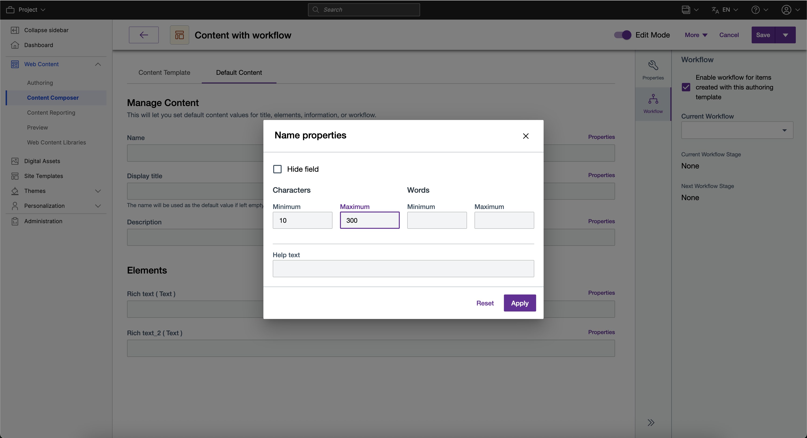
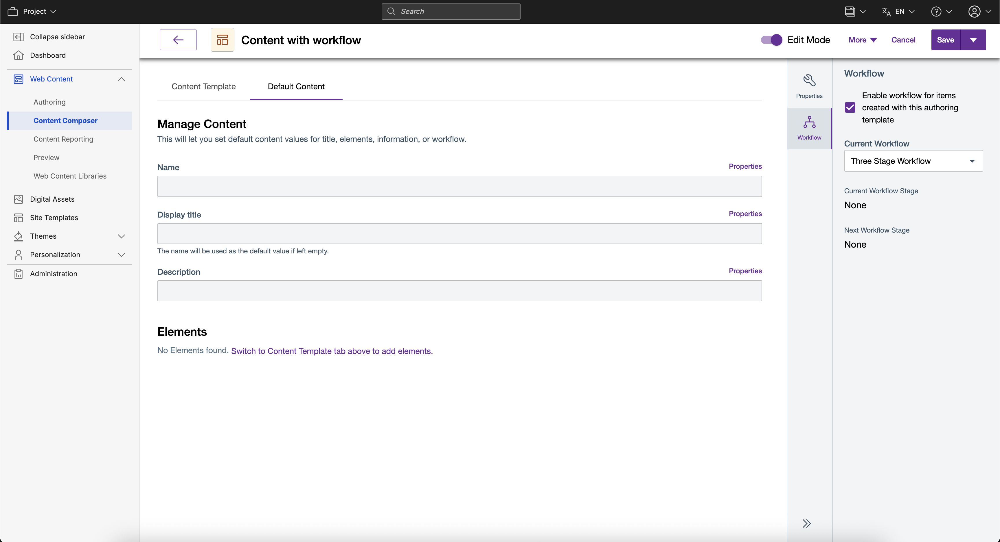
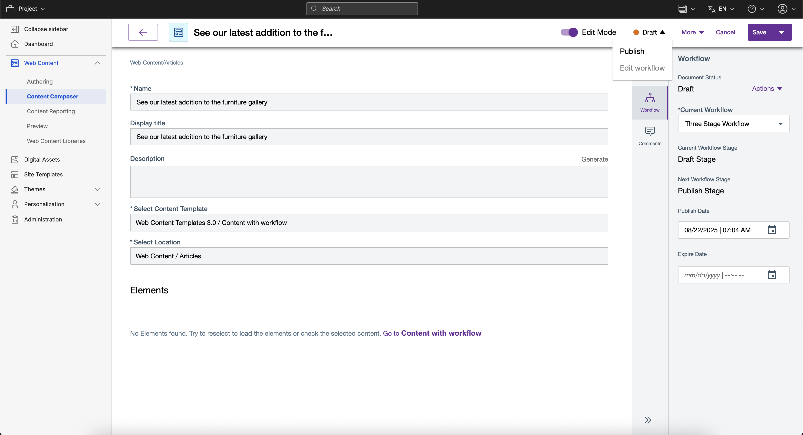
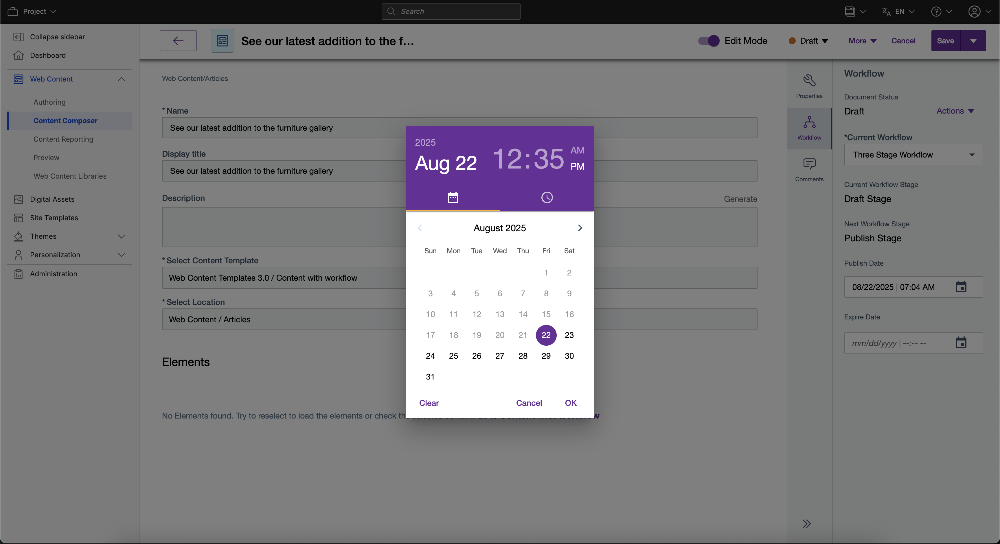

# Edit Content Templates

This section provides the steps on how to edit a content template using HCL Content Composer.

## Prerequisite

Content Composer should be installed and configured to HCL Digital Experience 9.5 container release update CF181 or higher. See instructions to install to supported container environments in the [Install HCL Digital Experience 9.5 Components](../../installation/install_config_cc_dam.md) topic.

Content Composer is accessible from the Practitioner Studio interface (after image configuration to your HCL Digital Experience 9.5 CF181 and higher deployment).

## Set start and end of date range for Date and Time element

Users can set start and end of date range for the Date and Time element of a newly-created or saved content template.

1.  From your HCL Digital Experience 9.5 Practitioner Studio interface, select **Web Content > Content Composer** from the navigator, and click **Create > Content Template** to create a new content template, or choose and click **Open Content Template** on a saved content template.

2.  On the content element interface, make sure that you are in **Edit mode**. Select the **Date and Time** element and complete the fields.

    

3.  If done, select **Save** to save your settings and create your new content template, or **Save and Close**, which will create your new content template with the saved settings and will redirect you to the new content template's location in the Content Composer Dashboard.

## Manage Web Content workflow approvals

Web Content workflow selections can be accessed from HCL Content Composer. Content authors can apply predefined workflow steps to manage the creation, modification, and publication of web and associated digital asset management content using approval processes.

The Content Composer Web Content workflow selections can be accessed from the HCL Digital Experience 9.5 Content Composer release, as shown in the following steps.

1.  Log in to your HCL Digital Experience 9.5 platform, and select **Web Content** from the Practitioner Studio navigator.

    

2.  From the HCL Digital Experience 9.5 Content Composer, select **Create Content Template** to create a Content Template that will enable a workflow for use by content authors.

    

3.  Complete the fields for your new Content Template: **Name** (required field\), **Display Title**, and **Description** (optional fields).

    

4.  Select the location of your Digital Experience content structure where you will place the Content Template. Use the type-ahead feature available from the Content Template location drop down list to easily find and select the desired content structure location to place the new content template.

    

5.  Select **Elements** and add content elements, such as **Rich Text** field for input to the Content Template design. Complete the element details and optional properties for the selected content items, then select **Close**. The added Element is automatically applied to the newly created Content Template.

    

6.  Select **Default Content** tab to set default content values for title, elements, information, or workflow.

    !!!note
        In the **Workflow** section on the right, ticking **Enable workflow for items created with this authoring template** will require content authors to select a workflow when selecting the newly created content template.

    

    When done, select **Save** to save your settings and create your new content template, or **Save and Close**, which will create your new content template with the saved settings and will redirect you to the new content template's location in the Content Composer dashboard.

    

7.  Click **Open Content Template** just created and saved.

8.  Select the **Read Only** selector to **Edit Mode**. Proceed to the Default Content area of the Content Template options and select **Workflow** on the right side of the interface.

9.  Select **See All Workflows** and proceed to the Web Content location of the Digital Experience content structure to view the available workflows for selection to add the Content Template.

    In this example, the **Three Stage Workflow** option is selected.

    

10. Select **See All Workflows** and proceed to the Web Content location of the Digital Experience content structure to view the available workflows for selection to add the Content Template. When done, select **Save** to save your settings and create your new content template, or **Save and Close**.

11. Select **Create Content** from the Content Composer menu. Select the **Content Template with Workflow** from the Web Content location.

12. Open the Content Template and place in Edit mode by moving the selector.

13. Add a *Content Display Title* and text in the *Rich Text* element field. Select the *Location* of the Digital Experience site area to place the content for display.

    

14. Click **Save** then reopen the content item and place the content item in Edit mode. Use the **Workflow** icon to view your options to edit or progress through the Workflow stages defined on the Workflow selected.

    

15. Select the **Expire Date** calendar icon to define an expiry date and time to manage your content publication timeline.

    

    Select the *Date* and *Time* and confirm your selections.

<!--
## HCL Digital Experience Solution Feedback

HCL Digital Experience is interested in your experience and feedback working with HCL Digital Experience 9.5 release software. To offer comments or issues on your findings, please access the [HCL Digital Experience 9.5 Feedback Reporting application](https://www.hclleap.com/apps/secure/org/app/158bbc7c-f357-4ef0-8023-654dd90780d4/launch/index.html?form=F_Form1){:target="_blank"}.
 -->

