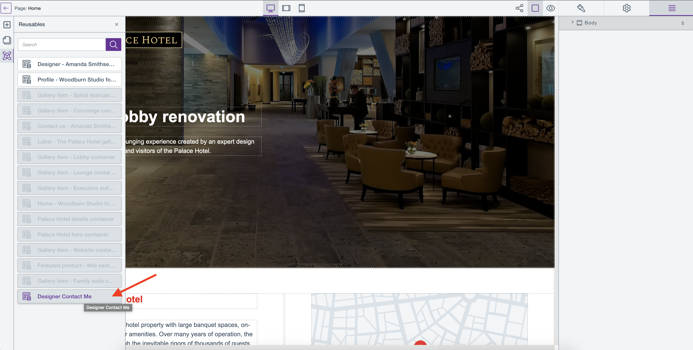

# Create or edit a reusable block

Learn how to create or edit a reusable block on your site and its pages in HCL Design Studio (Beta).

## Create a new reusable block

Content containers with WCM Content Items are automatically created as **new** reusable blocks and are automatically added in the **Reusables** panel as soon as they are created, as shown below:

You can create a reusable block as if you are creating a new content container for your page.

1. To create a new content container, follow the steps in [Add a content item to a Design Studio (Beta) page](../../update_content_items.md#add-a-content-item-to-a-design-studio-beta-page).
2. Access the newly-created reusable block in Page editor view, then open the Reusable blocks panel as shown below:

## Edit an existing reusable block

To edit an existing reusable block, follow the steps in [Edit a content item in a Design Studio (Beta) page](../../update_content_items.md#edit-a-content-item-in-a-design-studio-beta-page).

!!! note
    Make sure the name of your reusable block is unique and identifiable for you to be able to quickly locate it from the list.

## Use a reusable block
To use a reusable block:

1.  Open any page in Page Editor view.

2.  Click the **Reusables** panel to display the list of reusable blocks.

3.  Drag and drop the selected content list block to the Page Editor canvas.

!!! note
    The reusable block is disabled if it is already added in the page the user is currently on.