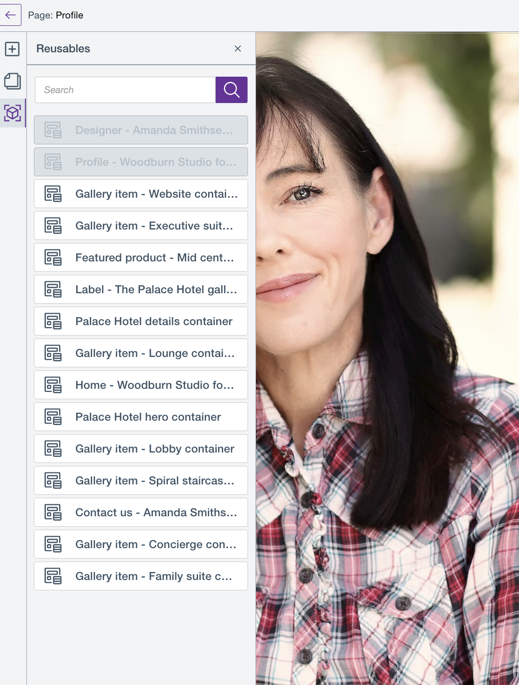
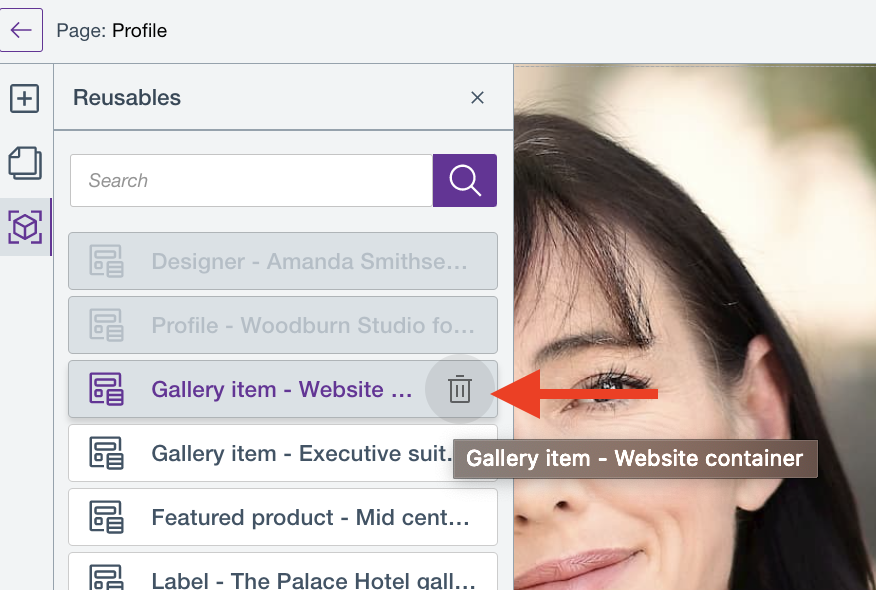
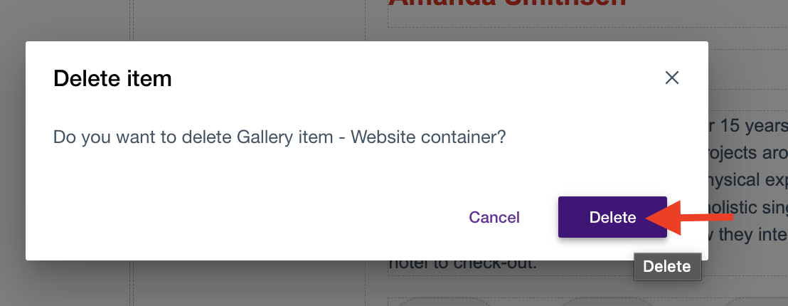

# Use reusable blocks

The following section details information and steps on how to use reusable content items across your HCL Digital Experience site.

## Overview

Users can reuse a content item multiple times across different pages of their HCL Digital Experience sites. Reusable content items are called *reusable
blocks*.

As of HCL Digital Experience CF205 and higher releases, the following reusable blocks made available are:

-   [Content Container](../../building_content/use_content_containers.md)
-   [Content list](../../building_content/use_content_lists.md) 
-   [Data containers](../../building_content/use_data_containers.md)

More content items will be introduced in future releases.

To access available reusable blocks, you need to be on the HCL Design Studio (Beta) Page editor and click the *Reusable blocks* icon as shown below:

!!! note
    A reusable block is not made available or to be reused if it is already used in a page. For example, the three reusable blocks `Designer-Amanda Smithsen`, `Profile - Woodburn Studio` , and `Designer Contact Me` are not available for reuse in the said page as they are already in use:

!!! notes
    - Deleting a reusable block results in an error if the reusable block is being used in your current or other pages. 
    - Deleting a reusable block also results in an error if the reusable block has already been deleted by another authorized user. In this case, the **Reusables** panel refreshes and updates the list of reusable blocks.
    - In previous releases (CF196 - CF202), once you delete a Content Container in Page Editor mode, the Content Container is also deleted in WCM. However, when a Content Container becomes a reusable block and you delete it from Page Editor mode, it will remain in WCM.

To delete a reusable block:

1.  Open any page in Page Editor view.

2.  Click the **Reusables** panel to display the list of reusable blocks.

3. Hover on the reusable block that you want to delete and click the **Delete** icon.

    

3.  A confirmation modal appears. Click **Delete** to confirm deletion or **Cancel** to cancel deletion.

    

4.  A message appears if the selected reusable block is successfully deleted.

## HCL Digital Experience Solution Feedback

HCL Digital Experience is interested in your experience and feedback working with HCL Digital Experience 9.5 release software. To offer comments or issues on your findings, please access the [HCL Digital Experience 9.5 Feedback Reporting application](https://www.hclleap.com/apps/secure/org/app/158bbc7c-f357-4ef0-8023-654dd90780d4/launch/index.html?form=F_Form1).