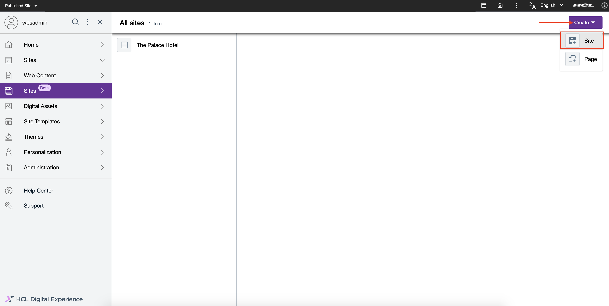
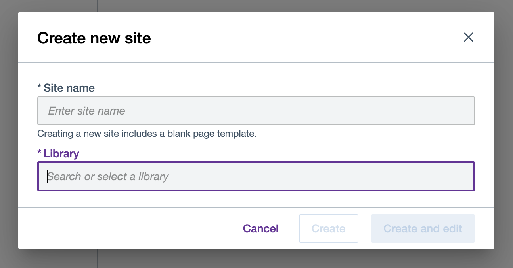
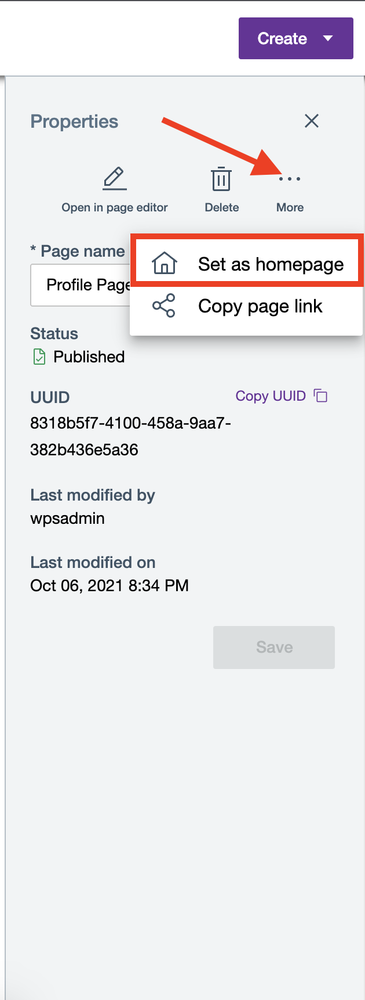
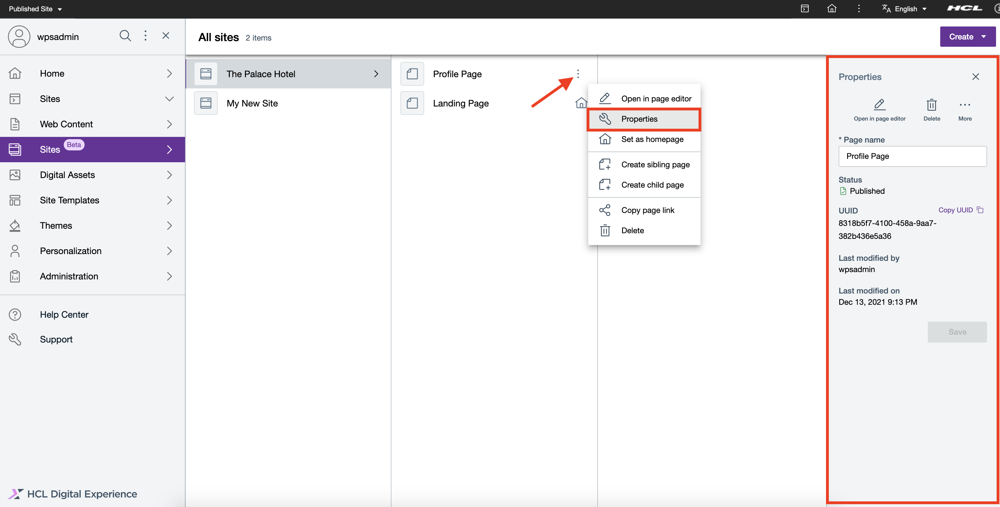

# Create sites and pages
The following provides steps on how to browse your site and its pages, create new ones, and update or delete metadata using HCL Design Studio (Beta).

## Prerequisite
Design Studio (Beta) is available for evaluation use and may not be used in production. It may be installed and configured to HCL Digital Experience 9.5 container release update CF196 or higher. See instructions to install Design Studio (Beta) in this Help Center topic: [Install Design Studio (Beta)](../installation/ds_installing.md).

Design Studio (Beta) is accessible from the Practitioner Studio interface, after image configuration to your HCL Digital Experience 9.5 CF196 or higher deployments.

## The demo site
Included in HCL Digital Experience 9.5 CF196 and higher deployments, Palace Hotel is a demonstration site for a fictional organization. The Palace Hotel demonstration site leverages in-line editing and site content authoring and management tools.

The home page of the provided Palace Hotel demo site is the default page. This site page is rendered when the site render URL is opened in a browser.

It is not recommended to reuse Palace Hotel for anything but a demonstration site. Its intent is to demonstrate the use of Design Studio (Beta) features.

The Palace Hotel demo will also be updated in future releases in line with the latest HCL Design Studio (Beta) features. As such, any changes saved using the Palace Demo site will disappear.

## Create a new site
The option to create a new site is now available in HCL Digital Experience 9.5 CF198 and higher releases. Follow the steps to create a new site using Design Studio (Beta).

1.  From the **Sites** overview, click the **Create** button on the far right, and choose **Site**.

    

2.  Enter the name of the library where you want to create your new site in and select from the autosuggest options the name of that library.

    

3.  Click **Create and edit** to create your new site and open it in the editor, or **Create** to create your new site and stay in the **Sites** overview.

    The new site created using Design Studio (Beta) comes with a single page set as the default home page.

    

## Update site metadata
At the moment, users can only edit the name of the site. Other site properties are updated through other ways that are automatically handled by Design Studio (Beta).

1.  From **Sites** overview, choose a site and then click the overflow (3-dot) menu icon to display options.

2.  Click **Properties** to pop up the panel menu of the selected site.

    

3.  Once the **Properties** panel is visible, update the editable fields of the site information.

    

4.  Click **Save** to keep your changes.

## Delete a site
In HCL Digital Experience 9.5 CF200, the option to delete a site on the **Sites** overview is introduced.

!!! note
    Users cannot delete a site in HCL Digital Experience 9.5 CF199 and lower deployments.

1.  In the **Sites** overview, hover to the site you want to delete until it shows the overflow menu icon.

2.  Click the overflow menu icon as shown below to access the site menu options, and choose **Delete**.

    

3.  A prompt will appear to confirm if you want to delete the site. Click **Delete** to proceed on deleting the site OR **Cancel** if you want to abort instead.

4.  A notification will appear once the site is deleted. If the deletion process fails, the notification will show the reason for the failure.

!!! important
    Once a site is deleted, you can no longer undo the action.

    

## Create a new page from Sites overview
Follow the steps to create a new page within your newly-created site using HCL Digital Experience 9.5 Design Studio (Beta).

1.  From **Sites** overview, click the **Create** button, and then **Page**.

    

2.  Enter the name of the new page in the **Page name** field. In the site page **Location** field, type and select the site or page as the location where you want to create the new page under.

    

3.  Click **Create and edit** to create your new page and open it in the Page editor, or **Create** to create your new page and stay in the **Sites** overview.

## Assign a location when creating a page

The option to choose a location when creating a new page is now available in HCL Digital Experience 9.5 CF198 and higher releases.

There are two ways to choose a location when creating a new page from **Sites** overview:

-   navigate to your target location; or
-   entering the name of the location and choosing an option from the auto-suggest list.

### Choosing location by navigation
  1.  Navigate to the target site location. In the Palace Hotel demo site example below, you can create a new page under **Profile Page**:

      

  2.  Type in the name of the new page. You can choose the pre-populated location last selected in **Sites** overview, or type in the name of the new location, as shown below:

      

  3.  Click **Create** or **Create and edit** to create and save the new page in the selected site location.

### From auto-suggest list

!!! note
    There may be more than one page that matches the name of the target location. Use the address displayed below each option as a hint to differentiate the selected location from other matches.

  1.  Follow the steps indicated in Option 1 (Choosing location by navigation).
  
  2.  In the Location field, enter the location keyword and choose from the auto-suggest list that matches the target location.

      

  3.  Click **Create** or **Create and edit** to create and save the new page in the selected site location.

      

## Create a child or sibling page
An HCL Digital Experience site is a hierarchical site type with the following levels:

-   A parent page, which is the top-level page (e.g. Home Page);
    -   A child page, which exists one level below a parent page or a child page above it;
    -   A sibling page, which exists on the same level of a child page

In HCL Digital Experience 9.5 CF200, shortcuts to create a child or sibling page are introduced.

In the example below, Design Studio (Beta) provides a shortcut whenever you create a new site:

You can also pre-fill the location field when creating a new child or sibling page.

There are four other ways to create a new child or sibling page using Design Studio (Beta).

### Create a child or sibling page for any page via the Pages panel
  1.  On the Page editor interface of the page you currently opened, click the **Pages** (multiple pages) icon. This action pops out the **Pages** panel.
  
  2.  On the **Pages** panel, click the **Create a new blank page** icon, then choose either **Create sibling page** or **Create child page** as shown below.

      

  3.  Enter a name for your new child or sibling page.
  
  4.  The **Location** field will initially be pre-filled. You can delete the pre-filled **Location** and enter a new location to assign a new one.

      -   If you select **Create sibling page**, the **Location** field is pre-filled with the location of the current page.
      -   If you select **Create child page**, the **Location** field is pre-filled with the current page itself.
      
      You can always delete the pre-filled **Location** and enter your desired location.

  5.  Click on **Create** to create your new child or sibling page.

### Create a child or sibling page for the page currently open in Page editor
  1.  On the Page editor interface of the page you currently opened, click the **Pages** (multiple pages) icon. This action pops out the **Pages** panel.
  
  2.  On the **Pages** panel, hover your cursor on the right side of the selected page until the overflow menu shows.
  
  3.  Click the overflow menu, then choose either **Create sibling page** or **Create child page** as shown below.

      

  4.  Enter a name for your new child or sibling page.
  
  5.  Keep the pre-filled **Location** as is or enter a new location to assign a new one.
  
  6.  Click on **Create** to create your new child or sibling page.

### Create a child or sibling page for any page displayed in the Sites overview
  1.  On the **Sites** overview, hover your cursor on the right side of the selected page until the overflow menu shows.
  
  2.  Click the overflow menu, then choose either **Create sibling page** or **Create child page** as shown below.

      

  3.  Keep the pre-filled **Location** as is or enter a new location to assign a new one.
  
  4.  Click on **Create** to create your new child or sibling page, or **Create and Edit** to create your new child or sibling page and open it on the Page editor.

### Create a child page for any site displayed in the Sites overview
  1.  On the **Sites** overview, hover your cursor on the right side of a selected site until the overflow menu shows.
  
  2.  Click the overflow menu, then select **Create new page**.

      

  3.  Keep the pre-filled **Location** as is or enter a new location to assign a new one.
  
  4.  Click on **Create** to create your new page, or **Create and Edit** to create your new child or sibling page and open it on the Page editor.

## Choose a home page
The first page under a site is rendered as a home page by default. You can assign a different page as your new home page.

There are three ways to set a home page.

### From Sites Overview > Page menu
  1.  Navigate to the target page you want to set as the new home page.
  
  2.  Hover your pointer on the page, then click the overflow (3-dot) menu icon.
  
  3.  Click **Set as homepage**.

      

  4.  A dialog box appears. Click **Confirm** to set the page as the new home page and dismiss the dialog, or click **Cancel** to abort the action.

### From the Sites Overview > Page information panel
  1.  Navigate to the target page you want to set as the new home page.
  
  2.  Hover your pointer on the page, then click the overflow (3-dot) menu icon.
  
  3.  Click **Properties**.

      

  4.  The page's information panel pops out on the right. Click **More**, then **Set as homepage**.

      

  5.  A dialog box appears. Click **Confirm** to set the page as the new homepage and dismiss the dialog, or click **Cancel** to abort the action.

### From the Page Editor
  1.  On the Page editor, click the **Pages** (multiple pages) icon. This action pops out the **Pages** panel.
  
  2.  On the selected page, hover and click the overflow (3-dot) menu icon, then select **Set as homepage**.

      

  3.  A dialog box appears. Click **Set as homepage** to set the page as the new homepage and dismiss the dialog, or click **Cancel** to abort the action.

## Get information about a page

1.  On the Design Studio (Beta) **Sites** overview, select a site then navigate to your target page.
2.  Click the overflow (3-dot) menu icon to display options, then click **Properties**.

    

3.  The **Properties** panel detailing page information and applicable actions pops out on the right.

## Update page metadata

As of HCL Digital Experience 9.5 CF198 and higher deployments, users can only directly edit the name of a selected page. Other page properties are updated through other ways that are automatically handled by Design Studio (Beta).

There are two ways to update your page name:

### From Sites overview
  1.  See steps above on how to *Get information about a page*.
  
  2.  Once the information panel is visible, update the editable fields of the page information.

      

  3.  Click **Save** to keep your changes.

### In Page editor
  1.  Open the **Pages** panel on the left and navigate to the selected page that you want to update.
  
  2.  Hover your pointer on the page, then click the overflow (3-dot) menu icon.
  
  3.  Click **Page properties** as shown below.

      

  4.  On the **Page properties** panel, edit the page name.

      

  5.  Click **Save** to save your changes.
  
  6.  Click **Cancel**, press **Esc**, or click outside the panel to discard your changes.

## Delete a page
There are three ways to delete a page in the new Design Studio (Beta).

### From Sites overview > Page overflow menu
  1.  On the Design Studio (Beta) **Sites** overview, select the site, then the page you want to delete.
  
  2.  Hover your pointer on the page, then click the overflow (3-dot) menu icon.
  
  3.  Click **Delete**.

      

  4.  A confirmation dialog prompts you to confirm or cancel deleting the page.

      

  5.  Click **Delete** to continue the cancellation, or **Cancel** to abort.

### From the Sites overview > Page information panel
  1.  Access the page information panel as described in [Get information about a page](creating_sites_and_pages.md#get-information-about-a-page).
  
  2.  Click **Delete** to delete the selected page.
  
  3.  A confirmation dialog prompts you to confirm or cancel deleting the page.
  
  4.  Click **Delete** to continue the cancellation, or **Cancel** to not continue with the deletion.

### From the Page Editor
  1.  On the Page editor, click the **Pages** (multiple pages) icon. This action pops out the **Pages** panel.
  
  2.  Hover and click the overflow (3-dot) menu icon on the selected page.
  
  3.  A dialog box appears. Click **Delete** to delete the selected page and dismiss the dialog, or click **Cancel** to abort the action.

      

<!--
## HCL Digital Experience Solution Feedback

HCL Digital Experience is interested in your experience and feedback working with HCL Digital Experience 9.5 release software. To offer comments or issues on your findings, please access the [HCL Digital Experience 9.5 Feedback Reporting application](https://www.hclleap.com/apps/secure/org/app/158bbc7c-f357-4ef0-8023-654dd90780d4/launch/index.html?form=F_Form1). -->

