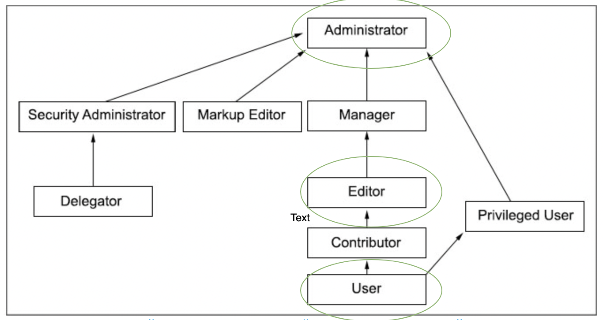
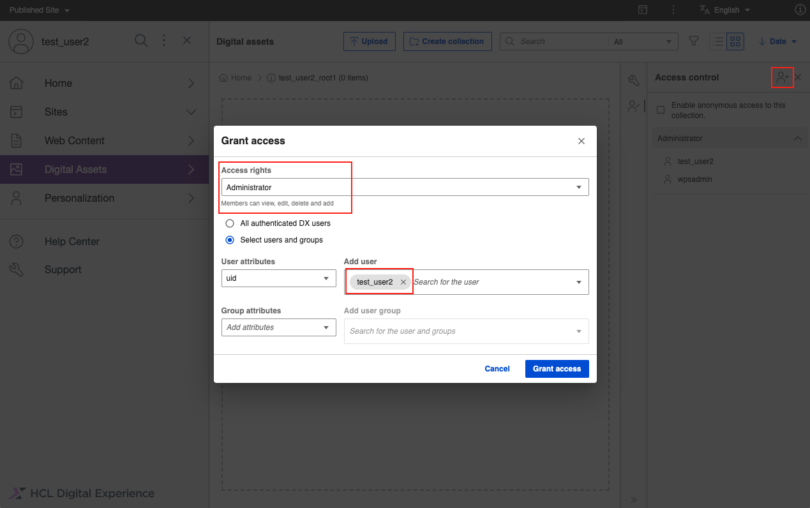
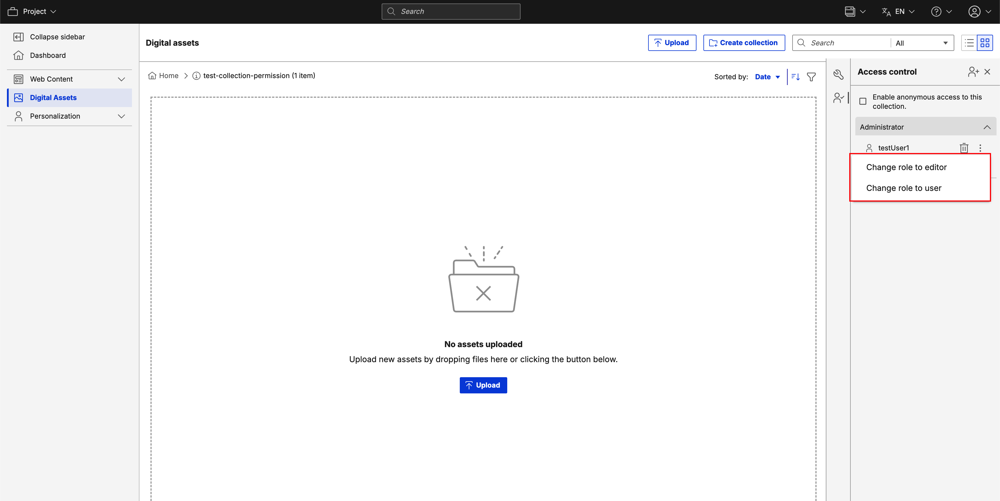
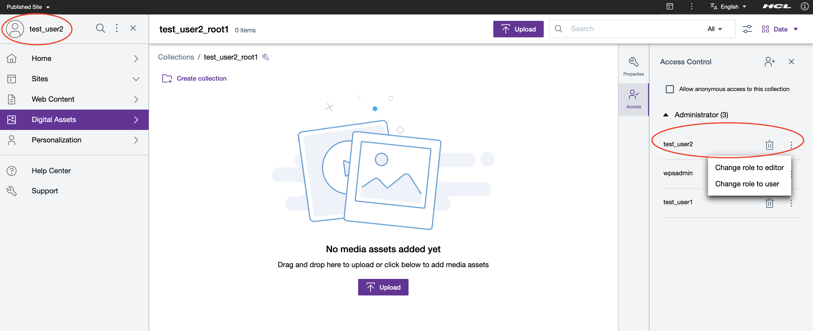

# DAM Access Control Management

This topic describes the details of DAM access control, its features and limitations and also on how to assign permission to Users through the DAM user interface.

## Overview on DX Portal Access Control for DAM

DX Portal Access Control follows an inheritance based tree structure. DAM is part of that tree just like WCM or Portal Pages. 
At the top of the tree is the virtual Resource Portal, below it is the virtual Resource DIGITAL ASSET MANAGEMENT and below that, are the resource instances (the collections) you are registering with its children. By assigning a role on a resource to a user, the user gets permission for the resource and its children. There is a way to block the inheritance with role blocks but it is not exposed in the initial configuration for collections, only for the virtual resource. 

For DAM, only a subset of the roles is exposed. Possible role types are User (view only), Editor (view, edit, create), and Administrator (view, edit, create, delete, set/remove access). Other roles existing in Portal Access Control like Manager or Privileged User are not exposed.

!!! note
    Currently, only highlighted roles (Administrator, Editor, User) are applicable in DAM. 

## Overview on DAM Collection Access Control

DAM collection is accessible by the currently logged in user based on his role and the access is managed by DX Portal Access Control as mentioned. 

!!! note
    Currently, only Administrator, Editor, and User roles are exposed in DAM UI. The user creating the collection gets explicitly assigned the Administrator role on the collection. All child-level collections under that created collection always have the same permissions as the root collection. 

### DAM Access Control in detail

From the DAM perspective, each individual root level collection is a resource instance that can be administered. Child collections cannot be administered separately and always have the same permissions as the root collection.

- User role: The user can view items in the collection and the collection itself as well as child collections.
- Editor role: All permissions of the User role plus the user can edit collection details as well as upload items.
- Administrator role: All permissions of the User and Editor role plus the user can view, create, edit, and delete a collection, delete items in a collection and he can assign/remove permission for other users as well on the collections.

A user that creates a root collection gets the Administrator role on the collection and so can do anything with that collection as indicated above.

See the out of the box collections to understand how the default access works!

!!! note 
    The Manager Role is not exposed in DAM UI currently.
    
To be able to create new root collections the Editor role or higher of the virtual resource DIGITAL ASSET MANAGEMENT is required.

Also, note that if the user has given a User/Editor role to any collection which is not created by him, that user can not modify the access permissions of that collection.

# Out of the box access

After installation, all Authenticated User Group is assigned to the Manager role of the virtual resource DIGITAL ASSET MANAGEMENT and propagation is blocked. With that, every authenticated user can create a root collection (and when doing that gets the Administrator role for that collection) but does not have access to other collections he did not create. You can change this as desired on the virtual resource.

# Assigning Permission to User

In DAM, the user can assign permission to a collection tree at the root level if he has administrator permission for the root collection as below.

# Nested Collection Permissions

DAM does not support assigning permissions at the nested collection level. We need to navigate to the root collection and assign permission to the users for the entire collection hierarchy if needed as you can see below.

# Changing Permissions on the collection tree for the users

You can change collection permissions for any user from Administrator to Editor or User or vice versa.

# Downgrading Self Permission

Downgrading self permission from Administrator to Editor or User will remove authority to upgrade back to Administrator as you can see below. In this case, the Administrator or Super Admin should add you back as Administrator if needed.

