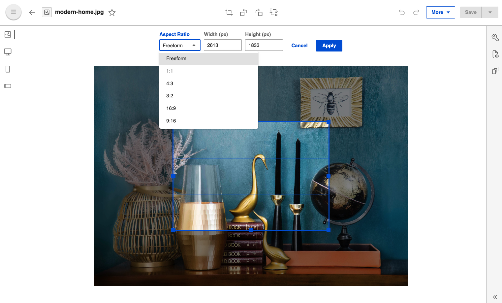

# Configure aspect ratios for crop

`cropAspectRatio` can be configured in `values.yaml` under `configurations` section of `digitalAssetManagement`.

```Yaml
configuration:
  digitalAssetManagement:
    cropAspectRatio:
      - "1:1"
      - "4:3"
      - "3:2"
      - "16:9"
      - "9:16"
      - "5:4"
```

`cropAspectRatio` is an array of aspect ratio string, which is passed to DAM as an environment variable.

Newly added aspect ratios can be seen while editing an image:


