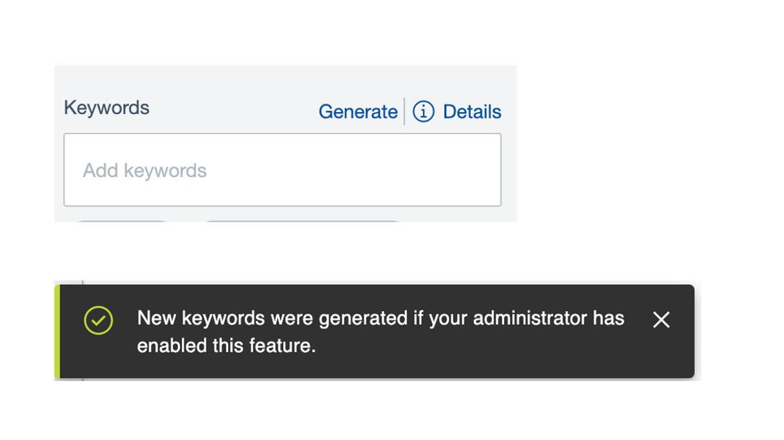
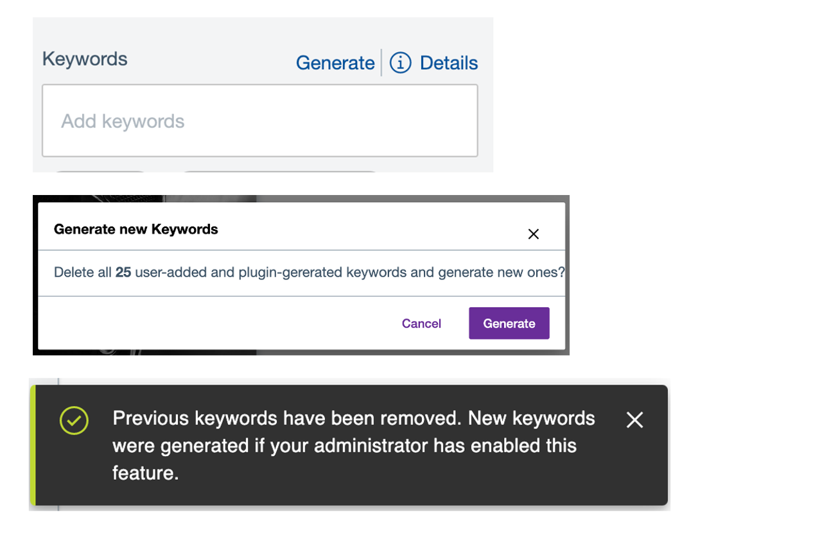

# DAM Keyword enhancements

Keywords can be generated by the Plugin enabled in DAM [Configure DAM extension to Google Vision API](configure_DAM_extension_to_google_vision_API.md). To enhance the usage, the following features are added:
- Detailed display of keywords
- Retain keywords during Save and Save as New
- Generate keywords

## Detailed display of keywords

The keyword section has the details link which shows the user-defined and plugin-generated keywords. If there are no plugin-generated keywords available, then the link will be disabled, which means either there are no keywords or keywords are user defined. If there are plugin-generated keywords, they will be displayed in a table along with the source (the plugin which generates the keyword) and the confidence percentage (Plugins confidence on the keyword based on the image provided). 

!!! note
    The confidence percentages are configurable via Helm configurations. For information, refer [Google vision plugin configuration](image_tagging.md#google-vision-plugin-configuration)

## Retain keywords during Save and Save as New

During image modifications for the original rendition on the edit page, the user would be prompted to save the image. While saving the image, the modal window will appear to alert the user and request to "Apply changes to renditions" or to "Retain existing keywords". If the user checks the "Apply changes to renditions" option, then all the previous keywords will be deleted and only the newly generated keywords will be added. And if the "Retain existing keywords" is checked, then the new keywords are generated along with the existing keywords. Irrespective of the checkbox selected, new keywords will be generated, if the plugins are enabled.

Similarly in the case of Save as new, the user would be prompted with the same "Retain existing keywords" option along with file name changes.

## Generate keywords

If the user likes to generate keywords, without any modification of the image. Users will be prompted with a modal window to confirm, delete all keywords (both user defined and plugin generated) and generate fresh. Clicking on the generate button, the keywords would be generated. Since the keywords are generated in the background, the user would need to refresh the page to see the newly generated keywords.

Also, in case if there are no Keywords available earlier, then no modal would be shown and keywords will be triggered (the user needs to refresh the page). Also, the keywords would be only generated, if the plugin is enabled. 

!!! note 
    The form data entry in the edit page will be disabled, until the page is refreshed or user move back to assets listing page and navigate back to edit.

In an ideal keyword management scenario, if a keyword is deleted by the user manually, then those deleted keywords will not be regenerated by the Plugin again. But the user would be able to manually add those keywords. In the case of generating new keywords, even if the user has deleted earlier in earlier versions, still it would be re-generated.