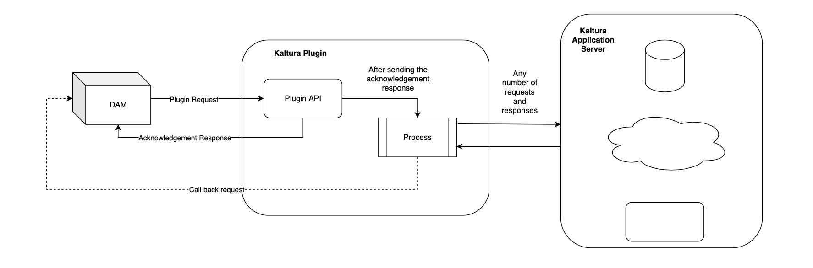
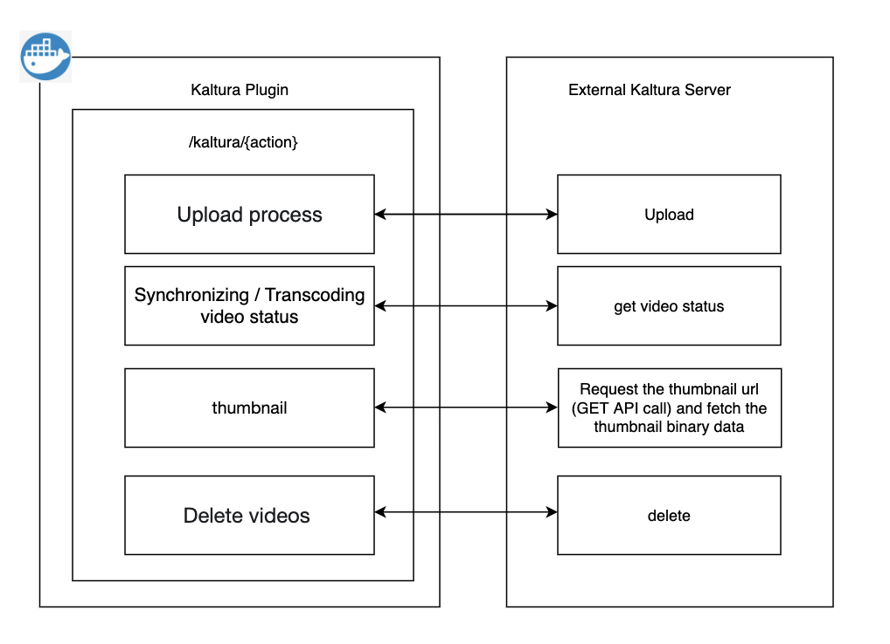

# Kaltura configuration

This section provides the steps on how the DAM extensibility allows the Kaltura plugin to follow the framework to provide interaction between DAM and actual Kaltura services.

## Architecture





## Kaltura configuration via DAM Extensibility

Following kaltura configuration changes are required to configure through DAM extensibility

**Kaltura Plugin configuration**
Under kaltura plugin configuration by default the enable flag will be set as false, the end user can enable kaltura-plugin by setting the enable flag to true.

```
{
  "kaltura-plugin": {
    "url": "http://localhost:8081/dx/api/kaltura/v1/plugin",
    "callBackHost": "http://localhost:3000",
    "authKey": "kalturaPluginSecretAuthKey",
    "playerid": "KalturaPluginPlayerId",
    "dataUrlPattern": "https://cdnapisec.kaltura.com/p/{PARTNERID}/sp/{PARTNERID}00/playManifest/entryId/{ENTRYID}/format/url/protocol/https",
    "playerLibraryUrlPattern": "https://cdnapisec.kaltura.com/p/{PARTNERID}/sp/{PARTNERID}00/embedIframeJs/uiconf_id/{PLAYERID}/partner_id/{PARTNERID}",
    "enable": false,
    "actions": {
      "upload": {
        "params": {},
        "url": "/upload"
      },
      "status": {
        "params": {},
        "url": "/status"
      },
      "resize": {
        "params": {},
        "url": "/resize"
      },
      "delete": {
        "params": {},
        "url": "/delete"
      }
    }
  }
}
```

**Kaltura Plugin Server Configurations**

- Config Map
```
{
  "thumbnailUrlPattern":string,
  "partnerId":string
}
```
!!! example
    ```
    {
      "thumbnailUrlPattern": "https://cfvod.kaltura.com/p/{PARTNERID}/sp/{PARTNERID}00/thumbnail/entry_id/{ENTRYID}/width/{WIDTH}/height/{HEIGHT}/type/3",
      "partnerId": "1234"
    }
    ```

- Video Configuration in DAM
```
{
   "video/mp4":{
      "rendition":[
         {
            "name":"Original",
            "transformationStack":[
                {
                  "plugin":"kaltura-plugin",
                  "operation":{
                     "upload":{
                       "mediaId":'',
                     }
                  }
               }
            ],
            "thumbnailStack":[
               {  
                  "plugin":"kaltura-plugin",
                  "operation":{
                     "resize":{
                        "height":192,
                        "width":192,
                         "entryId":'',
                     }
                  }
               }
            ],
            "supplementalStack":[
               {
                  "plugin":"kaltura-plugin",
                  "operation":{
                     "status":{
                       "entryId":'',
                     }
                  }
               }
            ]
         }
      ]
   },
   "video/ogg":{
      "rendition":[
         {
            "name":"Original",
            "transformationStack":[
               {
                  "plugin":"kaltura-plugin",
                  "operation":{
                     "upload":{
                       "mediaId":'',
                     }
                  }
               }
            ],
            "thumbnailStack":[
               {
                  "plugin":"kaltura-plugin",
                  "operation":{
                     "resize":{
                        "height":192,
                        "width":192,
                        "entryId":'',
                     }
                  }
               }
            ],
            "supplementalStack":[
               {
                  "plugin":"kaltura-plugin",
                  "operation":{
                     "status":{
                       "entryId":'',
                     }
                  }
               }
            ]
         }
      ]
   },
   "video/webm":{
      "rendition":[
         {
            "name":"Original",
            "transformationStack":[
               {
                  "plugin":"kaltura-plugin",
                  "operation":{
                     "upload":{
                       "mediaId":'',
                     }
                  }
               }
            ],
            "thumbnailStack":[
               {
                  "plugin":"kaltura-plugin",
                  "operation":{
                     "resize":{
                        "height":192,
                        "width":192,
                        "entryId":'',
                     }
                  }
               }
            ],
            "supplementalStack":[
               {
                  "plugin":"kaltura-plugin",
                  "operation":{
                     "status":{
                       "entryId":'',
                     }
                  }
               }
            ]
         }
      ]
   }
}
```

### Kaltura Synchronisation time interval configuration in DAM

We are using wait status in case of video synchronization. There will be 3 retries. each retry has same timeout of 2 minutes. Once all retries are finished the operation will go to FAILED status.

OPERATION_WAIT_INTERVAL is used as environment variable with default value of 2 minutes and the user can increase this value if needed. example: "OPERATION_WAIT_INTTERVAL: 120000".

## How is the configuration setup for Kaltura Plugin

The Kaltura plugin configurations are currently maintained as config maps. The user can find the kaltura-plugin.json file in the configuration folder under the Helm Package and can be deployed into DAM through the HELM upgrade.

```
configuration:
      # Configuration for Kaltura Plugin
        # File path for the kaltura plugin config JSON file
        kalturaPluginConfigFile: "configurations/kaltura-plugin.json"
```

### Plugin security Configuration
In DAM Extensibility, plugins come with the security enabled. So, the API requests are authenticated with the security key, which is transmitted and validated in every call, both for plugin and callback calls, and the user can write this in the same config file under security configuration and give the value to the authenticationKey parameter. This value is then passed for plugin configuration key attribute, so that DAM sends this with each request to authenticate.

```
   # Security related configuration, e.g. default credentials default
    # Security configuration for dam-kaltura-plugin
    damKalturaPlugin:
      # Authentication key for Plugin API
      authKey: "kalturaPluginSecretAuthKey"
      # Authentication key for Kaltura external service
      secretKey: "cnVtYWFhYm9zZS1oY2wK"
```

### List of deprecated Plugin APIs

The following DAM APIs are deprecated and no longer in use:-

- PUT: /plugins/{plugin_id} <br/>

- PATCH: /plugins/{plugin_id} <br/>

- GET: /plugins/{plugin_id} <br/>

- DELETE: /plugins/{plugin_id} <br/>

- POST: /plugins <br/>

- GET: /plugins<br/>

!!! note
    Please take a note of all Kaltura Plugin configuration details before upgrading.

<!--

## HCL Digital Experience Solution Feedback

HCL Digital Experience is interested in your experience and feedback working with HCL Digital Experience 9.5 release software. To offer comments or issues on your findings, please access the [HCL Digital Experience 9.5 Feedback Reporting application](https://www.hclleap.com/apps/secure/org/app/158bbc7c-f357-4ef0-8023-654dd90780d4/launch/index.html?form=F_Form1). -->