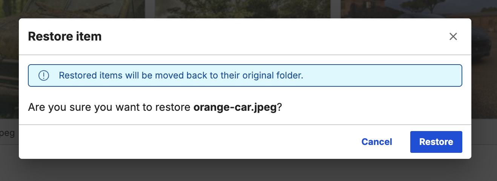
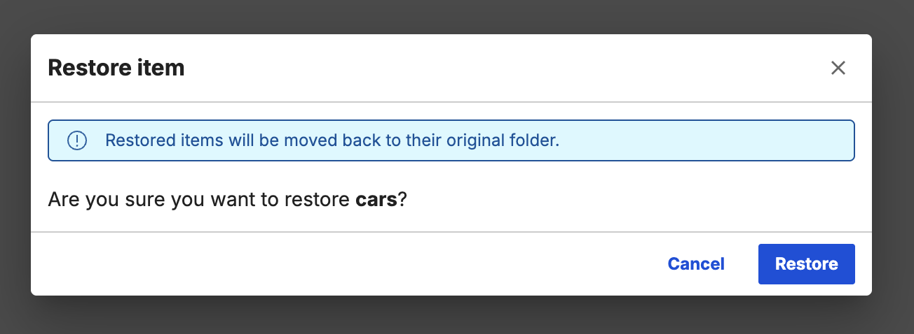
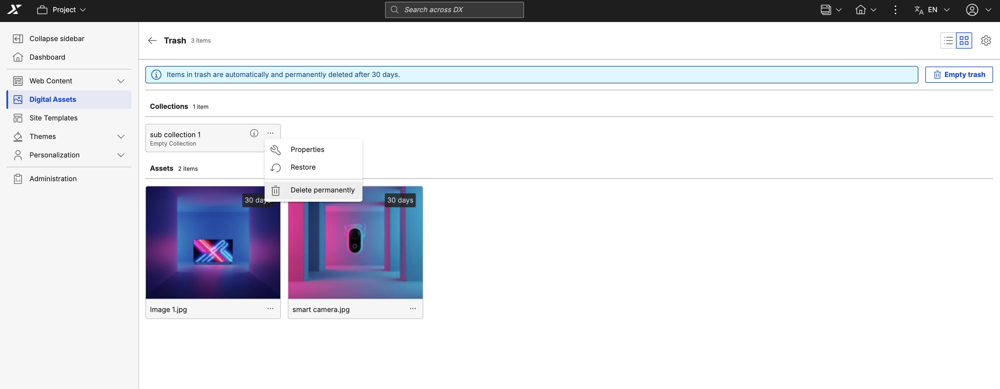
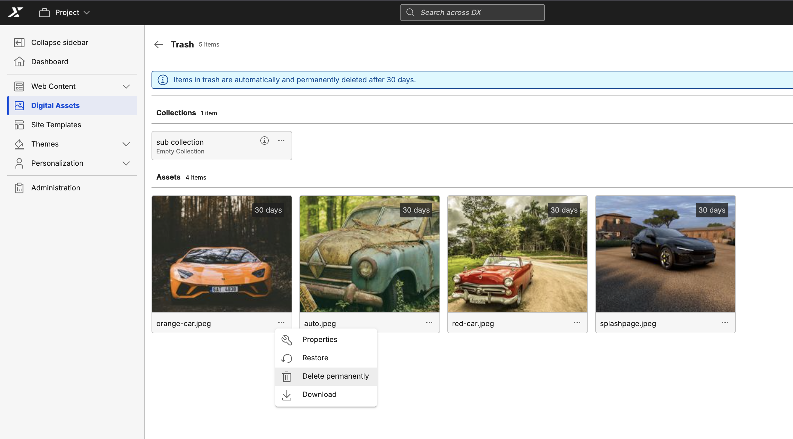
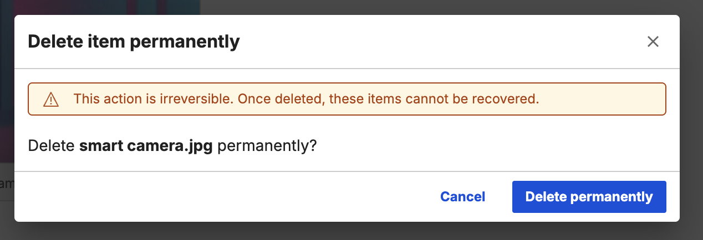
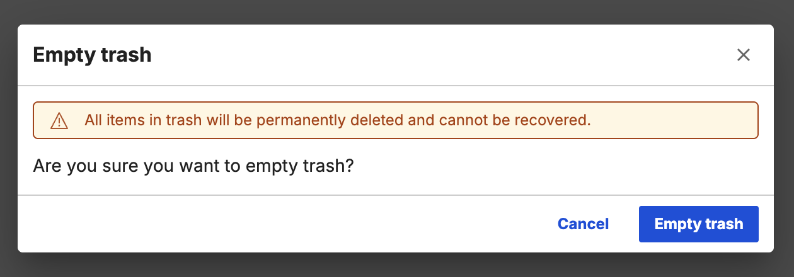

# DAM Soft Delete 
 
The Soft Delete feature helps prevent accidental deletion of assets and collections in Digital Asset Management (DAM). Instead of removing items immediately, soft delete moves them to a **Trash** state. Items in this state are hidden from standard views but remain in the database for a configurable period. Authorized users can restore items or permanently delete them.

## Soft Delete Lifecycle

### Moving an item to Trash
The system uses a **soft delete** mechanism: instead of permanent removal, items are moved to a hidden **Trash** state. It automatically records the **deletion date** and the **user** who performed the action.

**To move an item to Trash:**

1. Open the overflow menu for the asset or collection.
2. Select **Move to Trash**.
3. Confirm the action in the confirmation dialog.
4. A snackbar notification will confirm the move.

Soft-deleted items are hidden from all standard lists, search, and fetch APIs. They remain accessible only through the **Trash** view.

Items in the Trash are permanently deleted after a configurable retention period (default: 30 days). The **Days left until permanent deletion** value is displayed on each asset in the Trash view. For collections, this information is available via the **Info (i)** icon.

### Trash visibility and permissions
Access to the Trash is restricted by role:

| Role | Trash access |
|---|---|
| **Collection Admin** | Can view, restore, and permanently delete items. Can also clear all the accessible items in the trash. |
| **Editor/User** | Can view or access trash but no items would be displayed. |

The Trash can be accessed via **Settings**.

---

## Restore logic and conflict handling

### Standard restore

A Collection Admin can restore individual assets or entire collections from the Trash. Restoring a collection restores the collection and the items which are present in it while moving the collection to trash. Restore doesn't automatically restore subcollections/individual assets that were moved to the trash separately before the parent collection was soft deleted.

### Dependency rules

- **Referenced items:** Moving referenced items to the Trash makes them unavailable in linked content. A dialog box appears so the user can review references before confirming the action.
- **Nested deletions:** If a subcollection or asset is in the Trash and its parent collection is also in the Trash, restoring the subitem prompts a dialog box to select a new location.
- **Parent deletion:** If the parent collection has been permanently deleted, all child items are also permanently deleted and cannot be recovered.

### Media item restore


### Collection restore


### Name conflict resolution

If a new item with the same name is created in the original location after a soft delete, a name conflict occurs during restoration. In this case, a **Rename and restore** dialog appears, allowing the user to rename the item to resolve the conflict.

---

## Permanent deletion

### Individual permanent delete
A Collection Admin can permanently delete a specific item from the Trash at any time, bypassing the retention period. This action is irreversible.

**To permanently delete a collection/asset:**

1. Open the overflow menu for the collection/asset in trash.
2. Select **Permanently delete**.
3. Confirm the action in the confirmation dialog.
4. A snackbar notification will confirm the permanent delete.

#### Permanent delete collection


#### Permanent delete media asset



### Empty Trash
A Collection Admin can clear all items from the Trash that they have administrative access to. This permanently removes those items immediately.


### Automated Trash clearance (heartbeat)
A background heartbeat process runs at a configured interval to automatically purge items whose retention period has expired. This ensures the Trash is maintained without manual intervention.


---

## Actions available in Trash for collections and assets

- **Preview:** View the content (for image and video assets).
- **Download:** Download the content (for assets).
- **Properties:** View asset or collection metadata.
- **Restore:** Restores the asset or collection
- **Delete permanently:** Deletes the asset or collection permanently

---

## Configuration

Soft delete and Trash clearance behaviors are controlled in `values.yaml` under the `configuration.digitalAssetManagement` section:

```yaml
configuration:
  digitalAssetManagement:
    # Enable or disable automatic Trash clearance
    enableTrashClearance: true
    # Number of days before items are permanently deleted
    trashClearanceTimeInDays: 30
    # Interval (in minutes) for the clearance heartbeat
    trashClearanceHeartbeatInMinutes: 60
```

## Staging

In a Publisher/Subscriber staging setup, soft delete actions on the Publisher are propagated as hard deletes to Subscribers.

| Action on Publisher | Impact on Subscriber |
|---|---|
| **Soft delete** | Item is hard deleted immediately |
| **Restore** | Item is re-created |
| **Permanent delete** | N/A (already deleted) |

## Limitations

- Search and filtering are not available in the Trash view.
- Multi-select for bulk deletion or restoration is not supported.
- Collections in the Trash cannot be traversed; their contents cannot be browsed while the collection is soft-deleted.