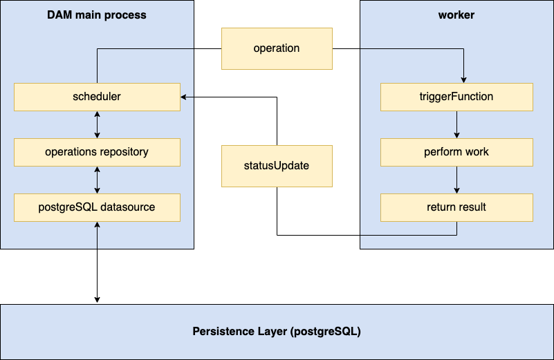

# DAM - Operations framework 

One integral part of HCL DX Digital Asset Management is the so-called "operations framework". This tooling allows DAM to run asynchronous background processes.
 
The operations framework consists of four key components:

- For storing `operations` we leverage our `DAM database`. On top of it sits a **`scheduler`** which always looks for `operations` that need to be handled and will assign those to **`workers`**. Those **`workers`** receive the `operation` to be handled from the scheduler and will return their result after being done. 


 
---
## Glossary

### Operation
A specific task that needs to be performed. Will be stored in the the DAM database and be handled by the scheduler.
### Worker
A forked task that will be created by the DAM main process. This `worker` will receive the `operation` from the DAM main process and carry out the work necessary. After the work is done, it will report back to the master. It can only handle one `operation` at a time. A worker has a metadata value called `lastTouched` which is used to determine how long a `worker` is its current state. 
### StatusUpdate
Will be send by the `workers` to the DAM scheduler to inform about the result of handling an `operation`.  
### Scheduler
The `scheduler` is the controlling mechanism of the operations framework. It takes care of creating `workers`, feeding them with `operations` to work on and ensuring expired `operations` and expired `workers` are being cleaned up.
### Scheduler heartbeat
The `scheduler heartbeat` defines the intervals in which the `scheduler` will try to claim `operations` for `workers`. This can be configured.  
## List of operations 

In the following sections, we described some of the operations that normally run in DAM. The list is not complete but should give a good understanding about which kind of task are run. 
### Failed operations clean up job

Naturally it might happen that the list of operations in the DAM database gets quite long. The operations cleanup job ensures to clean up obsolete operations to make sure the list it doesn't get cluttered. These kind of obsolete operations includes e.g. failed operations, etc. It is configurable for how long obsolete operations will be kept before they get finally cleaned up.
-   Naturally it might happen that the list of operations in the DAM database gets quite long. The operations cleanup job ensures to clean up obsolete operations to make sure the list it doesn't get cluttered. These kind of obsolete operations includes e.g. failed operations, etc. It is configurable for how long obsolete operations will be kept before they get finally cleaned up.
#### Configuration attributes in `values.yaml` 

- Maximum threshold time

`failedOperationThresholdTimeHours` determines the maximum threshold time for failed operation jobs after which failed operation will be deleted. 

```yaml
configuration:
  digitalAssetManagement:
    failedOperationThresholdTimeHours: 24
```

- Threshold limit of records

`failedOperationThresholdLimitRecords` determines maximum threshold limit of failed operation job records. If the threshold is met, failed operation will be deleted.

```yaml
configuration:
  digitalAssetManagement:
    failedOperationThresholdLimitRecords: 20000
```