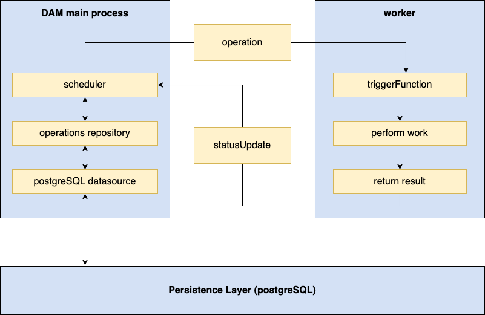

# Operations framework 

One integral part of HCL DX Digital Asset Management is the so-called "operations framework". This tooling allows DAM to run asynchronous background processes.
 
The operations framework consists of four key components:

- For storing `operations` we leverage our `DAM database`. On top of it sits a **`scheduler`** which always looks for `operations` that need to be handled and will assign those to **`workers`**. Those **`workers`** receive the `operation` to be handled from the scheduler and will return their results after being done. 


 
---
## Glossary

### Operation
A specific task that needs to be performed. Will be stored in the DAM database and handled by the scheduler.
### Worker
A forked task will be created by the DAM main process. This `worker` will receive the `operation` from the DAM main process and carry out the work necessary. After the work is done, it will report back to the master. It can only handle one `operation` at a time. A worker has a metadata value called `lastTouched` which is used to determine how long a `worker` is in its current state. 
### StatusUpdate
Will be sent by the `workers` to the DAM scheduler to inform about the result of handling an `operation`.  
### Scheduler
The `scheduler` is the controlling mechanism of the framework of the operations. It takes care of creating `workers`, feeding them with `operations` to work on and, ensuring expired `operations` and expired `workers` are being cleaned up.
### Scheduler heartbeat
The `scheduler heartbeat` defines the intervals in which the `scheduler` will try to claim `operations` for `workers`. This can be configured.  
## List of operations 

In the following sections, we described some of the operations that normally run in DAM. 

## Rendering & Media Processing Operations

| Operation | Description |
|------------------|-------------|
| **prepareRenditions** | Triggers rendition generation by mapping the detected MIME type to its predefined configuration. |
| **generateVersion** | Initiate versions generation for each renditions for different uses - such as a smaller version for mobile phones, a medium version for tablets, and a large version for computer screens. |
| **generateThumbnail** | Creates a small preview image (like a snapshot) of your media that shows up in lists and search results. For videos, it grabs a key moment from the video to display. For images, it shows a preview. Your original file's thumbnail is created first so you can see a preview right away. |
| **generateSupplement** | Creates alternative versions of your media such as HD or 4K archive versions, lower-quality versions for slower internet connections, or different format variations for better browser compatibility. |
| **generateKeyword** | Automatically reads the content of your media file and extracts searchable keywords and topics. For images, it can read text in the image. For documents, it finds key terms. For videos, it can analyze transcripts if available. This makes your media easier to find through search. |

## Metadata Operations

| Operation | Description |
|------------------|-------------|
| **generateMetaData** | Automatically extracts and reads detailed information about your media file such as dimensions, duration, color information, camera settings, author information, and creation dates. This information helps organize and understand your media without manual entry. |
| **updateMetaData** | Saves the automatically extracted file information into your media records so it can be searched and referenced. Creates a record of when the information was updated and by whom. |
| **validateThumbnail** | Checks that thumbnail previews meet quality standards - ensuring they're the correct size, proper format, and display correctly without damage or corruption. If a thumbnail fails quality checks, it can be regenerated. |

## Cleanup & Maintenance Operations

| Operation | Description |
|------------------|-------------|
| **cleanupMedia** | Removes temporary and unused files related to media after deletion or when processing fails. Frees up storage space by deleting temporary chunks, failed processing files, and cache files that are no longer needed. |
| **cleanupCollections** | Removes empty collection records and cleans up the relationships between collections and media items, particularly after deletions or moves. Keeps the collection structure organized and prevents orphaned entries. |
| **deleteOrphanDirectoryAndMedia** | Finds and removes "lost" files and folders that exist on the storage but don't have any record in the system database. This helps recover from failed uploads or corrupted data situations. |
| **deleteOrphanMediaStorage** | Removes storage records for media files that no longer exist as active items in the system. Prevents broken references and keeps the database clean after deletions. |
| **clearTrash** | Permanently deletes items that were deleted 30 days ago (configurable). Soft-deleted items stay for a recovery period before being completely removed. This operation cleans them up to free space when the retention period expires. |

## Delete Operations

| Operation | Description |
|------------------|-------------|
| **deleteMedia** | Marks a media item as deleted and moves it to trash. The file isn't actually removed yet - it stays in the system for 30 days so you can recover it if needed. All associated items like thumbnail versions, copies, and collection references are also marked for deletion. |
| **deleteStorage** | Permanently removes the actual media files from storage after they've been marked for deletion. This frees up disk space but happens only after deleteMedia has confirmed the deletion. |
| **deleteCollection** | Deletes a collection and everything in it - including all sub-collections and all media items within. Like deleteMedia, items are soft-deleted first and stay recoverable for 30 days before permanent removal. |
| **deleteOperations** | Removes old operation records from the system to prevent the operations log from growing too large. Failed operations are kept for 24 hours, successful ones are archived quickly. |
| **deleteIndexedDocumentsByQuery** | Removes deleted items from the search index so they no longer appear in search results. Keeps the search index synchronized with what's actually in the system. |

## Indexing & Search Operations

| Operation | Description |
|------------------|-------------|
| **initiateInitialIndexing** | Creates the search index for the first time or rebuilds it after corruption. Scans all media and collections to make them searchable. This is a large operation that may take time for systems with many items. |
| **initiateReIndexing** | Completely rebuilds the search index from scratch, removing old stale entries and re-indexing everything. Used when improving search functionality or recovering from serious search issues. |
| **processAssetsForIndexing** | Prepares batches of media items to be added to the search index. Groups items together for efficient batch processing. |
| **processAssetsForLiveIndexing** | Adds newly uploaded or modified media to the search index immediately so it appears in search results right away (within a few seconds). |
| **processAssetsDocumentBuilding** | Converts media item information into the structured format needed for search indexing. Extracts searchable text, keywords, and categories. |
| **invalidateIndexedContent** | Marks indexed content as needing to be updated when configuration changes or bulk updates occur. Triggers re-indexing on the next cycle. |
| **processCollectionsForIndexing** | Adds collection hierarchy and metadata to the search index so collections can be searched and used for filtering. |
| **processCollectionsDocumentBuilding** | Converts collection information into the structured format needed for search indexing. |
| **processAssetForDeletion** | Removes deleted media from the search index so it no longer appears in search results. |

## Version Management Operations

| Operation | Description |
|------------------|-------------|
| **versionRetention** | Automatically removes old versions of media files when you exceed your version limit. For example, you might keep only the 3 most recent versions. Very old versions that have been kept for a minimum period are cleaned up first. |
| **regenerateRenditionOrVersion** | Triggers the regeneration of missing asset renditions and versions, provided the 'Cleanup' flag is enabled in the system configuration. |

## Upload & Post-Actions Operations

| Operation | Description |
|------------------|-------------|
| **schedulePostActions** | Orchestrates all the automatic tasks that happen after you upload a file. These tasks run in sequence: extracting file information, generating different sizes and formats, creating thumbnails, making it searchable, and ready for use. This is the main operation that kicks off all the file processing. |
| **trackMediaState** | Continuously updates the status of your media as it's being uploaded and processed. Provides progress information to the user interface so users can see what stage their upload is at (uploading, processing, ready, or failed). |

## Staging & Synchronization Operations

| Operation | Description |
|------------------|-------------|
| **syncStagingCollectionContent** | Synchronizes collection information (names, descriptions, folder structure) between two separate DAM systems to keep them in sync. Used when you have a test/staging system and a production system. |
| **syncStagingMediaContent** | Copies media file information from one DAM system to another including names, descriptions, keywords, and properties. |
| **syncStagingRenditionContent** | Sync renditions for assets from publisher to subscriber in staging set up. |
| **syncStagingVersionContent** | Sync versions for assets from publisher to subscriber in staging set up. |
| **syncStagingPermissionResource** | Copies user permissions and access control settings between systems so the same people have access to the same items in both places. |
| **syncStagingCreatePermission** | Sets up new user permissions on copied items when they don't have permissions set up yet in the target system. |
| **syncStagingDeletePermission** | Removes user permissions from items when they've been revoked in the source system. |
| **syncStagingRoleBlock** | Copies user role definitions (like "Editor", "Viewer", "Admin") between systems. |
| **syncStagingFavoriteContent** | Copies each user's favorite items between systems so favorites appear on both. |
| **syncStagingMediaTypeContent** | Copies media type definitions (like image, video, document) and their settings between systems. |
| **syncStagingMediaTypeGroupContent** | Copies media type grouping categories (like "all images", "all videos") between systems. |
| **initiateNextSync** | Schedules and starts the next synchronization cycle between systems. |
| **initiateCollectionTreeTraversal** | Identifies which collections and items need to be synchronized by walking through the entire collection structure. |
| **findStagingPermissionsMismatch** | Checks if permissions are different between two systems and reports what doesn't match. |
| **compareRecords** | Determines if an item has changed and needs to be synchronized between systems. |
| **processCollection** | Prepares a single collection to be synchronized including all its media and permissions. |
| **processCollectionItems** | Prepares all media items in a collection for synchronization. |
| **resyncSubscriber** | Re-attempts synchronization for items that failed during a previous sync attempt, ensuring everything eventually gets synced. |

## Content Management Operations

| Operation | Description |
|------------------|-------------|
| **contentCreateUpdate** | Creates notifications when media or collections are created or changed. These notifications alert other systems (like websites or publishing platforms) about the changes so they can update their information too. |
| **contentDelete** | Sends notifications when items are deleted so other connected systems know to clean up their references. |
| **purgeEvents** | Removes old event records from the activity log to prevent it from growing too large. Event history is kept for 90 days before being archived. |
| **updateSyncStatus** | Updates progress information during synchronization between systems. Shows whether sync is in progress, completed successfully, or encountered problems. |

## Kaltura Video Integration Operations

| Operation | Description |
|------------------|-------------|
| **Kaltura Plugin** | Manages video integration with Kaltura (a video hosting service) including upload, delete, thumbnail generation, and status synchronization. Automatically uploads videos to Kaltura after upload to DAM, manages renditions and thumbnails, removes videos when deleted from DAM, and keeps metadata synchronized between both systems. |

---

### Failed operations clean up job

Naturally, it might happen that the list of operations in the DAM database gets quite long. The operations cleanup job ensures to clean up obsolete operations to make sure the list doesn't get cluttered. This kind of obsolete operations includes e.g. failed operations, etc. It is configurable for how long obsolete operations will be kept before they get finally cleaned up.
-   Naturally, it might happen that the list of operations in the DAM database gets quite long. The operations cleanup job ensures to clean up obsolete operations to make sure the list doesn't get cluttered. This kind of obsolete operations includes e.g. failed operations, etc. It is configurable for how long obsolete operations will be kept before they get finally cleaned up.
#### Configuration attributes in `values.yaml` 

- Maximum threshold time

`failedOperationThresholdTimeHours` determines the maximum threshold time for failed operation jobs after which failed operations will be deleted. 

```yaml
configuration:
  digitalAssetManagement:
    failedOperationThresholdTimeHours: 24
```

- Threshold limit of records

`failedOperationThresholdLimitRecords` determines the maximum threshold limit of failed operation job records. If the threshold is met, the failed operations will be deleted.

```yaml
configuration:
  digitalAssetManagement:
    failedOperationThresholdLimitRecords: 20000
```
