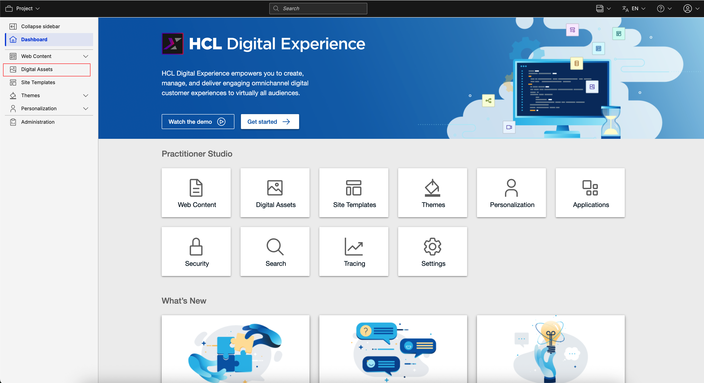
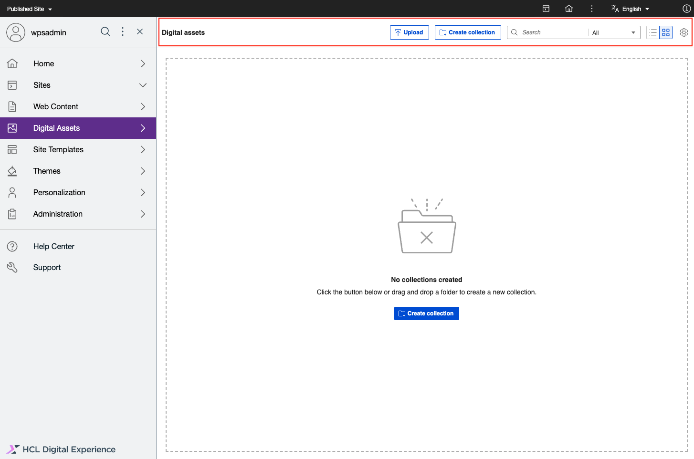
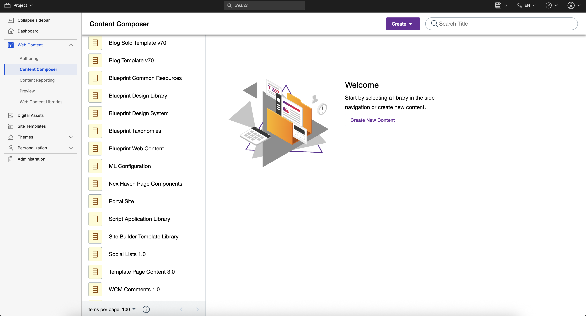
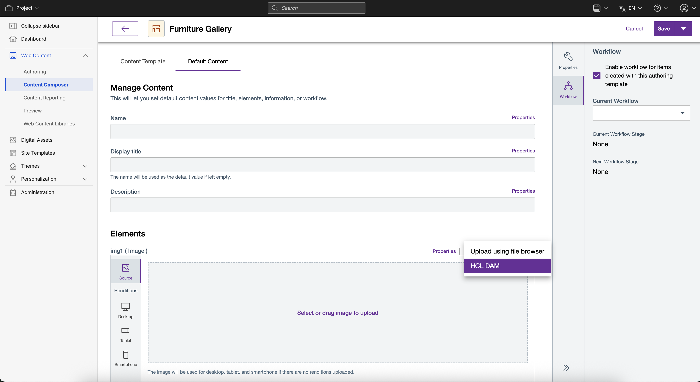

# Access HCL Digital Asset Management

This section provides the steps on how to access HCL Digital Asset Management \(DAM\) and use it as a central platform to store and include rich media assets. Using the HCL Digital Experience 9.5 Digital Asset Management features, users can upload, browse, and search for media files, edit images and metadata, and manage collections and media access.

## Prerequisite

HCL DAM should be installed and configured to HCL Digital Experience 9.5 Container Release Update CF181 and later.

-   For Operator-based deployments, see the [Install the HCL Digital Experience 9.5 Container components](../installation/install_config_dam.md) topic for instructions on container components.
-   For Helm-based deployments, see the [Deploying DX 9.5 applications to container platforms using Helm](../../../get_started/plan_deployment/container_deployment/application_architecture.md) topic for instructions on deploying applications

!!! note 
    If you are using a content delivery network \(CDN\) such as [Akamai](https://www.akamai.com/our-thinking/cdn/what-is-a-cdn), using `Vary: Origin` may prevent you from caching content. To bypass this limitation, your CDN configuration must strip the `Vary` header on the way in, to reinstate your ability to cache content. On the way out, you can append the `Origin` parameter to the `Vary` header when serving a response using **'Modify Outgoing Response Header'**.

## Access HCL DAM from Practitioner Studio

Follow these steps to access HCL Digital Experience 9.5 DAM from the Practitioner Studio:

1.  In the HCL Digital Experience 9.5 Practitioner Studio interface, select **Digital Assets** from the navigator.

    

    DAM can also be accessed via **Digital Assets** tile on the Practitioner Studio page.

2.  In the DAM user interface, the DAM features are displayed on the top bar of the page.

    

## Access HCL DAM from Content Composer

Content authors can access and use the DAM media assets when creating content using Content Composer or Web Content Manager, which uses content templates with image elements.

Follow these steps that describes how to access DAM assets when creating web content in Content Composer.

1.  In the HCL Digital Experience 9.5 Practitioner Studio interface, select **Web Content** and then **Content Composer** from the navigator.

    

2.  Select a content template with the **Image** element configured to it, for example, **Furniture Gallery**.

    

    Options are presented in the template **Image** element to drag and drop an image to the page or access DAM media items.

3.  Select the **Digital Asset Management** source then view the **Collections** you have access to. From the available **Collection** media items, select the item to add to your content page.

    

4.  Select the **Access** icon to assign levels for other users to access media items stored within the Collection.
5.  Complete the remaining elements in the Content item template as required and click **Save**. Select a **Location** of your Digital Experience site to present the content item, including the media asset from your Digital Asset Management repository.

## Access HCL Digital Asset Management from WCM Authoring Portlet or Inline Editing

Content authors can access and use DAM media items when creating or editing content, components, or content templates in the Web Content Manager authoring portlet or inline editing. Both the image and the file components and elements can be configured to use DAM as the source.

To enable users to use DAM as the source while editing the content, use one of the following options:

-   Remove the existing image or file from the content and then select a new image from DAM.
-   In the **Image field properties** window, select the **Show digital asset source** check box, and then select HCL DAM in the **Digital asset source** drop-down list.

    

<!-- ???Info "Related information:"
    - [Configuring a web content authoring environment](../../wcm/wcm_install_cfgauthoring.md)
    - [Digital Asset Management persistence architecture](../../containerization/dam_persistence_architecture.md) -->
