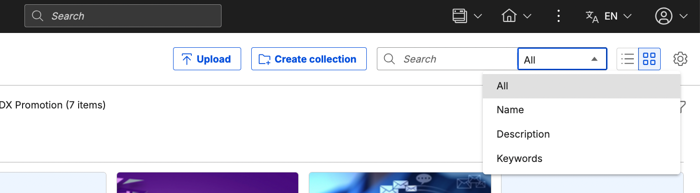

# DX Content Picker for DAM

## Overview  

The Digital Asset Content Picker provides a consistent interface you can use in any application to search for and select an asset. This unified experience makes it easier to find, preview, and insert digital assets without switching tools or workflows. For more information, see [Using DX Picker](https://help.hcl-software.com/digital-experience/9.5/CF229/manage_content/wcm_authoring/dx_picker/usage/).  

  

## HCLSoftware U learning materials

For an introduction and a demo on how to use Digital Asset Management, go to [Digital Assets](https://hclsoftwareu.hcl-software.com/component/axs/?view=sso_config&id=3&forward=https%3A%2F%2Fhclsoftwareu.hcl-software.com%2Fcourses%2Flesson%2F%3Fid%3D302){target="_blank"}.  try it out yourself, refer to [Digital Asset Management Lab](https://connect.hcltechsw.com/communities/service/html/communityview?communityUuid=8cc19fe0-5502-44bb-b00d-dd2b0a51b905#fullpageWidgetId=W7e4dd2688512_4322_ac5f_64c78f420c04&folder=8d35342c-82e0-4003-9e8d-9b0b1af6b304){target="_blank"} and corresponding [Digital Asset Management Lab Resources](https://hclsoftwareu.hcl-software.com/images/Lc4sMQCcN5uxXmL13gSlsxClNTU3Mjc3NTc4MTc2/DS_Academy/DX/Business_User/HDX-BU-100_Digital_Asset_Management_Lab_Resources.zip).
