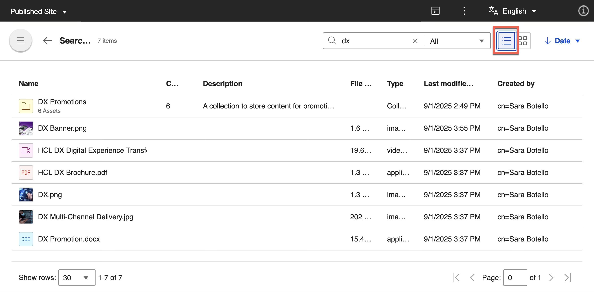

# Using DAM
Upload, manage, and modify rich media assets and collections using HCL Digital Asset Management (DAM).

- **[Accesing DAM](./access_digital_asset_mgmt.md)**  
This section provides the steps on how to access HCL DAM and use it as a central platform to store and include rich media assets.
- **[Managing DAM](./managing_dam/index.md)**  
This section provides topics on how to manage, upload, import, export, and modify your DAM media assets.

## Upload, update, use, and search digital assets

After you create your access-controlled collection, you can upload digital assets, update them, and search for them.

### Upload assets

1. Drag and drop your files into the upload area, or select one of the **Upload** options.  
2. Browse to the **Lab Resources** folder on your desktop at `HDX-BU-100 Digital Asset Management Resources`.  
3. Select all files in the folder, and then select **Open**.  
4. In the status bar, select the **View upload details** icon to see the status and size of the uploaded assets.  

Your assets are now uploaded to the DAM collection. You can view the resource details or close the details window by selecting **X**.

### Update an image asset

1. Find the file **DX Banner.png**, open its menu, and select **Edit**.  
2. Select the **Properties** icon, and then add metadata to make the asset easier to find and reuse:  
    - Title  
    - Description  
    - Alternate text  
    - Keywords (optional)  

   Review any automatically generated keywords, if configured.  
3. Expand the **URL** section. Note the UUID and friendly URLs. Add a custom URL, for example `https://dx.sbx0000.play.hclsofy.com/dx/api/dam/custom/dxbanner.png`. This generates a link.  

4. On the left, review the automatically generated renditions for **Desktop**, **Smartphone**, and **Tablet**.  
5. Select **View smartphone rendition**. The image is reduced to 121 KB (from 1.6 MB).  
6. To crop the smartphone rendition:  
    - Select the **Crop** icon.  
    - Choose the aspect ratio, width, and height.  
    - Drag the selection to the desired area.  
    - Select **Apply**.  
7. Select **Save**. The updated rendition shows a new file size.  

### Review versions

1. Select the **Versions** icon.  
2. Open the details for each version to see who made changes and when. You can also view older versions.  
3. From the **More** menu, select **Compare with current version**.  
4. Download a version or make an older version current.  

### Mark as a favorite

To help locate the asset later, mark it as a favorite by selecting the **Favorite** icon.  

### Search and view assets

1. In the search bar, enter **dx**, and then press **Enter**. Results include all collections and assets containing “dx.”  
2. Use the **Filter** menu to refine results.  
3. Change the view options:  
    - Select the **Grid view** (default) or **List view** icon.  
    
    - Apply different sort options.  

---

**Congratulations!** You’ve uploaded, updated, and searched for assets in a DAM collection.  

## HCLSoftware U learning materials

For an introduction and a demo on how to use Digital Asset Management, go to[Digital Assets](https://hclsoftwareu.hcltechsw.com/component/axs/?view=sso_config&id=3&forward=https%3A%2F%2Fhclsoftwareu.hcltechsw.com%2Fcourses%2Flesson%2F%3Fid%3D302){target="_blank"}.  try it out yourself, refer to [Digital Asset Management Lab](https://connect.hcltechsw.com/communities/service/html/communityview?communityUuid=8cc19fe0-5502-44bb-b00d-dd2b0a51b905#fullpageWidgetId=W7e4dd2688512_4322_ac5f_64c78f420c04&folder=8d35342c-82e0-4003-9e8d-9b0b1af6b304){target="_blank"} and corresponding [Digital Asset Management Lab Resources](https://hclsoftwareu.hcltechsw.com/images/Lc4sMQCcN5uxXmL13gSlsxClNTU3Mjc3NTc4MTc2/DS_Academy/DX/Business_User/HDX-BU-100_Digital_Asset_Management_Lab_Resources.zip).

