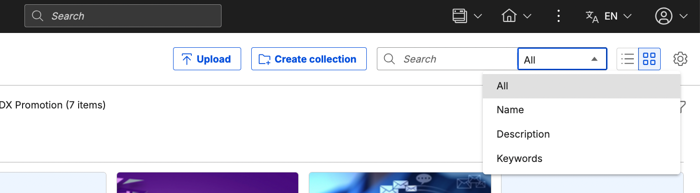
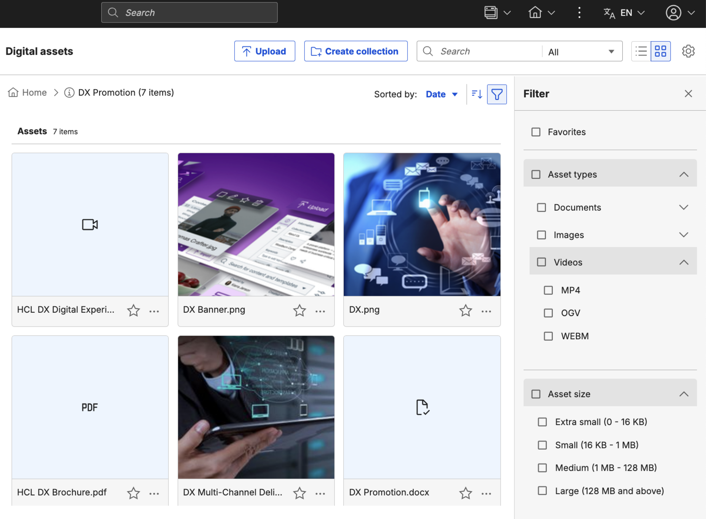
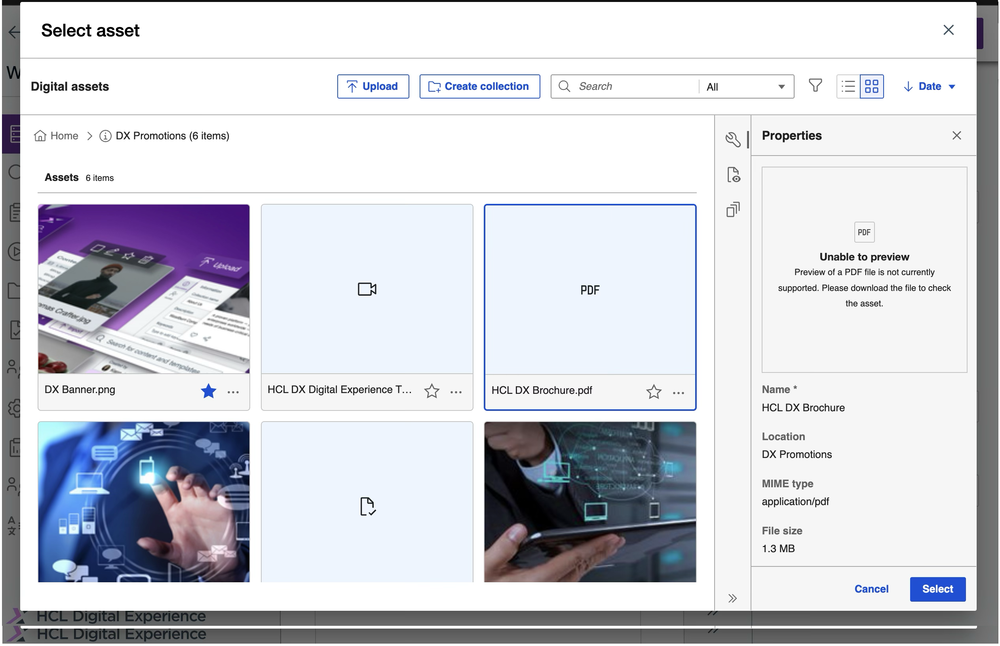

# Using DAM
Upload, manage, and modify rich media assets and collections using HCL Digital Asset Management (DAM).

- **[Accesing DAM](./access_digital_asset_mgmt.md)**  
This section provides the steps on how to access HCL DAM and use it as a central platform to store and include rich media assets.
- **[Managing DAM](./managing_dam/index.md)**  
This section covers how to manage, upload, import, export, and modify your DAM media assets.

## Digital Asset Search
### Overview

The DX Digital Asset Search helps you quickly find and retrieve digital assets across multiple repositories. You can search by keyword, metadata, or content to locate the right asset when needed. The unified search experience streamlines content management and makes assets easier to discover and reuse in your applications.

### Steps

1. Find your assets by using full-text search on the name, description, keywords, or all of them.  

   

2. Sort and order the results.  

   

   Sort from newer to older:  

   

   Sort from older to newer:  

   

3. Filter the assets.  

   The filtering options let you filter assets by favorites, asset type, and asset size.  

   

## DX Picker Overview

The Digital Asset Content Picker provides a consistent interface that you can use in any application to search for and select an asset. This unified experience makes it easier to find, preview, and insert digital assets without switching tools or workflows. For more details, refer to [Using DX Pcker](https://help.hcl-software.com/digital-experience/9.5/CF229/manage_content/wcm_authoring/dx_picker/usage/).

## HCLSoftware U learning materials

For an introduction and a demo on how to use Digital Asset Management, go to[Digital Assets](https://hclsoftwareu.hcltechsw.com/component/axs/?view=sso_config&id=3&forward=https%3A%2F%2Fhclsoftwareu.hcltechsw.com%2Fcourses%2Flesson%2F%3Fid%3D302){target="_blank"}.  try it out yourself, refer to [Digital Asset Management Lab](https://connect.hcltechsw.com/communities/service/html/communityview?communityUuid=8cc19fe0-5502-44bb-b00d-dd2b0a51b905#fullpageWidgetId=W7e4dd2688512_4322_ac5f_64c78f420c04&folder=8d35342c-82e0-4003-9e8d-9b0b1af6b304){target="_blank"} and corresponding [Digital Asset Management Lab Resources](https://hclsoftwareu.hcltechsw.com/images/Lc4sMQCcN5uxXmL13gSlsxClNTU3Mjc3NTc4MTc2/DS_Academy/DX/Business_User/HDX-BU-100_Digital_Asset_Management_Lab_Resources.zip).

