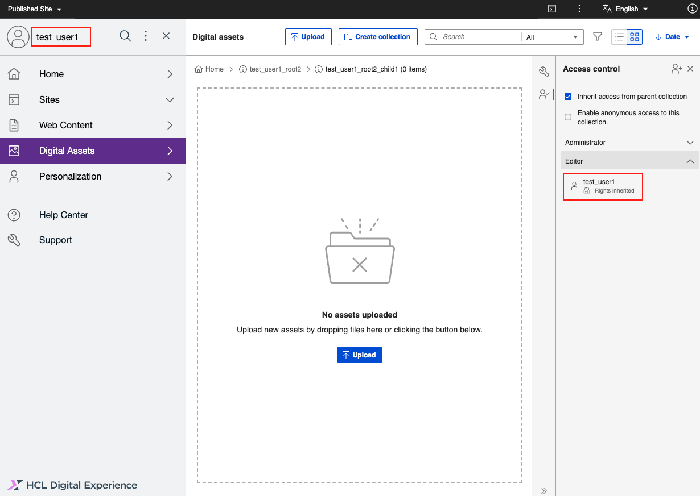
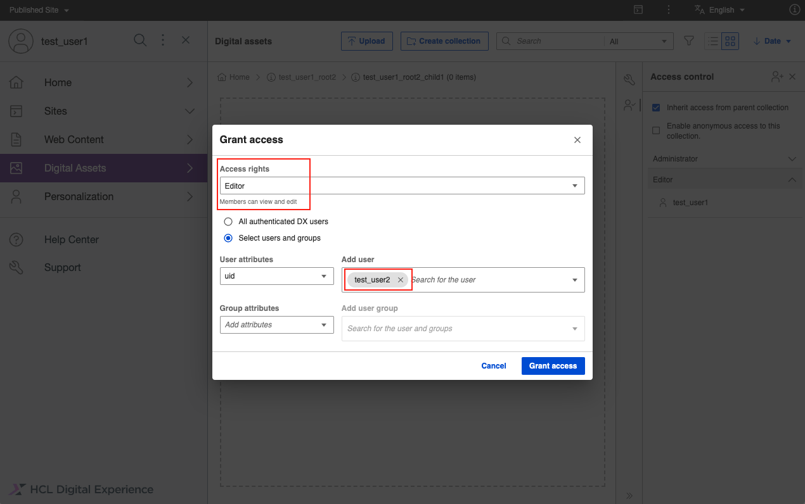
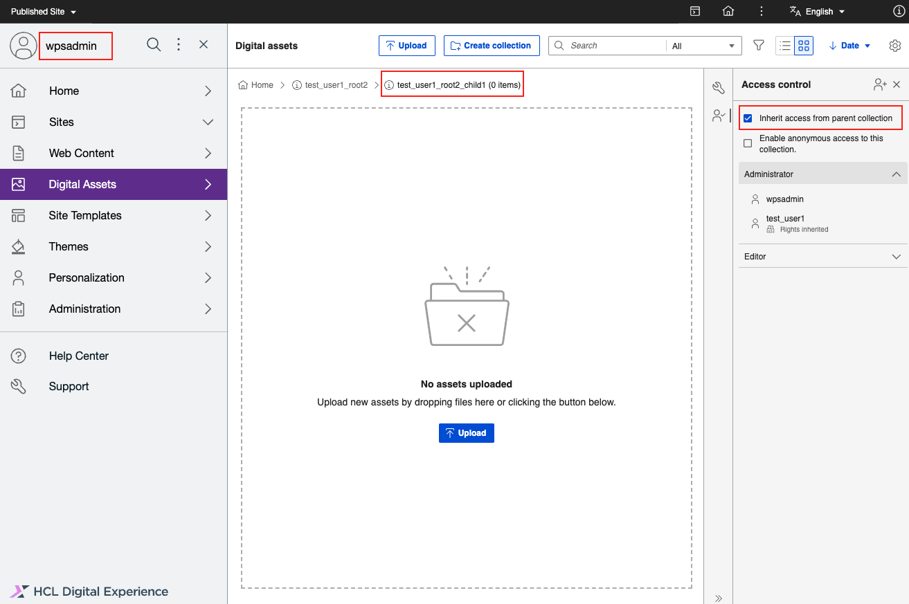
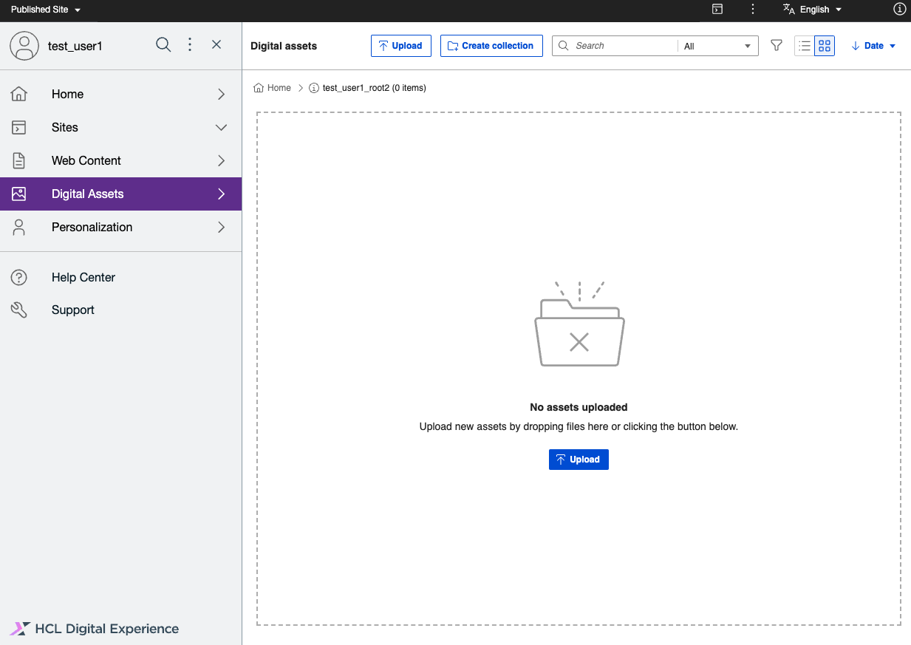
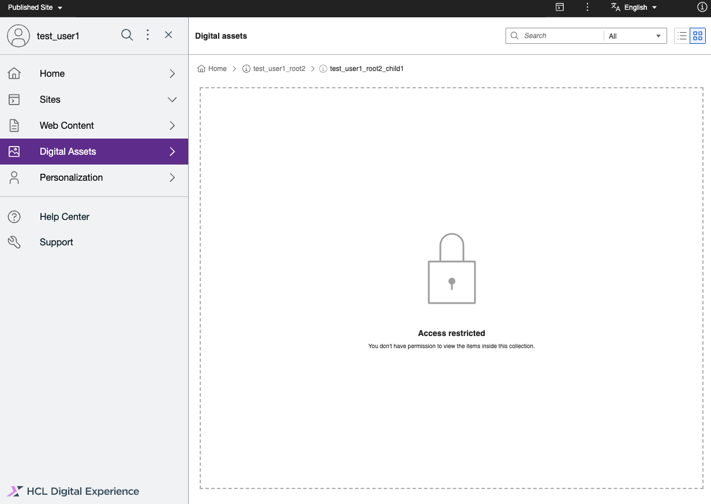
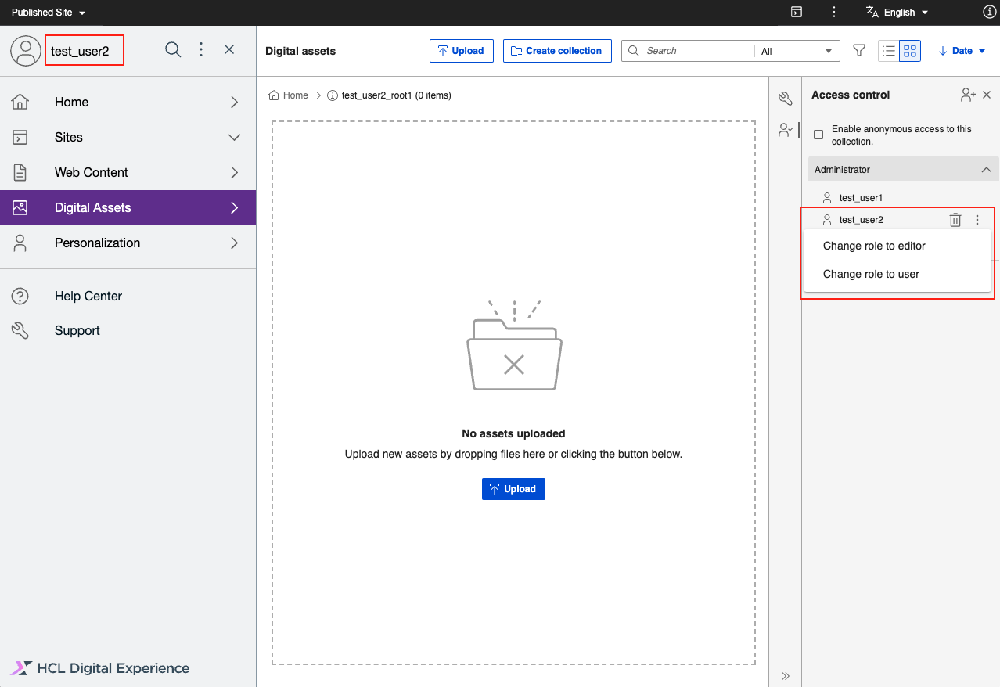
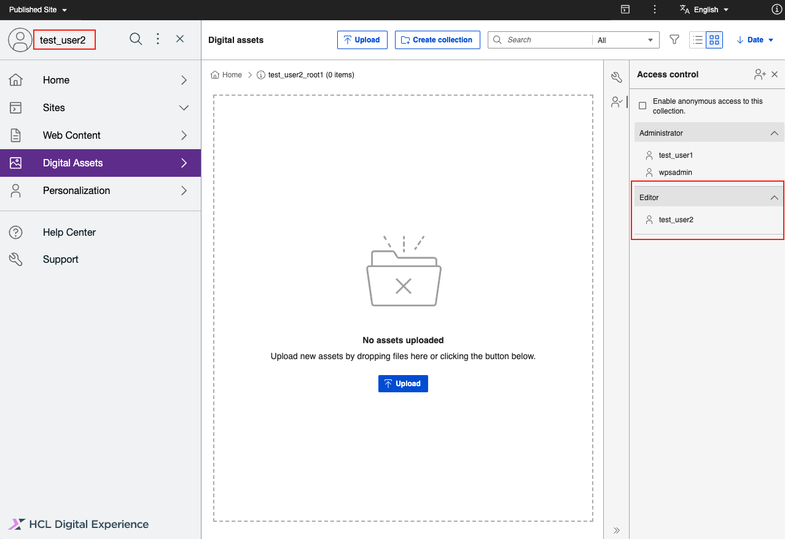

# DAM Access Control Management

This topic describes the details of Digital Access Management (DAM) access control, its features and limitations and also on how to assign permission to Users through the DAM user interface.

## Overview on DX Portal Access Control for DAM

DX Portal Access Control follows an inheritance based tree structure. DAM is part of that tree just like WCM or Portal Pages. 
At the top of the tree is the virtual Resource Portal, and below it is the virtual resource DAM. Below DAM are the resource instances (the collections) you are registering with its children. By assigning a role on a resource to a user, the user gets permission for the resource and its children.

For DAM, only a subset of the roles is exposed. Possible role types are User (view only), Editor (view, edit, create), and Administrator (view, edit, create, delete, set/remove access). Other roles existing in Portal Access Control like Manager or Privileged User are not exposed.

!!! note
    Currently, only highlighted roles (Administrator, Editor, User) are applicable in DAM.


## Overview on DAM Collection Access Control

DAM collection is accessible by the currently logged in user based on his role and the access is managed by DX Portal Access Control as mentioned. 

!!! note
    Currently, only Administrator, Editor, and User roles are exposed in DAM UI. The user creating the collection gets explicitly assigned the Administrator role on the collection. By default, all nested collections inherit the permissions from the root collection. However, you can modify these permissions.

### DAM Access Control in detail

From the DAM perspective, each individual root-level collection and child collection is a resource instance that can be administered.

- User role: The user can view items in the collection and the collection itself as well as child collections.
- Editor role: All permissions of the User role plus the user can edit collection details as well as upload items.
- Administrator role: All permissions of the User and Editor role plus the user can view, create, edit, and delete a collection, delete items in a collection and he can assign/remove permission for other users as well on the collections.

A user that creates a root collection gets the Administrator role on the collection and so can do anything with that collection as indicated above.

See the [Out of the box access](#Out-of-the-box-access) section, to understand how the default access works for a collection.

!!! note
    The Manager Role is not exposed in DAM UI currently.

To be able to create new root collections the Editor role or higher of the virtual resource DIGITAL ASSET MANAGEMENT is required.

Also, note that if the user has given a User/Editor role to any collection which is not created by him, that user can not modify the access permissions of that collection.


## Out-of-the-box access

After installation, all Authenticated User Group is assigned to the Manager role of the virtual resource DIGITAL ASSET MANAGEMENT and propagation is blocked. With that, every authenticated user can create a root collection (and when doing that gets the Administrator role for that collection) but does not have access to other collections he did not create. You can change this as desired on the virtual resource.

## Assigning permission to user

In DAM, the user can assign permission to a collection tree at the root level if he has administrator permission for the root collection as below.


## Nested collection permissions

A nested collection inherits the permission from its root collection by default. In the following screenshot, the Editor permission is inherited from the root collection.



In DAM, users can assign permission to a nested collection if they have Administrator permission for the root collection.



Permissions are inherited from root to the nested collection because the **Inherit access from parent collection** checkbox is selected by default.



If the **Inherit access from parent collection** checkbox is cleared by the Administrator, then the inherited permission for the nested collection is removed and users are not able to view the nested collection.



## Access Control Traversal for nested collections

For access control in nested collections, if the user has access to the child collection but not the parent, then the parent collection is not visible to the user. Hence, user cannot navigate to the child collection to perform any operations. To overcome this, a new configuration called Access Control (ACL) Traversal is introduced.

ACL Traversal allows users to view collections across DAM, but they cannot modify or view media items and the access panel unless they have access to that collection. Users can only navigate by clicking the parent collection to reach the child collection for which the user has access to. This configuration is an application-level configuration that you can enable or disable through Helm. By default, ACL traversal is disabled:

```
# Application Configuration
configuration:
  digitalAssetManagement:
    aclTraversal: false
```

To enable, set `aclTraversal` to `true`. With ACL Traversal enabled, users can traverse across all the root collections and nested collections even if they do not have the required permission for the collections. However, they cannot view the media items under these collections.



When an Administrator clears the **Inherit access from parent collection** checkbox, user and editor permissions are blocked for the collection and items within that collection. If the **Inherit access from parent collection** checkbox is selected, user and editor permissions for the collection are granted.

Below API endpoint is used to achieve the role block.

!!! note       
    You can use the [Update Resource Config API](https://opensource.hcltechsw.com/experience-api-documentation/ring-api/#operation/accessUpdateResourceConfig) to set or remove permissions for the collections. The default mode for the endpoint is set to update.

## Changing Permissions on the collection tree for the users

You can change collection permissions for any user from Administrator to Editor or User or vice versa.


## Downgrading Self Permission

Downgrading self permission from Administrator to Editor or User will remove authority to upgrade back to Administrator as you can see below. In this case, the Administrator or Super Admin should add you back as Administrator if needed.




