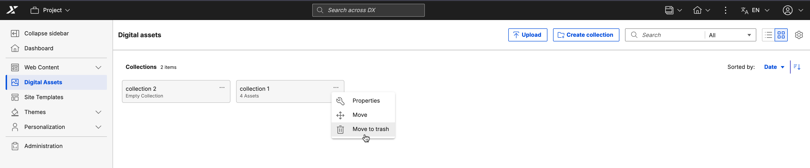
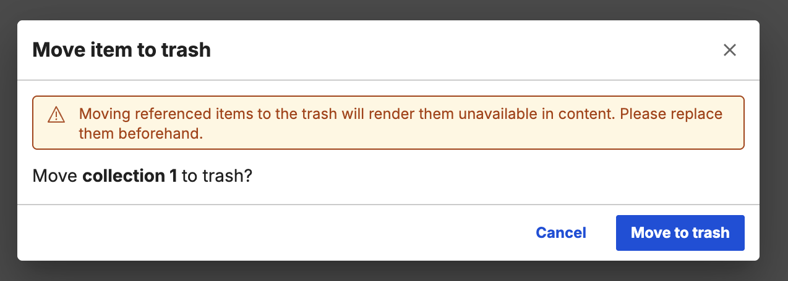
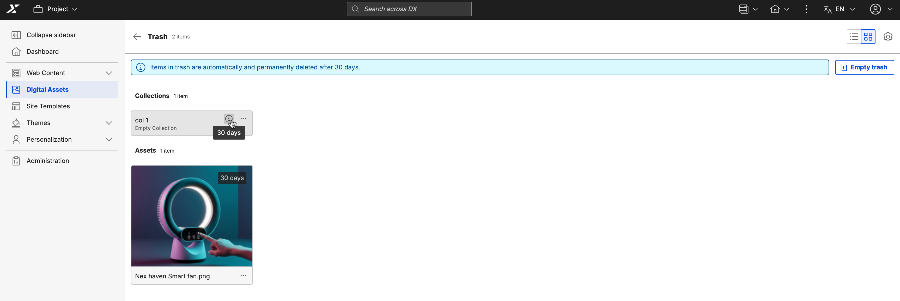
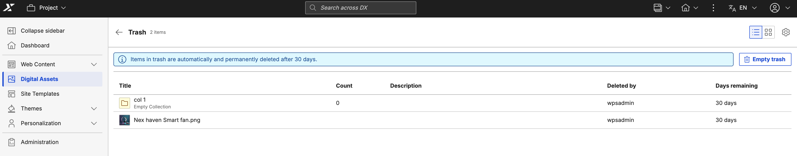

# DAM Soft Delete

Use the Soft Delete feature to prevent accidental deletion of assets and collections in Digital Asset Management (DAM). Soft Delete moves assets and collections to a hidden **Trash** view instead of immediately removing them from the database. The system automatically records the deletion date and the user who performed the action. Authorized users can restore these assets and collections or permanently delete them.

## Moving an asset or collection to the Trash

1. Select the three-dot icon for the asset or collection.
2. Select **Move to Trash**.

    

3. Select **Move to Trash** again in the confirmation dialog.

    { width=50% }

!!!note
    - Soft-deleted assets and collections are hidden from all standard lists, search, and fetch APIs. They remain accessible only through the **Trash** view.
    - Assets and collections in **Trash** are permanently deleted after a configurable retention period (default: 30 days).
    - The **Days left until permanent deletion** value is displayed on each asset in the **Trash** view. For collections, this information is available through the **Info (i)** icon.

## Accessing the Trash view

1. Select **Digital Assets** from the applications menu.
2. Select the **Settings** gear icon.
3. Select **Trash** > **Go to trash**.

Access to the Trash is restricted by user role:

| Role | Trash access |
|---|---|
| **Collection Admin** | Can view, restore, and permanently delete assets and collections. Can also empty the Trash. |
| **Editor** or **User** | Can access the Trash view, but cannot see or interact with any assets or collections. |

## Actions available in Trash

- **Preview:** View the content (images and videos only).
- **Download:** Download the content (assets only).
- **Properties:** View asset or collection metadata.
- **Restore:** Restore the asset or collection to its original location.
- **Delete permanently:** Delete the asset or collection permanently.

## Restoring assets and collections and resolving conflicts

Collection Admins can restore individual assets or entire collections from the Trash. Restoring a collection restores both the collection and the assets and sub-collections it contained when it was moved to the Trash. It does not automatically restore sub-collections or assets that were moved to the Trash separately.

**Dependency rules**

- **Referenced assets or collections:** Moving referenced assets or collections to the Trash makes them unavailable in linked content. A dialog box prompts you to review references before you confirm the move.
- **Nested deletions:** If a sub-collection or asset is in the Trash and its parent collection is also in the Trash, restoring the asset or sub-collection prompts you to select a new location.
- **Parent deletion:** If the parent collection is permanently deleted, all child assets and sub-collections are also permanently deleted and cannot be recovered.

**Resolving a name conflict**

If a new asset or collection with the same name is created in the original location after a Soft Delete, a name conflict occurs during restoration. To resolve the conflict, rename the asset or collection in the **Rename and restore** dialog.

## Deleting an asset or collection permanently

A Collection Admin can permanently delete an asset or collection from the Trash at any time, bypassing the retention period. **This action is irreversible.**

1. Select the three-dot icon for the asset or collection in the Trash.
2. Select **Permanently delete** (for collections) or **Delete permanently** (for assets).
3. Confirm the action in the dialog box.

**Emptying Trash**

A Collection Admin can clear all assets and collections from the Trash that they have administrative access to. This permanently removes all content immediately.

1. Select **Empty trash**.
2. Select **Empty trash** again in the confirmation dialog.

## Automated Trash clearance

A background heartbeat process runs at a configured interval to automatically purge assets and collections whose retention period has expired. This ensures the Trash is maintained without manual intervention. For more information on how to configure the automated Trash clearance feature, refer to [DAM Soft Delete configuration](../../configuration/dam_soft_delete_config.md).

**Grid view**

**List view**

## Staging

In a publisher-subscriber staging setup, Soft Delete actions on the publisher are propagated as hard deletes to subscribers.

| Action on Publisher | Impact on Subscriber |
|---------------------|----------------------|
| **Soft delete** | Asset or collection is hard deleted immediately. |
| **Restore** | Asset or collection is re-created. |
| **Permanent delete** | N/A (the asset or collection is already deleted). |

## Limitations

- Search and filtering are not available in the Trash view.
- Multi-select for bulk deletion or restoration is not supported.
- You cannot open or browse the contents of a collection while it is soft-deleted.

???+ info "Related information"
    - [DAM Soft Delete configuration](../../configuration/dam_soft_delete_config.md)