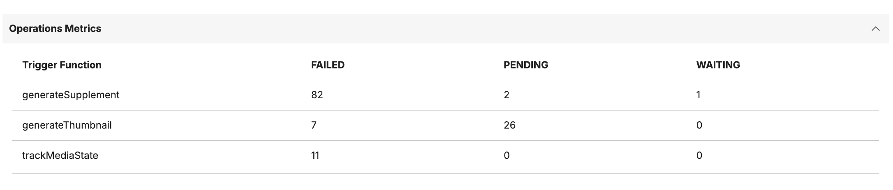

# Database Analysis

The Digital Asset Management (DAM) Database Analysis feature (available from CF233 onward) provides you metrics and insights into your DAM deployment for monitoring performance, storage utilization, media asset distribution, broken collection and media assets.

!!! note
    Only users with Administrator permissions can access these metrics through the DAM user interface or REST API.

## Accessing Database Analysis

1. Log in to HCL DX Portal as a DAM administrator.
2. Go to the **Digital Asset Management** application.
3. Click **Settings**.
4. Select **Database Analysis** from the administration options.
5. Expand your desired category to view specific metrics.

## Database Analysis metrics

Database Analysis provides comprehensive visibility into your DAM deployment through multiple metric categories. Each metric category offers specific insights that help you monitor system health, optimize performance, and plan for capacity requirements.

!!! note
    - Use specific type parameters to retrieve only the metrics you need for faster response times.
    - The system calculates metrics in real-time. For large deployments, initial metric loading may take a few seconds.

The feature organizes metrics into distinct categories, each serving a specific monitoring purpose:

| Metric Category                         | Description                                                                                                                                               |
|-----------------------------------------|-----------------------------------------------------------------------------------------------------------------------------------------------------------|
| Database Metrics                        | Provides core database information such as size, schema, and version                                                                                      |
| Media Metrics                           | Provides aggregate data on content distribution, storage consumption, and organizational structure within DAM                                             |
| Media Type Distribution                 | Provides a categorical breakdown of media assets by file type, including the specific count and percentage for each format relative to the total library  |
| Operations Metrics                      | Provides a status breakdown of all DAM operations                                                                                                         |
| Collections Missing Access Reference ID | Provides details on collections that do not have proper access control configuration                                                                      |
| Media Items not in Collection           | Provides metrics on media items that are not associated with any collection                                                                               |


### Database Metrics

Database Metrics provides details about the underlying PostgreSQL database that powers your DAM deployment. These metrics help you understand database size, structure, and version information.

The following table describes the available database metrics:

| Metric              | Description                                                      |
|---------------------|------------------------------------------------------------------|
| Database Name       | Name of the PostgreSQL database used by DAM                      |
| Database Size       | Total size of the database in MB                                 |
| Schema Name         | Current schema name being used by DAM (typically `schema_X_X_X`) |
| Table Count         | Total number of tables in the current schema                     |
| PostgreSQL Version  | Current version of the PostgreSQL database server                |


REST API endpoint:

```
GET /dx/api/dam/v1/database-analysis?type=Database
```

!!! note
    Database size is calculated in bytes and automatically converted to MB for easier interpretation. For very large databases, the size may be displayed in GB.

### Media Metrics

Media Metrics provides detailed statistics about your media assets, collections, and storage utilization. These metrics help you understand content distribution, storage consumption, and organizational structure within DAM.

The following table describes the available media metrics:

| Metric                          | Description                                              |
|---------------------------------|----------------------------------------------------------|
| Total Storage                   | Total storage consumed by all media assets in GB         |
| Media Item Count                | Total number of media items across all collections       |
| Total Collections               | Total number of collections (root and sub-collections)   |
| Root Collections                | Number of top-level collections                          |
| Sub Collections                 | Number of nested collections                             |
| Media Items Not in Collection   | Number of media items not associated with any collection |
| Total Operations                | Total number of incomplete operations                    |
| Largest Collection Size         | Size of the largest collection in bytes                  |
| Smallest Collection Size        | Size of the smallest collection in bytes                 |


REST API endpoint:

```
GET /dx/api/dam/v1/database-analysis?type=Media
```

### Media Type Distribution

Media Type Distribution provides a breakdown of your media assets by type, showing both absolute counts and percentages. This information helps you understand content composition and plan for type-specific optimization strategies.


#### Percentage calculation

```
Percentage = (Type Count / Total Media Items) × 100
```

REST API endpoint:

```
GET /dx/api/dam/v1/database-analysis?type=MediaTypes
```

### Operations Metrics

The Operations Metrics show the status of DAM operations by trigger function. Use this metric to identify operation patterns and troubleshoot issues.



!!! note
    For performance analysis, focus on recent operation patterns rather than historical totals.

REST API endpoint:

```
GET /dx/api/dam/v1/database-analysis?type=Operations
```

### Collections Missing Access Reference ID

The Collections Missing Access Reference ID metric identifies collections that do not have proper access control configuration. Collections without access reference IDs may have inconsistent permission inheritance or access control issues that need administrative attention.


!!! note
    Collections missing access reference IDs should be addressed promptly to ensure proper access control functionality across your DAM deployment.

For each collection missing an access reference, the following information is displayed:

| Field           | Description                                             |
|-----------------|---------------------------------------------------------|
| Collection ID   | Unique identifier of the collection                     |
| Collection Name | Display name of the collection                          |
| Created         | Date and time when the collection was created           |
| Parent ID       | ID of the parent collection (null for root collections) |

#### Resolving missing access reference IDs

1. Review the identified collections in the **Database Analysis** section.
2. Use the **[`registerResource` Config API](https://opensource.hcltechsw.com/experience-api-documentation/ring-api/#operation/registerResource){target="_blank"}** to set proper access references.
3. Verify permission inheritance is working correctly after updating.

REST API endpoint:

```
GET /dx/api/dam/v1/database-analysis?type=CollectionsMissingAccessReference
```

### Media Items not in Collection

The Media Items not in Collection metric lists orphaned media assets that are not associated with any collection. While these items exist in the DAM system, they are not organized within the collection hierarchy, making them difficult to discover and manage.


For each orphan media item, the following information is displayed:

| Field    | Description                                    |
|----------|------------------------------------------------|
| Media ID | Unique identifier of the media item            |
| Name     | File name of the media item                    |
| Created  | Date and time when the media item was uploaded |

!!! note
    Consider organizing orphaned media items into appropriate collections for better content management.

REST API endpoint:

```
GET /dx/api/dam/v1/database-analysis?type=OrphanMediaItems
```
