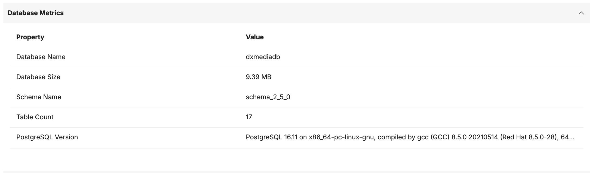
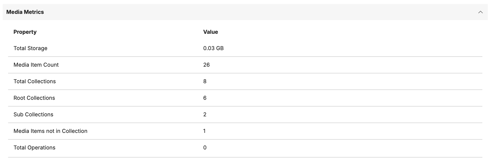
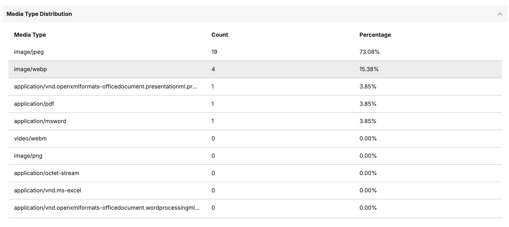
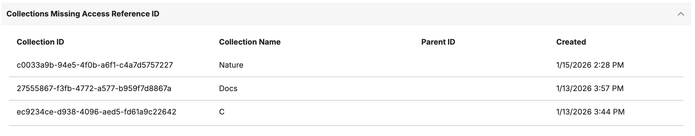
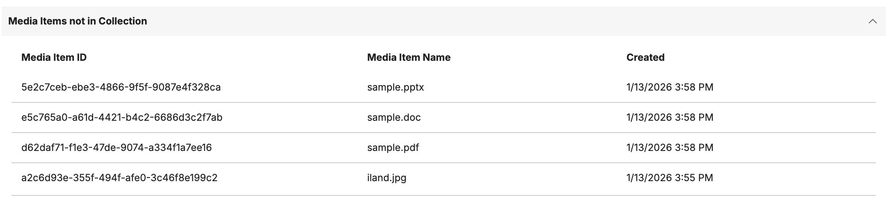

# Database Analysis

This topic describes the details of Digital Asset Management (DAM) Database Analysis feature, which provides administrators with comprehensive metrics and insights into their DAM deployment for monitoring performance, storage utilization, media asset distribution, broken collection and media assets.

## Overview of DAM Database Analysis

DAM Database Analysis is a tool that enables administrators to monitor and analyze their DAM system's health. This feature provides detailed metrics across multiple dimensions, helping you make informed decisions about resource allocation and storage optimization.

!!! note
    Database Analysis is available starting with HCL DX CF233. Only users with Administrator permissions can access these metrics through the DAM user interface or REST API.

### Access Database Analysis through the DAM UI:

1. Log in to HCL DX Portal with an account that has Administrator role for DAM
2. Navigate to the Digital Asset Management application
3. Click on the **Settings** panel icon
4. Select **Database Analysis** from the administration options
5. Expand the desired metric category accordion to view specific metrics

## Overview of Database Analysis Metrics

Database Analysis provides comprehensive visibility into your DAM deployment through multiple metric categories. Each metric category offers specific insights that help administrators monitor system health, optimize performance and plan for capacity requirements.

!!! note
    All metrics are calculated in real-time when requested. For large deployments, initial metric loading may take a few seconds.

### Database Analysis Metrics in Detail

The Database Analysis feature organizes metrics into distinct categories, each serving a specific monitoring purpose:

| Metric Category                     | Description                                                         | Administrator Access | Editor Access | User Access |
|-------------------------------------|---------------------------------------------------------------------|----------------------|---------------|-------------|
| Database Metrics                    | Core database information including size, schema, and version       | Yes                  | No            | No          |
| Media Metrics                       | Statistics about media assets, collections, and storage usage       | Yes                  | No            | No          |
| Media Type Distribution             | Breakdown of media assets by type with count and percentage         | Yes                  | No            | No          |
| Operations Matrix                   | Overview of all operations with status breakdown                    | Yes                  | No            | No          |
| Collections Missing Access Reference| Collections without proper access control configuration             | Yes                  | No            | No          |
| Orphan Media Items                  | Media items not associated with any collection                      | Yes                  | No            | No          |


## Database Metrics

Database Metrics provide fundamental information about the underlying PostgreSQL database that powers your DAM deployment. These metrics help administrators understand database size, structure, and version information.

The following table describes the available database metrics:

| Metric              | Description                                                                 |
|---------------------|-----------------------------------------------------------------------------|
| Database Name       | The name of the PostgreSQL database used by DAM                             |
| Database Size       | Total size of the database in megabytes (MB)                                |
| Schema Name         | The current schema name being used by DAM (typically `schema_X_X_X`)        |
| Table Count         | Total number of tables in the current schema                                |
| PostgreSQL Version  | Version of the PostgreSQL database server                                   |



REST API endpoint for database metrics:

```
GET /dx/api/dam/v1/database-analysis?type=database
```

!!! note
    Database size is calculated in bytes and automatically converted to megabytes for easier interpretation. For very large databases, the size may be displayed in gigabytes (GB).

## Media Metrics

Media Metrics provide detailed statistics about your media assets, collections, and storage utilization. These metrics help administrators understand content distribution, storage consumption, and organizational structure within DAM.

The following table describes the available media metrics:

| Metric                          | Description                                                         |
|---------------------------------|---------------------------------------------------------------------|
| Total Storage                   | Total storage consumed by all media assets in gigabytes (GB)        |
| Media Item Count                | Total number of media items across all collections                  |
| Total Collections               | Total number of collections (root and sub-collections)              |
| Root Collections                | Number of top-level collections                                     |
| Sub Collections                 | Number of nested collections                                        |
| Media Items Not in Collection   | Number of media items not associated with any collection            |
| Total Operations                | Total number of incomplete operations        |
| Largest Collection Size         | Size of the largest collection in bytes                             |
| Smallest Collection Size        | Size of the smallest collection in bytes                            |



REST API endpoint for media metrics:

```
GET /dx/api/dam/v1/database-analysis?type=media
```

## Media Type Distribution

Media Type Distribution provides a breakdown of your media assets by type, showing both absolute counts and percentages. This information helps administrators understand content composition and plan for type-specific optimization strategies.



### Percentage Calculation

The percentage for each media type is calculated as:

```
Percentage = (Type Count / Total Media Items) × 100
```

This helps you quickly identify the dominant media types in your deployment.

REST API endpoint for media type distribution:

```
GET /dx/api/dam/v1/database-analysis?type=mediatypes
```

!!! note
    Media types with zero count are also displayed in the distribution table.

## Operations Matrix

The Operations Matrix provides a comprehensive overview of all DAM operations, showing the breakdown of operation status by trigger function. This matrix helps administrators identify operation patterns, success rates, and potential issues requiring attention.


### Matrix Interpretation

The operations matrix displays:

- Rows representing different trigger functions
- Columns representing operation statuses
- Cell values showing the count of operations for each combination

This allows administrators to quickly identify:

- Which operations are most frequently performed
- Success rates for different operation types
- Operations that may require troubleshooting

REST API endpoint for operations matrix:

```
GET /dx/api/dam/v1/database-analysis?type=operations
```

!!! note
    The operations matrix includes all operations regardless of age. For performance analysis, focus on recent operation patterns rather than historical totals.

## Collections Missing Access Reference

This metric identifies collections that do not have proper access control configuration. Collections missing access reference IDs may have inconsistent permission inheritance or access control issues that need administrative attention.



### Collection Information Provided

For each collection missing an access reference, the following information is displayed:

| Field         | Description                                                    |
|---------------|----------------------------------------------------------------|
| Collection ID | Unique identifier of the collection                            |
| Collection Name| Display name of the collection                                |
| Created       | Date and time when the collection was created                  |
| Parent ID     | ID of the parent collection (null for root collections)        |

### Why This Matters

Collections without proper access reference IDs may experience:

- Inconsistent permission inheritance
- Access control errors
- Issues with sharing and staging operations
- Problems with role-based access

### Resolving Missing Access References

To resolve collections with missing access references:

1. Review the identified collections in the Database Analysis section
2. Use the [Update Resource Config API](https://opensource.hcltechsw.com/experience-api-documentation/ring-api/#operation/accessUpdateResourceConfig) to set proper access references
3. Verify permission inheritance is working correctly after updating

REST API endpoint for collections missing access reference IDs:

```
GET /dx/api/dam/v1/database-analysis?type=missingreferenceid
```

!!! note
    Collections missing access references should be addressed promptly to ensure proper access control functionality across your DAM deployment.

## Orphan Media Items

Orphan Media Items are media assets that are not associated with any collection. While these items exist in the DAM system, they are not organized within the collection hierarchy, making them difficult to discover and manage.



### Media Item Information Provided

For each orphan media item, the following information is displayed:

| Field    | Description                                          |
|----------|------------------------------------------------------|
| Media ID | Unique identifier of the media item                  |
| Name     | File name of the media item                          |
| Created  | Date and time when the media item was uploaded       |

The orphan media items are also available through the REST API endpoint:

```
GET /dx/api/dam/v1/database-analysis?type=orphanmediaitems
```

!!! note
    Orphan media items represent orphaned assets that may need attention. Consider organizing these items into appropriate collections for better content management.

### Performance Considerations

When accessing Database Analysis metrics:

- Metrics are calculated in real-time upon request
- Large deployments may experience slight delays during initial metric calculation
- Use specific type parameters to retrieve only needed metrics for faster response times