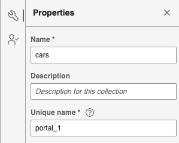
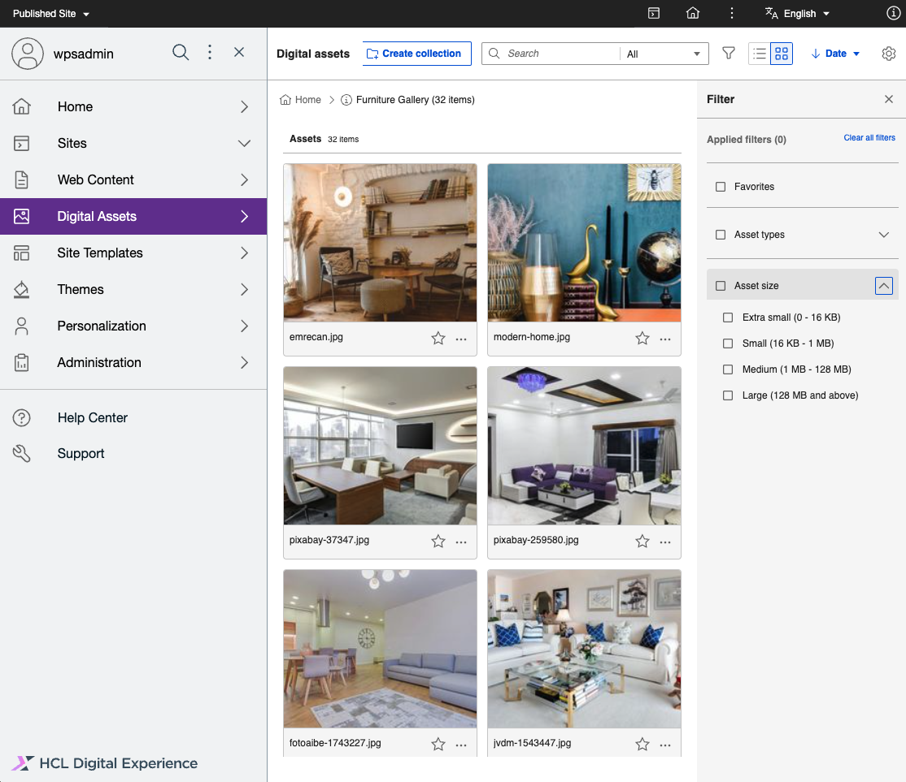
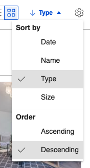
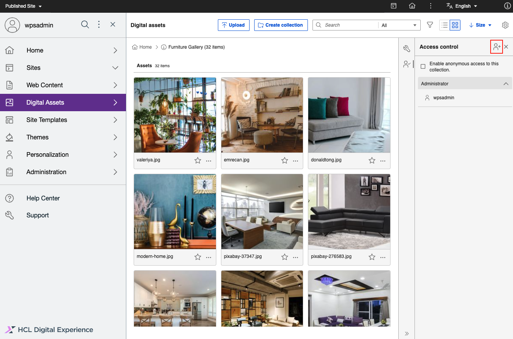
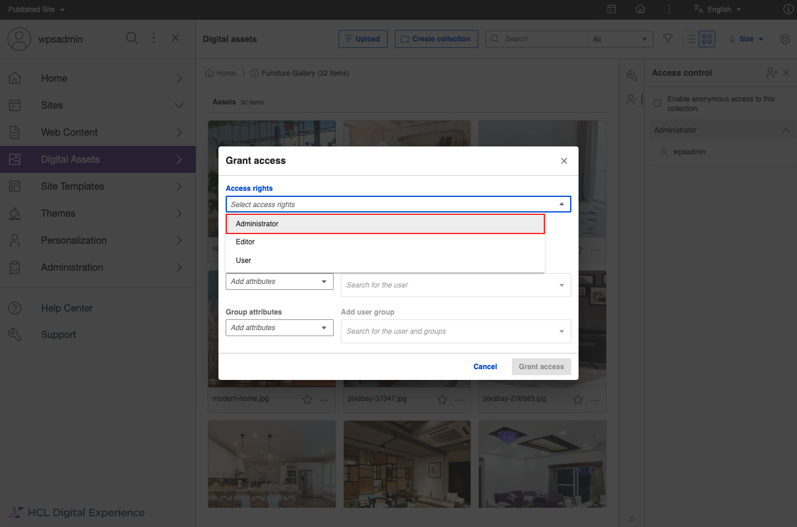
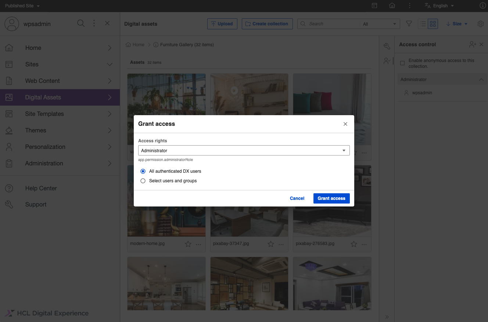

# Manage collections

Learn more about creating, configuring, and deleting media asset collections using Digital Asset Management (DAM).

## What is a collection unique-name?

Collection unique-names are the unique identifier for each collection which can be used in friendly url instead of collection UUID to access DAM assets. Collection unique-names support all languages as per existing system. A collection unique-name does not support any URL reserved characters (e.g. "?!#$&%'*+/;:,=@()\[]").

## How are collection unique-names generated?

- While creating a collection, the user has a provision to enter a custom collection unique-name.

{ width=45% }
{ width=47% }
{ width=45% }

- Collection unique-name is an optional field. If it is not provided by the user, the system will generate a collection unique-name based on the collection name replacing all the URL reserved characters (e.g. "?!#$&%'*+/;:,=@()\[]") with underscores.
- Collection unique-names will follow simple format of adding “_Number” for collections having same collection-names.
- For existing collections, the system will generate a collection unique-name based on the collection name by using the migration script.

## How can the user change the collection unique-names?

Once the collection unique-name is generated, user can view/edit the collection unique-name in the collection information panel.

{ width=47% }
{ width=45% }

## What happens if a collection unique-name already exists while creating or editing a collection?

While creating or editing a collection, DAM checks for any duplication of the unique-name and prompts with an error message. It also suggests an available unique-name if a duplicate is found in any other collection.

{ width=45% }
{ width=45% }

When the user clicks on the suggested name, the unique-name input field gets pre-filled with the suggested unique-name.

{ width=45% }
{ width=50% }

## Browsing and searching for media assets in a collection

Follow these steps to work with Collections in HCL Digital Experience 9.5 DAM.

1. From the HCL Digital Experience 9.5 DAM user interface, click **Collections**. The HCL DAM user user interface allows you to see previews of media assets for a specified collection. For example, a curated set of media assets are grouped in a collection named **Furniture Gallery** as shown below.

    

    Following options are displayed in Collections interface:

    - **Create Collection** - Create a new collection or a new nested collection (when used inside an existing collection)
    - **View information** - Opens the Information panel and shows Access Control

        

        - **Information** - Allows you to update the Collection name and description.
        - **Access Control** - Allows you to set who can access the media assets in the Collection.

    - **Delete Collection** - Deletes the selected Collection.

2. Select the **Filter** option to filter media asset results by **Favorites**, **Asset types**, or **Asset size**.

    - **Favorites** - Filters media assets added to your favorites.
    - **Asset types** - Filters media assets by type. You can further refine search results by selecting a specific file type.
    - **Asset size** - Filters media assets by size.
    

    !!! note
        Asset size filter is available in HCL DX CF192 and later.

3. On the top right, click the **Grid** or **List** icon \(**Open view options**\) to change how the media assets or collections are displayed:

    

    - **View as** - Lists options to view media assets or collections.
        -  *Grid** - Shows media assets in an equal-sized thumbnail view. This is the default display view.
        - **List**- Shows media assets in a standard list. Use this view to access a media asset when you can recognize the asset by its attributes, such as its file name.
    - **Sort by** - Lists options to sort media assets or collections:
        - **Date**
        - **Name**
        - **Type**
        - **Size**
    - **Order** - Lists options to sort order of media assets or collections depending on the selected **Sort by** option:
        - **Date**

            

            - Order by file name by **Older to newer** date
            - Order by file name by **Newer to older** date

        - **Name**

            

            - Order by file name from **A-Z**
            - Order by file name **Z-A**

        - **Type**

            

            - **Ascending**
            -  *Descending**
            
        - **Size**

            

            - **Smaller to larger**
            - **Larger to smaller**

## Modify information metadata of a media asset collection

1. From the HCL Digital Experience 9.5 DAM user interface, hover over a collection and click the **Information** icon \(small i\).

    

2. On the **Information** panel, edit the **Collection name** and **Description** as applicable.
3. Click **Save** to save changes.

## Manage user access permissions of a media asset collection

**Video**: [Configuring user access permissions to Digital Asset Management assets](https://youtu.be/vNJFcQViNVo)

1. From the HCL Digital Experience 9.5 Digital Asset Management interface, hover over a collection and click **Information** \(small i\).
2. Click **Access**.
3. Assign levels for other users to access media items stored within the collection by clicking **Add user**.

    

4. When you click **Add User**, a pop-up displays options to add these user access levels for individuals and groups as defined by the user directory integrated to your Digital Experience platform. Select the appropriate member. In this example, click **Administrator**.

    

5. Select the appropriate **Access rights**. For this example, click **All authenticated DX users**.

    

6. Click **Add users and groups** to save changes.
7. Once added, you can specify additional users for the selected access right. Select the access right to add a member or groups. For this example, click **Add Administrator**.

    

    

8. Once done, click **Add users and groups** to save changes.

## Deleting a collection

1. From the HCL Digital Experience 9.5 Digital Asset Management interface, hover over a collection and click **Delete**.
2. A pop-up message displays to confirm your action. Once a collection is deleted, you can no longer retrieve it, including the media assets, renditions, and versions you have used as your web content.
3. Click **Delete** to proceed with deleting the collection.

## Moving a collection

Refer to the following steps if you want to move a collection from one location to another.

!!! note 
    If a collection is moved to another collection, permissions and access restrictions of the collection and its contents align with the permissions of the destination location. If the collection is moved to the root level, the permissions align with the source permissions. 

1. From the HCL Digital Experience 9.5 Digital Asset Management interface, hover over a collection and click **Move**.

    A dialog box appears that shows the list of collections. You can search for a specific collection, or you can also navigate inside a collection if a subcollection is present.

    

    !!!note
        If the user does not have edit access for the collection, the row for that collection is disabled in the dialog.

2. To move the collection, there are two options depending on the target location:

    - Select the target collection where you want to move the collection and click **Move here**.

        If a collection with the same name exists in the target collection, a dialog box to rename the collection appears.

    - If you want to move the collection to root level, do not select any collection in the dialog box. Just click the **Move here** button to move the collection to the root level.

3. Click **View Location** to navigate inside the collection.

### Configuration for enabling the Move Collection feature

The Move Collection feature can be enabled or disabled through the helm. By default, this feature is enabled.

```yaml
configuration:
  digitalAssetManagement:
    enableCollectionMove: true
```
