# Manage media assets

This section provides the steps on how to manage media assets and view configuration settings using HCL Digital Asset Management (DAM).

## Prerequisite

HCL DAM CF181 or higher should be installed and configured for the HCL DX (HCL DX) 9.5 Container Release update, following these instructions in the [Install the HCL DX 9.5 Container components](../../index.md) topic.

## Viewing supported file formats

Follow these steps to view a list of file formats supported by HCL DX 9.5 DAM.

1.  Log in to your HCL DX 9.5 platform and select **Digital Assets** from the Practitioner Studio navigator.

    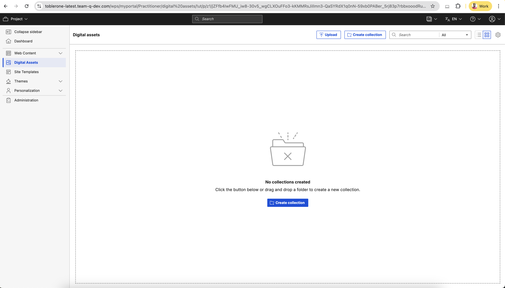

    The HCL DX 9.5 DAM can also be accessed from the Practitioner Studio **Digital Assets** tile.

2.  From the HCL DX 9.5 DAM user interface, select the gear icon \(for **Settings**\) located at the far top-right of the DAM menu bar.
3.  **Settings** will display the **Supported file formats** section by default.

    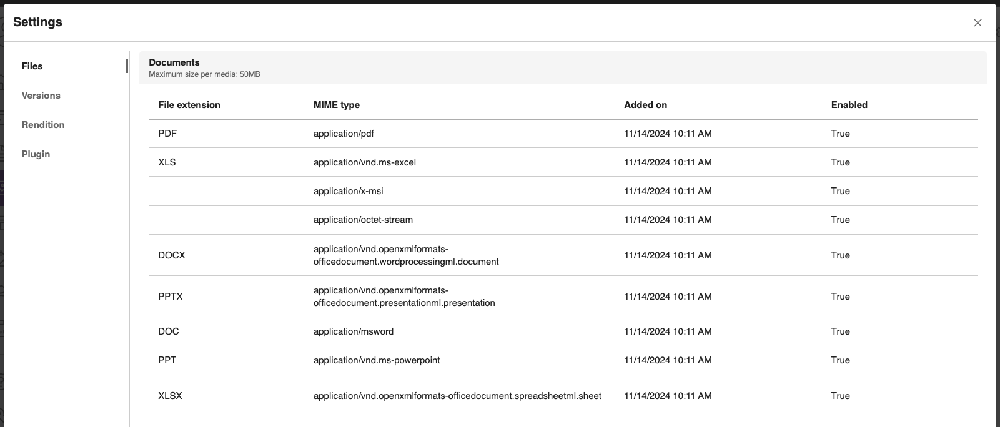


The following are supported media asset file formats in HCL DX 9.5 Container. From CF205 onwards, *WebP* file type extension is also supported.

|File type|Extension|
|---------|---------|
|.png|image/png|
|.gif|image/gif|
|.jpg|image/jpeg|
|.jpeg|image/jpeg|
|.tif|image/tiff|
|.tiff|image/tiff|
|.webp|image/webp|

!!! note
    - YYou can set the maximum file size for DAM asset uploads. For more information on configuring file size, see the `MediaTypeGroupController.updateById` API documentation topic.

    - SVG files are disabled by default. To enable `.svg` files (extension `image/svg+xml`) for asset uploads, use the API and set the `enabled` parameter to `true`. For more information, see [`MediaTypeController.updateById`](https://opensource.hcltechsw.com/experience-api-documentation/dam-api/#operation/MediaTypeController.updateById). For step-by-step guidance, see [Add a new MIME type in DAM](../../../../extend_dx/apis/hcl_experience_api/openapi_example_API_calls.md/#adding-a-new-mime-type-in-dam).

    - If you cannot upload files to DAM, see [Cannot upload files to DAM](https://support.hcl-software.com/csm?id=kb_article&sysparm_article=KB0129583){target="_blank"} for reference.


|File type|Extension|
|---------|---------|
|.ogv|video/ogg|
|.mp4|video/mp4|
|.webm|video/webm|

!!! notes

    -   \\\\ju
    -   \\\\ju
    -   Videos are automatically synchronized once they are uploaded. Auto-synchronization is a background activity in HCL Digital Asset Management that happens when any video is uploaded and when Kaltura integration is configured and enabled.

|File type|Extension|
|---------|---------|
|.pptx|application/vnd.openxmlformats-officedocument.presentationml.presentation|
|.xls|application/vnd.ms-excel <br/> application/octet-stream <br/> application/x-msi|
|.doc|application/msword|
|.docx|application/vnd.openxmlformats-officedocument.wordprocessingml.document|
|.xlsx|application/vnd.openxmlformats-officedocument.spreadsheetml.sheet|
|.ppt|application/vnd.ms-powerpoint|
|.pdf|application/pdf|

!!! note
    DAM does not scan uploaded files for any viruses or vulnerabilities. Files such as PDF files can be manipulated to contain active code. For users that have access to DAM, it is recommended to scan files for potential security issues. If scanning files is not possible, you can disable file types that could be exploited with active code (for example, PDF files).

### Enabling or adding other file types by using the DAM MediaTypeController API

This section explains how to enable additional file types in HCL DX DAM that are not included in the default supported file formats. It also explains how to add, configure, and activate new media types for asset uploads by using the DAM MediaTypeController API.

1. Authenticate with the DAM API
    Log in to the Ring API using:
    ```http
    POST https://<domain>/dx/api/core/v1/auth/login
    ```

2. Identify the media type group

    Retrieve the list of media type groups (such as images, videos, etc.) to find the appropriate group for your file type:
    ```http
    GET https://<domain>/dx/api/dam/v1/mediatypegroups
    ```

3. Add a new MIME type
    To enable uploading a new file type (for example, WebP or other formats), send a `POST` request to add it to DAM:
    ```http
 POST https://<domain>/dx/api/dam/v1/mediatypes
    ```
    Payload Example for Adding a New File Type
    ```
    [
    {
    "mimeType": "image/webp",
    "extensions": ["webp"],
    "mediaTypeGroupId": "<mediaTypeGroupId>"
    }
    ]
    ```
    Replace "image/webp", ["webp"], and mediaTypeGroupId with your desired MIME type, file extensions, and the media type group ID retrieved earlier.

4. Enable an existing or newly added file type
    If a file type exists but is disabled, use a `PATCH` request to enable it:
    ```
    PATCH - https://<domain>/dx/api/dam/v1/mediatypes/<id>
    ```
    Payload example:
    ```json
    {
    "enabled": true
    }
    ```
    The `<id>` is the ID for the media type obtained from the `GET mediatypes` endpoint.

5. Verify and add additional configuration

After enabling or adding the new file type, verify its status using a `GET` request to `mediatypes`. You can also check the DAM settings UI to confirm that the file type is enabled. For additional configuration (such as renditions or custom transformations), see the extensibility documentation.

**Example:**

To add and enable SVG or other custom formats, follow the `GET` media type group and `POST`/`PATCH` steps above. This allows uploading file types beyond those listed in the [Supported file formats](#viewing-supported-file-formats) section.

### Enabling other file types

 To enable file types that are not listed in the [Viewing supported file formats](#viewing-supported-file-formats) section for HCL DX DAM, you can use the DAM MediaTypeController API. The process involves adding new file types and enabling or disabling them for uploads.

!!! note
    The SVG file type is disabled by default. To enable `.svg` files (`image/svg+xml`) for asset uploads, use the `enabled` parameter in the `MediaTypeController.updateById` API. For more information, see the [`MediaTypeController.updateById`](https://opensource.hcltechsw.com/experience-api-documentation/dam-api/#operation/MediaTypeController.updateById){target="_blank"} API documentation.

## Playing a video in DAM

Play uploaded videos in DAM using the DAM binary URL or the Kaltura Player \(if the Kaltura plugin is configured and enabled\):

-   Use the DAM binary URL when:
    -   The uploaded video synchronization status is SYNC FAILED.
    -   The Kaltura plugin is not configured and enabled.

        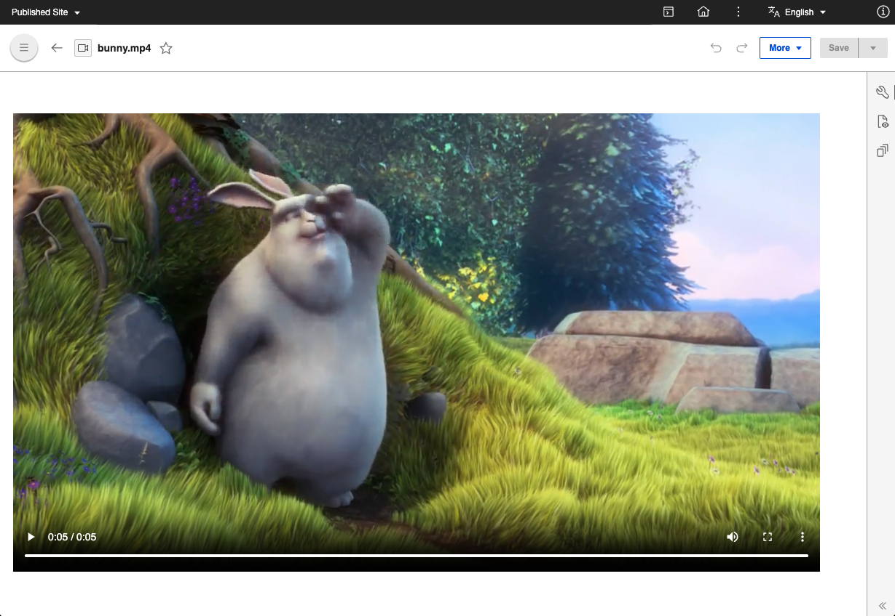

-   Use the Kaltura Player when:
    -   The video synchronization status is SYNCED, play the video based on the configured Player ID.
    -   The Kaltura plugin is configured and enabled.

        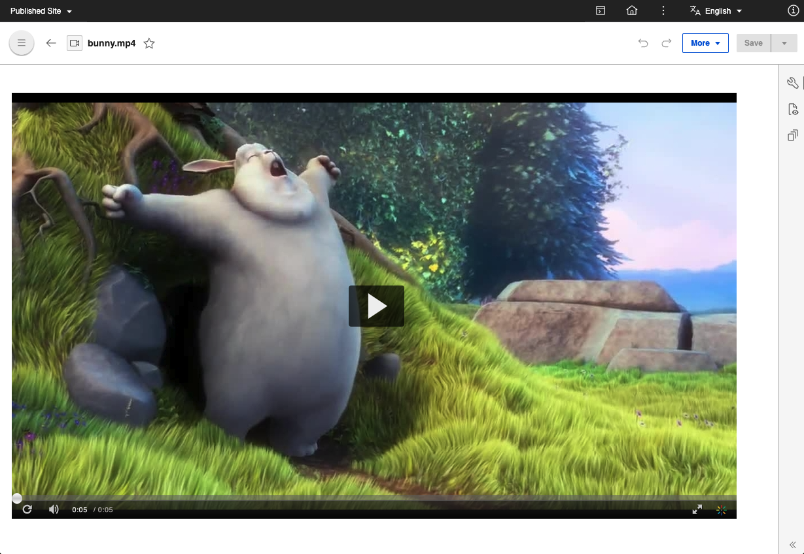


## Downloading a media asset source, version, or rendition

Use the HCL DX 9.5 DAM editor to download a media asset source, version, or rendition:

1.  From the HCL DX 9.5 DAM user interface, click the **More actions** menu (three horizontal dots icon) of a media asset. Click **Download**.

    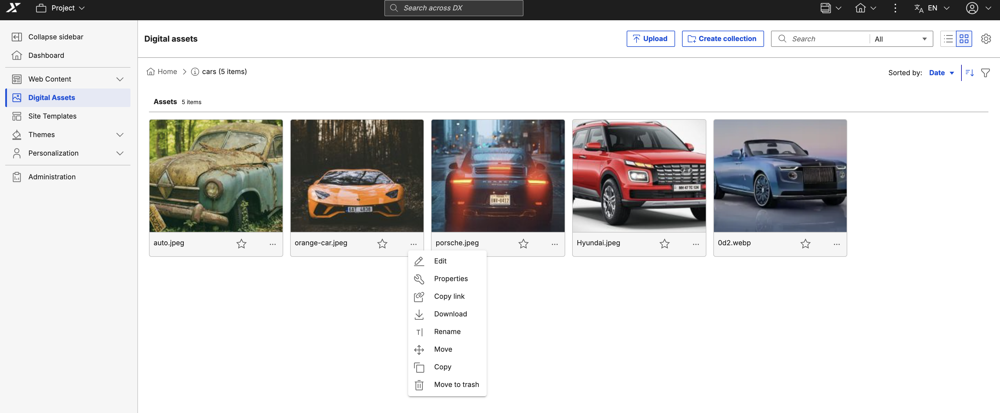

2.  A pop-up will appear for you to select your Download actions. You can rename downloaded media asset and choose to download **Source** or **Renditions**, or all asset types.

    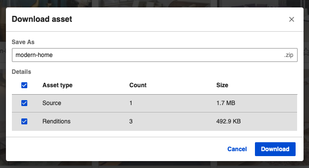

3.  Click **Download** to proceed.

## Deleting a media asset

Use the HCL DX 9.5 DAM editor to delete a media asset, including its renditions:

1.  From the HCL DX 9.5 DAM user interface, click the **More actions** menu (three horizontal dots icon) of a media asset. Click **Delete**.
2.  A pop-up will appear for you to select your Delete action. If the selected media assets will not affect any references, click **Check for references and delete** to complete action.

    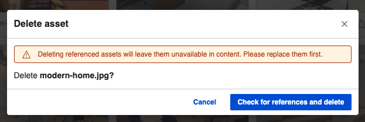

## Copying a media asset

When copying a media asset, only the latest version of the source assets is copied.

Refer to the following steps if you want to copy a media asset from one collection to another.

1. Click the **More actions** menu of the asset. 

    This displays more actions such as **Edit**, **Properties**, **Preview**, **Copy Link**, **Download**, **Copy**, **Move**, **Rename**, and **Delete**.

2. Click **Copy**.

    A dialogue box appears that shows the list of collections. You can search for a specific collection or you can also navigate inside a collection if a subcollection is present. 

3. Navigate to the collection where you want to copy the asset to and click **Paste here**.

    If you copied an asset to the same collection, a dialogue box to rename the asset appears. 

4. Click **View Location** to navigate inside the collection.

## Moving a media asset

Refer to the following steps if you want to move a media asset from one collection to another.

!!! note 
    Moving an asset location can break its links if it is referenced in WCM or any external references. To update the link, manual relinking is necessary. 
    To view the asset references, go to **Properties > Insights**.

1. Click the **More actions** menu of the asset. 

    This displays more actions such as **Edit**, **Properties**, **Preview**, **Copy Link**, **Download**, **Copy**, **Move**, **Rename**, and **Delete**.

2. Click **Move**.

    A dialogue box appears that shows the list of collections. You can search for a specific collection or you can also navigate inside a collection. 

    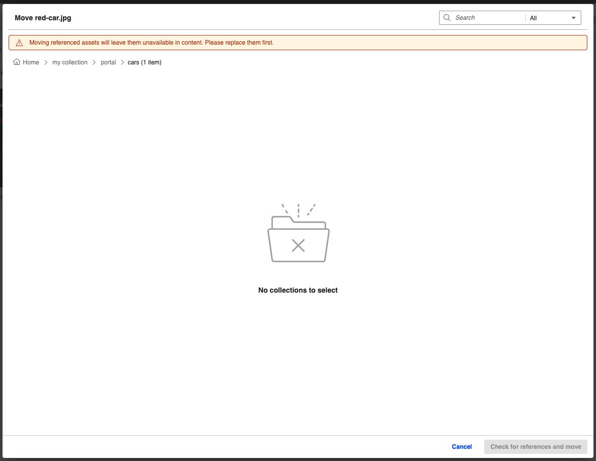

3. Navigate to the collection where you want to move the item and click **Check for references and move**.

    The confirmation dialogue appears if the asset is referenced in WCM. If an asset with same name exists in the target collection, a dialogue box to rename the asset appears. 

5. Click **View Location** to navigate inside the collection.

## Renaming a media asset

Refer to the following steps to modify the name of a media asset.

!!! note 
    Renaming an asset name breaks existing references to the asset name in WCM or any external content. To update the asset name, manual relinking is necessary.

1. Click the **More actions** menu of the asset. 

    This displays more actions such as **Edit**, **Properties**, **Preview**, **Copy Link**, **Download**, **Copy**, **Move**, **Rename** and **Delete**.

2. Click **Rename**.

    A dialogue box appears for renaming the media asset. 

    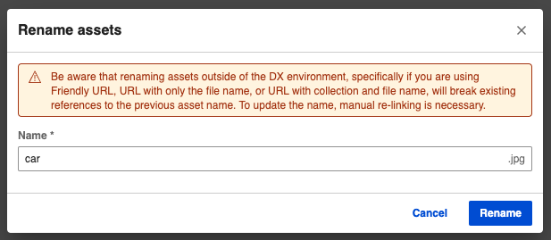
    
3. In the **Rename** dialogue box, enter the new name of the media asset. Click **Rename**. 

Another way to modify the name of a media asset is to edit the asset by clicking the **Pencil** icon. Go to **Properties**. You can edit the **Name** of the media asset in this panel, along with the **Title** and **Description**. Click **Save**.

## Enabling or disabling file types

Use the DAM MediaTypeController API to enable or disable supported file types for asset uploads in HCL DX DAM. For more infor mation on how configure the HCL DX server to recognize other images, refer to [How to enable support for additional image formats in HCL Web Content Manager](../../../../guide_me/howto/configuration/EnableImageFormats.md)

The SVG file type is disabled by default. To enable the `.svg` file type (`image/svg+xml`) for asset uploads, use the `enabled` parameter with the [`MediaTypeController.updateById`](https://opensource.hcltechsw.com/experience-api-documentation/dam-api/#operation/MediaTypeController.updateById){target="_blank"} API described in this documentation topic.

## Changing duplicate asset names using DAM

If an asset happens to have the same name with another asset in a collection, a rename dialogue will be shown when editing an asset.

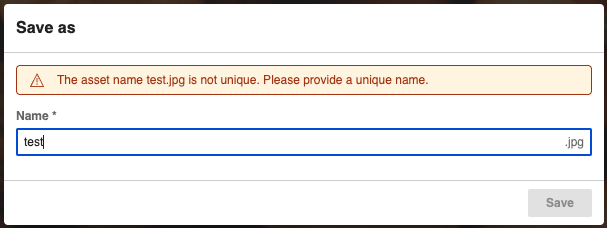{ width=50% }

## Copying friendly URLs for assets

You can copy the friendly URL and UUID URL of an asset from the URLs section of the asset's inspector panel.

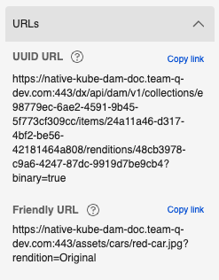

## HCL DX Solution Feedback

HCL DX is interested in your experience and feedback working with HCL DX 9.5 release software. To offer comments or issues on your findings, please access the [HCL DX 9.5 Feedback Reporting application](https://www.hclleap.com/apps/secure/org/app/158bbc7c-f357-4ef0-8023-654dd90780d4/launch/index.html?form=F_Form1).

???+ info "Related information"
    - [URL Addressability](../../../../build_sites/create_sites/url_addressing/index.md)
