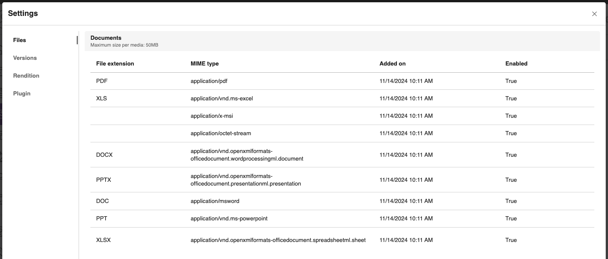
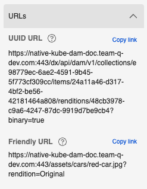

# Manage media assets

This section provides the steps on how to manage media assets and view configuration settings using HCL Digital Asset Management (DAM).

## Prerequisite

HCL DAM CF181 or higher should be installed and configured to the HCL Digital Experience 9.5 Container Release update, following these instructions in the [Install the HCL Digital Experience 9.5 Container components](../../index.md) topic.

## Viewing supported file formats

Follow these steps to view a list of file formats supported by HCL Digital Experience 9.5 DAM.

1.  Log in to your HCL Digital Experience 9.5 platform and select **Digital Assets** from the Practitioner Studio navigator.

    

    The HCL Digital Experience 9.5 DAM can also be accessed from the Practitioner Studio **Digital Assets** tile.

2.  From the HCL Digital Experience 9.5 DAM user interface, select the gear icon \(for **Settings**\) located at the far top-right of the DAM menu bar.
3.  **Settings** will display the **Supported file formats** section by default.

    


The following are supported media asset file formats in HCL Digital Experience 9.5 Container. From CF205 onwards, *WebP* file type extension is also supported.

|File type|Extension|
|---------|---------|
|.png|image/png|
|.gif|image/gif|
|.jpg|image/jpeg|
|.jpeg|image/jpeg|
|.tif|image/tiff|
|.tiff|image/tiff|
|.webp|image/webp|

!!! note 
    -   You can set the maximum file size for the DAM asset uploads. For more information on configuring the file size, refer to the [MediaTypeGroupController.updateById](https://opensource.hcltechsw.com/experience-api-documentation/dam-api/#operation/MediaTypeGroupController.updateById) API documentation topic.
    -   SVG file type is disabled. If you wish to enable .svg file type (extension image/svg+xml) for asset upload, you can enable it via API using enabled parameter.
    [MediaTypeController.updateById](https://opensource.hcltechsw.com/experience-api-documentation/dam-api/#operation/MediaTypeController.updateById)
    this API documentation topic.
|File type|Extension|
|---------|---------|
|.ogv|video/ogg|
|.mp4|video/mp4|
|.webm|video/webm|

!!! notes

    -   You can set the maximum file size for the DAM asset uploads. For more information on configuring the file size, refer to the [MediaTypeGroupController.updateById](https://opensource.hcltechsw.com/experience-api-documentation/dam-api/#operation/MediaTypeGroupController.updateById) API documentation topic.
    -   Videos are automatically synchronized once they are uploaded. Auto-synchronization is a background activity in HCL Digital Asset Management that happens when any video is uploaded and when Kaltura integration is configured and enabled.

|File type|Extension|
|---------|---------|
|.pptx|application/vnd.openxmlformats-officedocument.presentationml.presentation|
|.xls|application/vnd.ms-excel <br/> application/octet-stream <br/> application/x-msi|
|.doc|application/msword|
|.docx|application/vnd.openxmlformats-officedocument.wordprocessingml.document|
|.xlsx|application/vnd.openxmlformats-officedocument.spreadsheetml.sheet|
|.ppt|application/vnd.ms-powerpoint|
|.pdf|application/pdf|

## Playing a video in DAM

Play uploaded videos in DAM using the DAM binary URL or the Kaltura Player \(if the Kaltura plugin is configured and enabled\):

-   Use the DAM binary URL when:
    -   The uploaded video synchronization status is SYNC FAILED.
    -   The Kaltura plugin is not configured and enabled.

        

-   Use the Kaltura Player when:
    -   The video synchronization status is SYNCED, play the video based on the configured Player ID.
    -   The Kaltura plugin is configured and enabled.

        

!!! note 
    Videos being synced in progress displays a warning message and cannot be played yet.


For more information on the video synchronization statuses for uploaded videos, see [Upload rich media assets](upload_rich_media_assets.md#ul_zhl_vxq_qnb).

## Downloading a media asset source, version, or rendition

Use the HCL Digital Experience 9.5 DAM editor to download a media asset source, version, or rendition:

1.  From the HCL Digital Experience 9.5 DAM user interface, hover over a media asset to access and click the Overflow menu on the far right \(three vertical dots icon\). Then, select **Download**.

    

2.  A pop-up will appear for you to select your Download actions. You can rename downloaded media asset and choose to download **Source** or **Renditions**, or all asset types.

    

3.  Click **Download** to proceed.

## Deleting a media asset

Use the HCL Digital Experience 9.5 DAM editor to delete a media asset, including its renditions:

1.  From the HCL Digital Experience 9.5 DAM user interface, hover over a media asset to access and click the Overflow menu on the far right (three vertical dots icon). Then, select **Delete**.
2.  A pop-up will appear for you to select your Delete action. If the selected media assets will not affect any references, click **Check for references and delete** to complete action.

    

## Copying a media asset

Refer to the following steps if you want to copy a media asset from one collection to another.

1. Click the **more menu** option of the asset. 

    This displays more options such as **Properties**, **Preview**, **Copy Link**, **Download**, **Copy**, **Move**, **Rename**, and **Delete**.

2. Click **Copy**.

    A dialogue box appears that shows the list of collections. You can search for a specific collection or you can also navigate inside a collection if a subcollection is present. 

3. (Optional) Check the **Add new keywords to existing** box if you want newly generated keywords to be added to existing keywords. This is available only when Plugin is enabled.

4. Select a collection you want to copy the asset to and click **Copy**.

    If you copied an asset to the same collection, a dialogue box to rename the asset appears. 

5. Click **View Location** to navigate inside the collection.

## Moving a media asset

Refer to the following steps if you want to move a media asset from one collection to another.

!!! note 
    Moving an asset location can break its links if it is referenced in WCM or any external references. To update the link, manual relinking is necessary.

1. Click the **more menu** option of the asset. 

    This displays more options such as **Properties**, **Preview**, **Copy Link**, **Download**, **Copy**, **Move**, **Rename**, and **Delete**.

2. Click **Move**.

    A dialogue box appears that shows the list of collections. You can search for a specific collection or you can also navigate inside a collection if a subcollection is present. 

    

3. Select the collection in which you want to move the item and click **Check for references and move**.

    The confirmation dialogue appears if the asset is referenced in WCM. If an asset with same name exists in the target collection, a dialogue box to rename the asset appears. 

5. Click **View Location** to navigate inside the collection.

## Renaming a media asset

Refer to the following steps to modify the name of a media asset.

!!! note 
    Renaming an asset name will break existing references to the asset name in WCM or any external content. To update the asset name, manual relinking is necessary.

1. Click the **more menu** option of the asset. 

    This displays more options such as **Properties**, **Preview**, **Copy Link**, **Download**, **Copy**, **Move**, **Rename** and **Delete**.

2. Click **Rename**.

    A dialogue box appears for renaming the media asset. 

    
    
3. In the **Rename** dialogue box, enter the new name of the media asset. Click **Save**. 

Another way to modify the name of a media asset is to edit the asset by clicking the **Pencil** icon. Go to **Properties**. You can edit the **Name** of the media asset in this panel, along with the **Title** and **Description**. Click **Save**.

### Configuration for enabling the asset rename and move feature

The asset move and renaming feature can be enabled or disabled through the helm. By default, this feature is enabled.

```yaml
configuration:
  digitalAssetManagement:
    enableAssetMoveRename: true
```

## Changing duplicate asset names using DAM

If an asset happens to have the same name with another asset in a collection, a notification is displayed in the **Information** panel.

{ width=50% }

You can click **Rename** from the notification and provide a unique name.

{ width=50% }

## Copying friendly URLs for assets

You can can copy the friendly URL and API URL of an asset from the URLs section of the asset's inspector panel.

{ width=50% }

## HCL Digital Experience Solution Feedback

HCL Digital Experience is interested in your experience and feedback working with HCL Digital Experience 9.5 release software. To offer comments or issues on your findings, please access the [HCL Digital Experience 9.5 Feedback Reporting application](https://www.hclleap.com/apps/secure/org/app/158bbc7c-f357-4ef0-8023-654dd90780d4/launch/index.html?form=F_Form1).
