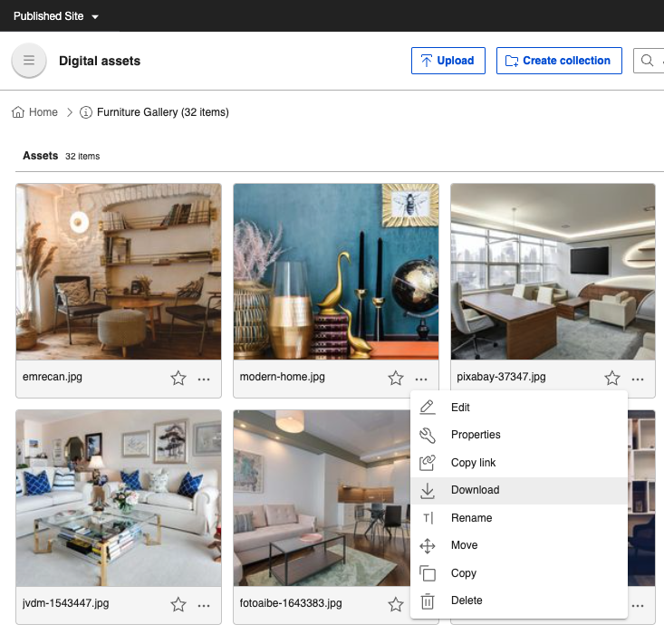

# Edit image

HCL Digital Experience comes with functionalities to edit media assets.

## Prerequisite

HCL Digital Asset Management \(DAM\) should be installed and configured to HCL Digital Experience 9.5 Container Release Update CF181 and higher. See the [Install the HCL Digital Experience 9.5 Container components](../../../installation/install_config_dam.md) topic for instructions.

## Edit image

Follow these steps to edit images using HCL Digital Experience 9.5 Digital Asset Management:

1.  From the HCL Digital Experience 9.5 Digital Asset Management interface, hover over a media asset to access **Edit** options. Click the **Edit** \(pencil\) icon.

    

2.  From the **Edit** page, several options are available to edit the image.

    

3.  Select and click any of the following **Edit** options:

    !!! note
        Some of the menu options are also available for video and document media assets.

    -   **Add to Favorites** \(the star located next to the image title and from the edit digital media asset selection\) - This can be used to sort and filter digital media assets from the HCL Digital Asset Management repository \(See [Manage media asset collections](../manage_collections.md)\).
    -   **Crop** - Extracts a region of the specified dimensions from the original image. You can crop the image using the resize handles \(freeform\) or by selecting a preset aspect ratio.
    -   **Rotate left**, **Rotate right** - You can rotate the image 90° counter-clockwise \(left\) or 90° clockwise \(right\).
    
        !!! note
            When editing assets in DAM, there is some expected variation in image size.
    
    -   **Replace** - Replace the digital media asset file with a new image media file.

        !!! note
            You can only replace the image with a new image of a supported image filetype. No other assets \(like document and video filetypes\) have the **Replace** option at the moment.

    -   **More** - Click to see additional actions available for the digital media asset.

        

        -   **Copy link** - Copy the URL address of the digital media asset.
        -   **Delete** - Delete the selected digital media asset.
        -   **Download** - Download a copy of the digital media asset, including versions and renditions \(See [Generate Digital Asset Renditions](dam_generate_renditions_and_versions.md)\).
        
4.  Click **Undo**or **Redo** to undo and/or redo any edits to an image prior to saving the image.
5.  Click **Apply**to save your changes.
6.  To save your changes, click either **Save** or **Save as new** to save changes as a new digital asset.

<!--
## HCL Digital Experience Solution Feedback

HCL Digital Experience is interested in your experience and feedback working with HCL Digital Experience 9.5 release software. To offer comments or issues on your findings, please access the [HCL Digital Experience 9.5 Feedback Reporting application](https://www.hclleap.com/apps/secure/org/app/158bbc7c-f357-4ef0-8023-654dd90780d4/launch/index.html?form=F_Form1).-->

