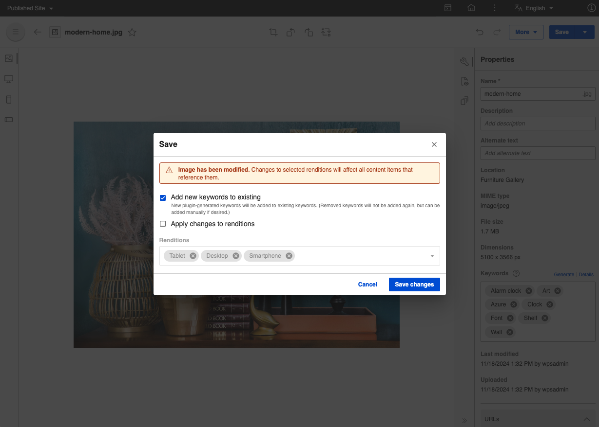

# DAM Keyword enhancements

Keywords can be generated by the Plugin enabled in DAM [Configure DAM extension to Google Vision API](configure_DAM_extension_to_google_vision_API.md). To enhance the usage, the following features are added:
- Detailed display of keywords
- Add new keywords to existing during Save and Save as New
- Generate keywords
- Remove All Keywords tagged in a media asset
- Error validation on adding duplicate keywords

## Detailed display of keywords

The keyword section has the details link which shows the user-defined and plugin-generated keywords. If there are no plugin-generated keywords available, then the link will be disabled, which means either there are no keywords or keywords are user defined. If there are plugin-generated keywords, they will be displayed in a table along with the source (the plugin which generates the keyword) and the confidence percentage (Plugins confidence on the keyword based on the image provided). 

!!! note
    The confidence percentages are configurable via Helm configurations. For information, refer [Google vision plugin configuration](image_tagging.md#google-vision-plugin-configuration)

## Add new keywords to existing during Save and Save as New

During image modifications for the original rendition on the edit page, the user would be prompted to save the image. While saving the image, the modal window will appear to alert the user and request to "Apply changes to renditions" and to "Add new keywords to existing". If the user checks the "Apply changes to renditions" option, then all the existing keywords will be available. And if the "Add new keywords to existing" is checked, then new plugin-generated keywords will be added to existing keywords. (Removed keywords will not be added again, but can be added manually if desired.) new keywords will be generated, if the plugins are enabled and "Add new keywords to existing" checkbox is selected.

Similarly in the case of Save as new, the user would be prompted with the same "Add new keywords to existing" option along with file name changes.

## Generate keywords

If the user likes to generate keywords, without any modification of the image. Users will be prompted with a modal window to confirm, delete all keywords (both user defined and plugin generated) and generate fresh. Clicking on the generate button, the keywords would be generated. Since the keywords are generated in the background, the user would need to refresh the page to see the newly generated keywords.

Also, in case if there are no Keywords available earlier, then a modal would be shown, on confirmation keywords will be triggered (the user needs to refresh the page). Also, the keywords would be only generated, if the plugin is enabled. 

!!! note 
    The form data entry in the edit page will be disabled, until the page is refreshed or user move back to assets listing page and navigate back to edit.

In an ideal keyword management scenario, if a keyword is deleted by the user manually, then those deleted keywords will not be regenerated by the Plugin again. But the user would be able to manually add those keywords. In the case of generating new keywords, even if the user has deleted earlier in earlier versions, still it would be re-generated.

## Remove All Keywords tagged in a media asset

If the user wants to remove all the keywords, user can select cross icon (Clear). User will be prompted with a modal window to confirm, delete all keywords (both user defined and plugin generated).

## Error validation on adding duplicate keywords

If the user enters an existing keyword(Case sensitive), the keyword input component shows some error messages to aid user in entering unique keywords.

1. If user enters an empty keyword value, the input component throws error  - **Enter at least one character to continue.**

2. If user enters a duplicate keyword, the input component throws error - **Keyword already exists.**

3. If user enters multiple duplicate keywords, the input component throws error  - **first duplicate keyword and no. of duplicate keywords -1 other keywords already exist. Please enter a different keyword.**
