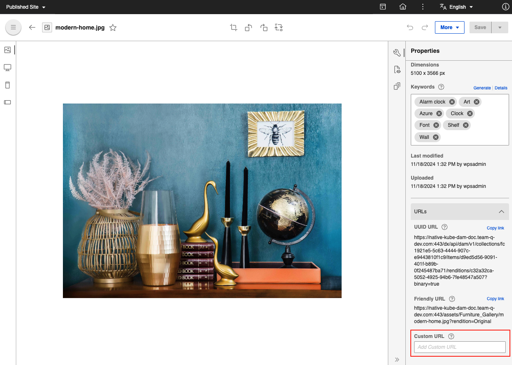

# Set unique custom URL for a media asset

The media assets in the HCL Digital Asset Management (DAM) can be accessed through a URL. However, this URL is long and complex since it contains unique identifiers to locate the resource. Digital Asset Management allows users to customize complex URLs and change them to human-readable URLs, which are shorter, readable, and easier to use.

A `customUrl` provides the original rendition of an asset. The `customUrl` is not related to a friendly URL.



**Sample `customUrl`**:    

```
https://sample-url.com/dx/api/dam/custom/car
```

## Setting a unique custom URL for a media asset

Follow these steps to set a unique custom URL value for a media asset:

1.  From the HCL Digital Experience 9.5 DAM user interface, click to select the collection where the media asset is located.
2.  Click the **More** menu of a media asset and click **Edit** \(pencil icon\).
3.  Click **Properties** and enter the expected text in the **Custom URL** field. A helper text shows a preview of the custom URL below the field.

    !!! note 
        Supported values for the **Custom URL** field:

        -   Custom URL values are unique for a media asset and are associated to the latest version of any rendition.
        -   They should not contain special characters except underscore \(“\_”\), hyphen \(“-”\), and forward slash \(“/”\).
        -   They should not contain any white spaces.
        -   They can be represented as a file path \(for example ../events/team-outing/images/image000\) for better categorization and classification of media assets.
        -   Every rendition of a media asset can have a Custom URL value associated to it.
        -   To access the media asset using custom URL:
            -   ```
                GET `/dx/api/dam/custom/<customurlText>`
                ```

        -   To add/update/delete custom URL value:
            -   ```
                PUT `/collections/<collectionId>/items/<itemId>/renditions/<renditionId>`
                ```

            -   ```
                PATCH `/collections/<collectionId>/items/<itemId>/renditions/<renditionId>`
                ```

4.  Click **Save**. A **Copy link** option appears on top of the **Custom URL** field. You can access the media asset using the custom URL after you click the **Copy link** option. A notification shows custom URL is copied successfully.

## Editing or deleting a custom URL for a media asset

Follow these steps to edit or delete a custom URL value for a media asset:

1.  From the HCL Digital Experience 9.5 DAM user interface, click to select the collection where the media asset with the custom URL is located.
2.  Click the **More** menu of a media asset and click **Edit** \(pencil icon\).
3.  Click **Properties** and edit or delete the text in the **Custom URL** field. A helper text shows an updated preview of the custom URL below the field. When the **Custom URL** field is empty, the helper text below no longer shows.
4.  Click **Save** to save the changes made. A notification shows the media asset information is updated successfully.

## HCL Digital Experience Solution Feedback

HCL Digital Experience is interested in your experience and feedback working with HCL Digital Experience 9.5 release software. To offer comments or issues on your findings, please access the [HCL Digital Experience 9.5 Feedback Reporting application](https://www.hclleap.com/apps/secure/org/app/158bbc7c-f357-4ef0-8023-654dd90780d4/launch/index.html?form=F_Form1).


