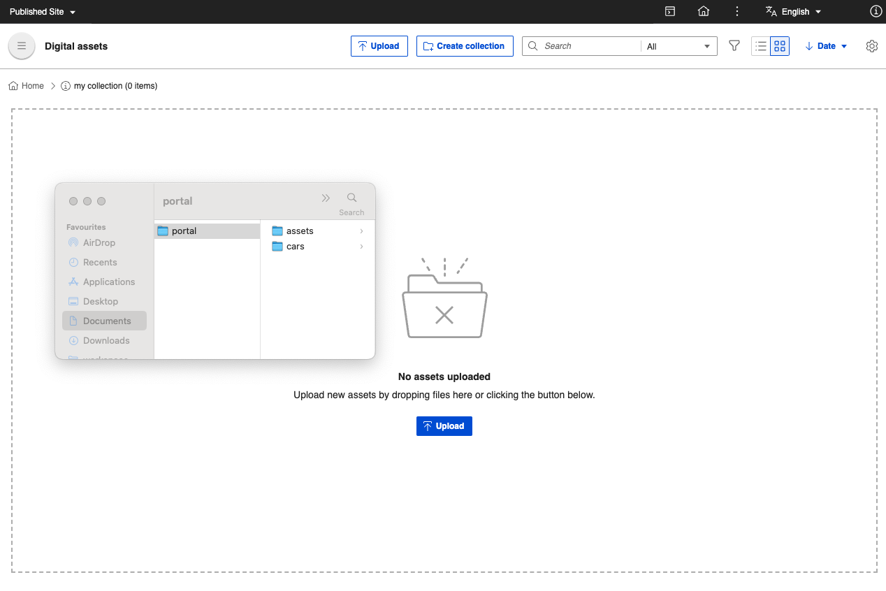
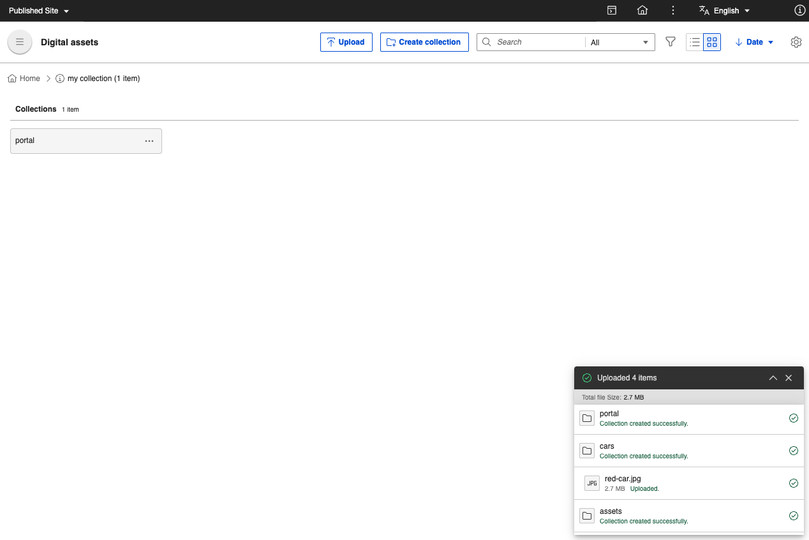

# Uploading rich media assets

Follow these steps to upload rich media assets using HCL Digital Experience (DX) 9.5 Digital Asset Management \(DAM\).

1. From the HCL DX 9.5 DAM user interface, click **Upload**. This allows you to view or search, select, and upload rich media assets, such as images and videos from your source repository, to be stored in HCL DAM.

    

    !!! notes

        - You can drag and drop rich media assets from your source or local repository to the HCL DAM user interface to upload selected rich media assets.
        - Once the Kaltura plugin is configured and enabled, automatic synchronization of videos happen in the background whenever a video is successfully uploaded.

            - Videos uploaded to HCL DAM are automatically synchronized.
            - Videos with the **SYNCED** status generates the thumbnail from Kaltura and displays the preview in HCL Digital Asset Management. Videos with other statuses will not have the preview thumbnail available.

            See the [Configure DAM - Kaltura integration](../../configuration/dam_extensibility/kaltura_configuration.md) topic for details.

2. (Optional) Upon selecting the rich media assets, a warning prompt will appear if the number of assets you selected exceeds the limit set using the `maxBulkUploadWithoutWarning` parameter configured in Helm. Click **Upload** to continue.

    

    Afterwards, you are prompted to either upload the assets to an existing collection or create a collection.

3. Upload the assets to an existing collection or create a collection.

    

    To upload the assets to an existing collection:

    1. Click the **Collection** dropdown and select an existing collection.

    2. Click **Upload**.

    To upload the assets to a new collection:

    1. Click **Create Collection** to add selected rich media assets to a new collection.

    2. Enter the **Collection Name** and **Collection Description**.

    3. Click **Create and Upload**.

4. The HCL DAM user interface shows an upload progress bar on the lower right corner of the page. Once the upload is completed, click the **View upload details** arrow to see more information about the media assets uploaded, including the file size and media type.

    

## Uploading using drag-and-drop

You can upload files and folders using the drag-and-drop feature. With this feature, you can add multiple folders and their contents to DAM. When you drag and drop folders to DAM, the system handles the upload of folders, their sub-folders, and their respective assets. The hierarchy of nested folders during the upload process is preserved.

To upload files and folders using drag-and-drop, refer to the following steps:

1. Select the folders or files to be uploaded from the system file explorer.

    

2. Drag and drop the files and folders into the DAM root page or any other sub-collection page.

    

3. (Optional) Upon dropping your files and folders, a warning prompt will appear if the number of rich media assets you want to upload exceeds the limit set using the `maxBulkUploadWithoutWarning` parameter configured in Helm.

    

4. (Optional) If files are dropped into a root collection page, a dialog box appears, allowing you to select the collection where you want to upload the assets.

All uploaded folders create a collection with the same name as the folder. The contents of the folders are uploaded into the same collection.


### Configuration to change the `maxBulkUploadWithoutWarning` value

You can configure the maximum number of assets allowed for bulk upload without prompting a warning using the following Helm configuration:

```yaml
configuration:
  digitalAssetManagement:
    maxBulkUploadWithoutWarning: 100
```

!!!note

    - If the Kaltura plugin is configured and enabled, the media tile shows the following sync statuses for uploaded videos:

        - SYNC IN PROGRESS
        - SYNC FAILED
        - SYNCED
        
        See the [Configure DAM - Kaltura integration](../../configuration/dam_extensibility/kaltura_configuration.md) topic for details.

    - The interface displays features that allows you to edit media asset metadata (for example, `Title` and `Description`) and user access control (for example, Access) of the new or existing collection the rich media asset is uploaded to. For more information, see [Manage collections](manage_collections.md).

    - To upload folders without using drag-and-drop, you must [manually create collections](#uploading-rich-media-assets) and upload assets using the **Upload** button.
