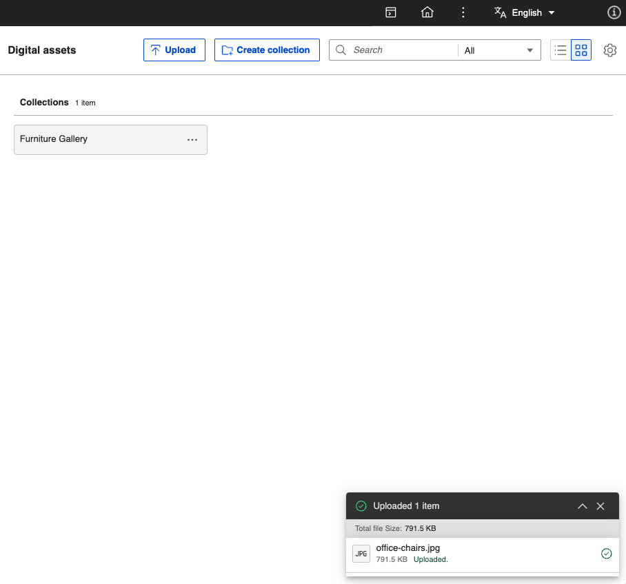

# Uploading rich media assets

Follow these steps to upload rich media assets using HCL Digital Experience (DX) 9.5 Digital Asset Management \(DAM\).

1. From the HCL DX 9.5 DAM user interface, click **Upload**. This allows you to view or search, select, and upload rich media assets, such as images and videos from your source repository, to be stored in HCL DAM.

    

    !!! notes

        - You can drag and drop rich media assets from your source or local repository to the HCL DAM user interface to upload selected rich media assets.
        - Once the Kaltura plugin is configured and enabled, automatic synchronization of videos happen in the background whenever a video is successfully uploaded.

            - Videos uploaded to HCL DAM are automatically synchronized.
            - Videos with the **SYNCED** status generates the thumbnail from Kaltura and displays the preview in HCL Digital Asset Management. Videos with other statuses will not have the preview thumbnail available.

            See the [Configure DAM - Kaltura integration](../../configuration/dam_extensibility/kaltura_configuration.md) topic for details.

2. (Optional) Upon selecting the rich media assets, a warning prompt will appear if the number of assets you selected exceeds the limit set using the `maxBulkUploadWithoutWarning` parameter configured in Helm. Click **Upload** to continue.

    

    Afterwards, you are prompted to either upload the assets to an existing collection or create a collection.

3. Upload the assets to an existing collection or create a collection.

    

    To upload the assets to an existing collection:

    1. Click the **Collection** dropdown and select an existing collection.

    2. Click **Upload**.

    To upload the assets to a new collection:

    1. Click **Create Collection** to add selected rich media assets to a new collection.

    2. Enter the **Collection Name** and **Collection Description**.

    3. Click **Create and Upload**.

4. The HCL DAM user interface shows an upload progress bar on the lower right corner of the page. Once the upload is completed, click the **View upload details** arrow to see more information about the media assets uploaded, including the file size and media type.

    

## Uploading using drag-and-drop

You can upload files and folders using the drag-and-drop feature. With this feature, you can add multiple folders and their contents to DAM. When you drag and drop folders to DAM, the system handles the upload of folders, their sub-folders, and their respective assets. The hierarchy of nested folders during the upload process is preserved.

To upload files and folders using drag-and-drop, refer to the following steps:

1. Select the folders or files to be uploaded from the system file explorer.

    

2. Drag and drop the files and folders into the DAM root page or any other sub-collection page.

    

3. (Optional) Upon dropping your rich media assets, a warning prompt will appear if the number of files and folders you want to upload exceeds the limit set using the `maxBulkUploadWithoutWarning` parameter configured in Helm.

    

4. (Optional) If files are dropped into a root collection page, a dialog box appears, allowing you to select the collection where you want to upload the assets.

All uploaded folders create a collection with the same name as the folder. The contents of the folders are uploaded into the same collection.


## Upload cancellation using Cancel Uploading/ Cancel All buttons

The progress bar gives you full control to terminate any ongoing upload, from a single file to an entire folder structure.

**Cancel Individual Upload**

- A Cancel Uploading button is available next to each file or folder when the upload is in progress.
- Clicking the Cancel Uploading button stops the upload of that specific item.
- The item's status will update to "Cancelled" in the progress bar item list.


**Cancel All Uploads**

- The Cancel all button is enabled in the progress bar header when any file or folder upload is in progress.
- Clicking Cancel all button terminates all pending uploads at once.
- Cancelled items will display a Cancelled status in the progress bar item list.
- Click the View upload details arrow to see the status of all uploaded and cancelled items.


!!! notes 

    - The cancellation feature works for deeply nested folder structures.
    - Cancel all function will not affect items that have already finished uploading from server; it only cancels items that are currently pending or in progress.
    - The progress bar will accurately show the final count of successfully uploaded items versus the total number of items in the initial queue.

## Collection/ Nested Collection Sorting

To help you find assets more efficiently, you can sort collections and their contents in both Grid and List views. Your sorting preferences are saved and persist as you navigate between these views. A dedicated icon allows you to switch between ascending and descending order for your selected sort criteria.

**Root Collection Sort**

When viewing the top-level root collections, you can sort them by the following criteria: 

- Date: The last modified date of the collection.
- Name: The name of the collection.
- Count: The number of items (assets and collections) inside the collection.

Grid View


List View


**Nested Collection Sort**

When you are inside a collection, you can sort its contents (both sub-collections and assets) by the following criteria:

- Date: last modfied date of collection. This is the default sort order (descending). 
- Name: The name of the asset or sub-collection.
- Count/Size:
    - Sub-collections are sorted by the number of items (assets and collections) they contain. 
    - Assets are sorted by their file size. 
- Type: This option groups items first, then sorts them: 
    - Assets are grouped by category (e.g., Images, Videos, then Documents), then sorted by file extension, and finally by name. 
    - Sub-collections are sorted by name.

Grid View


List View


!!! notes

    - Collections are always displayed before assets. This behavior is consistent in both Grid and List views.
    - List view table sort will not sort the entire items. It sorts only the items that available on the page.
    - The sort order you select is saved as you navigate through your collections. For example, if you sort the root collections by 'Name,' then click into a sub-collection and later return, the root collections will still be sorted by 'Name.' This persistence applies to sorting at any level, whether at the root or within a nested collection.

### Configuration to change the `maxBulkUploadWithoutWarning` value

You can configure the maximum number of assets allowed for bulk upload without prompting a warning using the following Helm configuration:

```yaml
configuration:
  digitalAssetManagement:
    maxBulkUploadWithoutWarning: 100
```

!!!note

    - If the Kaltura plugin is configured and enabled, the media tile shows the following sync statuses for uploaded videos:

        - SYNC IN PROGRESS
        - SYNC FAILED
        - SYNCED
        
        See the [Configure DAM - Kaltura integration](../../configuration/dam_extensibility/kaltura_configuration.md) topic for details.

    - The interface displays features that allows you to edit media asset metadata (for example, `Title` and `Description`) and user access control (for example, Access) of the new or existing collection the rich media asset is uploaded to. For more information, see [Manage collections](manage_collections.md).

    - To upload folders without using drag-and-drop, you must [manually create collections](#uploading-rich-media-assets) and upload assets using the **Upload** button.
