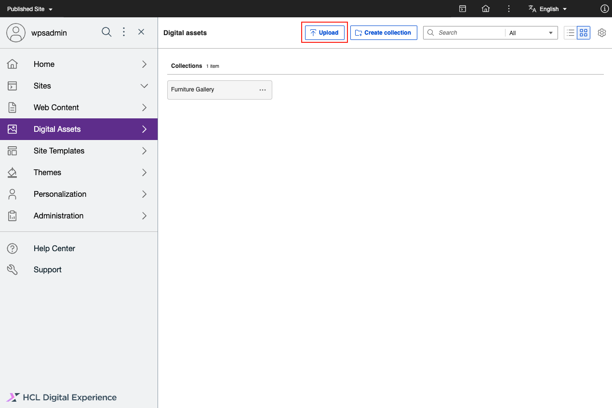

# Upload rich media assets

Follow these steps to upload rich media assets using HCL Digital Experience 9.5 Digital Asset Management \(DAM\).

1. From the HCL Digital Experience 9.5 DAM user interface, click **Upload**. This allows you to view or search, select, and upload rich media assets, such as images and videos from your source repository, to be stored in HCL DAM.

    

    !!! notes

        - You can drag and drop rich media assets from your source or local repository to the HCL DAM user interface to upload selected rich media assets.
        - Once the Kaltura plugin is configured and enabled, automatic synchronization of videos happen in the background whenever a video is successfully uploaded.

            - Videos uploaded to HCL DAM are automatically synchronized.
            - Videos with the **SYNCED** status generates the thumbnail from Kaltura and displays the preview in HCL Digital Asset Management. Videos with other statuses will not have the preview thumbnail available.

            See the [Configure DAM - Kaltura integration](../../configuration/dam_extensibility/kaltura_configuration.md) topic for details.

2. After selecting the rich media assets for upload, you are prompted to either add the selected assets to an existing collection or create a collection.
3. Click **Create Collection** to add selected rich media assets to a new collection. Enter the **Collection Name** and **Collection Description** as applicable.

    

4. Click **Upload**.
5. The HCL DAM user interface shows an upload progress bar. When completed, it shows a success message. Click **View Details** to see information about the media asset uploaded, including file size and media type.

    

    !!! notes

        - If the Kaltura plugin is configured and enabled, the media tile shows the following sync statuses for uploaded videos:

            - SYNC IN PROGRESS
            - SYNC FAILED
            - SYNCED
            See the [Configure DAM - Kaltura integration](../../configuration/dam_extensibility/kaltura_configuration.md) topic for details.

        -   The interface displays features that allows you to edit media asset metadata \(such as `Title` and `Description`\) and user access control \(Access\) of the new or existing collection the rich media asset is uploaded to. See the [Manage collections](manage_collections.md) topic for details.
