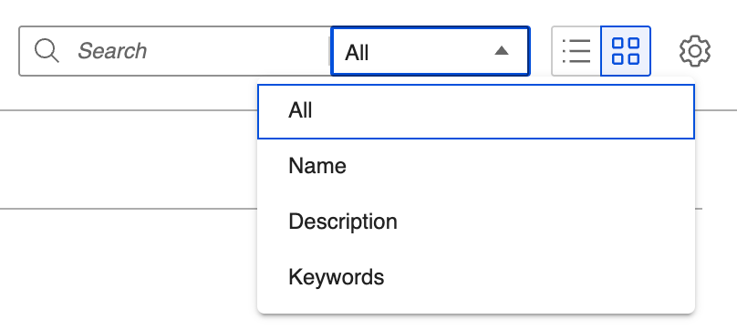
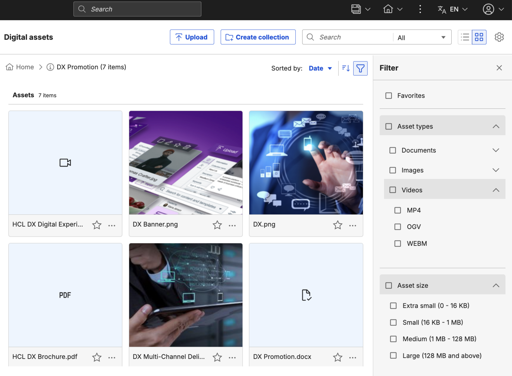

# Digital Asset Search
## Overview

DX Digital Asset Search helps you quickly find and retrieve digital assets across multiple repositories. You can search by keywords, metadata, or content to locate the right asset when you need it. The unified search experience streamlines content management and makes assets easier to discover and reuse in your applications.

## Steps

1. Find your assets by using full-text search on the name, description, keywords, or all of them.

    

2. Sort and order the results.

    
     
     
     
     

## HCLSoftware U learning materials

For an introduction and a demo on how to use Digital Asset Management, go to [Digital Assets](https://hclsoftwareu.hcltechsw.com/component/axs/?view=sso_config&id=3&forward=https%3A%2F%2Fhclsoftwareu.hcltechsw.com%2Fcourses%2Flesson%2F%3Fid%3D302){target="_blank"}.  try it out yourself, refer to [Digital Asset Management Lab](https://connect.hcltechsw.com/communities/service/html/communityview?communityUuid=8cc19fe0-5502-44bb-b00d-dd2b0a51b905#fullpageWidgetId=W7e4dd2688512_4322_ac5f_64c78f420c04&folder=8d35342c-82e0-4003-9e8d-9b0b1af6b304){target="_blank"} and corresponding [Digital Asset Management Lab Resources](https://hclsoftwareu.hcltechsw.com/images/Lc4sMQCcN5uxXmL13gSlsxClNTU3Mjc3NTc4MTc2/DS_Academy/DX/Business_User/HDX-BU-100_Digital_Asset_Management_Lab_Resources.zip).

