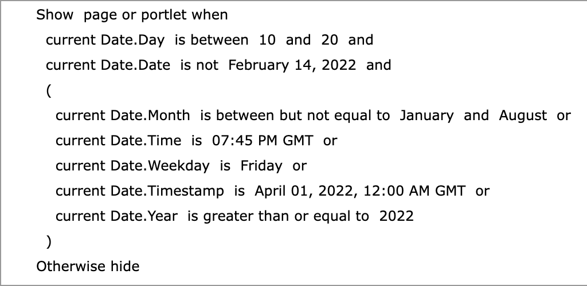
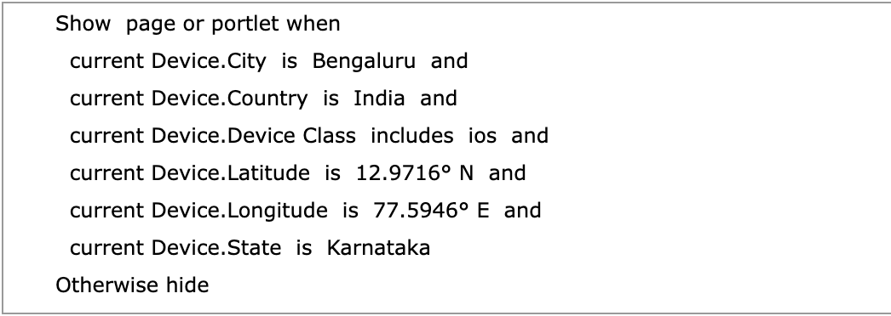
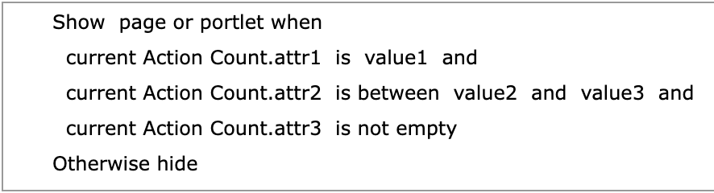
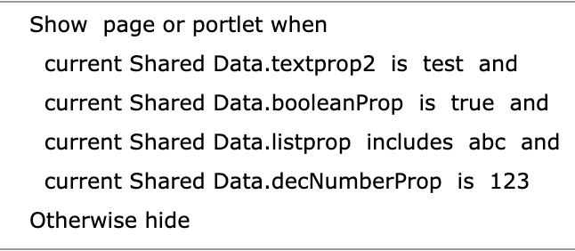
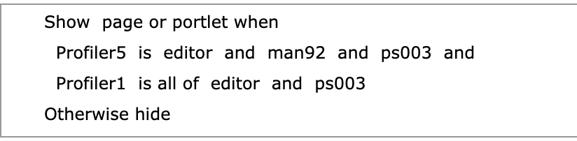

# References for display formats of attribute properties defined to Personalization APIs and examples

The following topic provides additional details about the conditions and response structures for various attributes defined in the examples to execute API calls presenting different attributes of DX [Personalization](../.././../personalization/index.md) services.

## Browser Capability

Sample conditions for each `Browser Capability` property with different operators:


-   Sample attributes: `AcceptLanguage`, `AcceptMimeTypes`, `Agent`, `BrowserType`, `FullVersion`, and `MajorVersion`.
-   Sample operators allowed \(values passed differs from based on the applied operator\):

    -   `includes`, `includes any of`, `is not any of`, `is empty and is not empty` for `AcceptMimeTypes`.
    -   `includes`, `is`, `is not`, `is empty`, `is not empty`, `is between`, `is between but not equal to`, `is greater than`, `is greater than or equal to`, `is less than`, `is less than or equal to`, and `is included in` for other properties.

-   `BrowserType` allows set of values from the following operators: `Mozilla`, `Internet Explorer`, `Safari`, `Opera`, `Netscape`, `Firefox`, `Chrome`, and `Other`.

-   Request/Response structure example:

    ```
    {
      "and": [
        {
          "operator": "is included in",
          "attributeName": "AcceptLanguage",
          "attributeType": "BrowserCapability",
          "value": [
            "en-US"
          ]
        },
        {
          "operator": "includes",
          "attributeName": "AcceptMimeTypes",
          "attributeType": "BrowserCapability",
          "value": [
            "application/json"
          ]
        },
        {
          "operator": "is",
          "attributeName": "Agent",
          "attributeType": "BrowserCapability",
          "value": [
            "Mozilla/5.0"
          ]
        },
        {
          "operator": "is",
          "attributeName": "BrowserType",
          "attributeType": "BrowserCapability",
          "value": [
            "Mozilla"
          ]
        },
        {
          "operator": "is between",
          "attributeName": "FullVersion",
          "attributeType": "BrowserCapability",
          "value": [
            4.5,
            5.8
          ]
        },
        {
          "operator": "is greater than",
          "attributeName": "MajorVersion",
          "attributeType": "BrowserCapability",
          "value": [
            4
          ]
        }
      ]
    }
    ```


## Date

Sample conditions for each `Date` property with different operators:



-   Sample attributes: `day`, `date`, `month`, `time`, `weekday`, `timestamp`, and `year`.
-   Sample operators allowed \(values passed differs from based on the applied operator\): `is`, `is not`, `is empty`, `is not empty`, `is between`, `is between but not equal to`, `is greater than`, `is greater than or equal to`, `is less than`, `is less than or equal to`, and `is included in`.
-   Request/Response structure example:

    ```
    {
      "and": [
        {
          "operator": "is between",
          "attributeName": "day",
          "attributeType": "Date",
          "value": [
            10,
            20
          ]
        },
        {
          "operator": "is not",
          "attributeName": "date",
          "attributeType": "Date",
          "value": [
            "2022-02-14"
          ]
        },
        {
          "or": [
            {
              "operator": "is between but not equal to",
              "attributeName": "month",
              "attributeType": "Date",
              "value": [
                "January",
                "August"
              ]
            },
            {
              "operator": "is",
              "attributeName": "time",
              "attributeType": "Date",
              "value": [
                "19:45:00"
              ]
            },
            {
              "operator": "is",
              "attributeName": "weekday",
              "attributeType": "Date",
              "value": [
                "Friday"
              ]
            },
            {
              "operator": "is",
              "attributeName": "timestamp",
              "attributeType": "Date",
              "value": [
                "2022-04-01 00:00:00"
              ]
            },
            {
              "operator": "is greater than or equal to",
              "attributeName": "year",
              "attributeType": "Date",
              "value": [
                2022
              ]
            }
          ]
        }
      ]
    }
    ```


## Device

Sample conditions for each `Device` property with different operators:



-   Sample attributes: `City`, `Country`, `DeviceClass`, `Latitude`, `Longitude`, and `State`.
-   Sample operators allowed \(values passed differs from based on the applied operator\):
    -   `includes`, `includes any of`, `is not any of`, `is empty` and `is not empty` for `DeviceClass`.
    -   `includes`, `is`, `is not`, `is empty`, `is not empty`, `is between`, `is between but not equal to`, `is greater than`, `is greater than or equal to`, `is less than`, `is less than or equal to`, and `is included in` for other properties.

-   `DeviceClass` allows set of values from: `Mozilla`, `Internet Explorer`, `Safari`, `Opera`, `Netscape`, `Firefox`, `Chrome`, and `Other`.
-   Request/Response structure example:

    ```
    {
      "and": [
        {
          "operator": "is",
          "attributeName": "City",
          "attributeType": "Device",
          "value": [
            "Bengaluru"
          ]
        },
        {
          "operator": "is",
          "attributeName": "Country",
          "attributeType": "Device",
          "value": [
            "India"
          ]
        },
        {
          "operator": "includes",
          "attributeName": "DeviceClass",
          "attributeType": "Device",
          "value": [
            "ios"
          ]
        },
        {
          "operator": "is",
          "attributeName": "Latitude",
          "attributeType": "Device",
          "value": [
            "12.9716° N"
          ]
        },
        {
          "operator": "is",
          "attributeName": "Longitude",
          "attributeType": "Device",
          "value": [
            "77.5946° E"
          ]
        },
        {
          "operator": "is",
          "attributeName": "State",
          "attributeType": "Device",
          "value": [
            "Karnataka"
          ]
        }
      ]
    }
    ```


## Referrer

Sample condition for each `Referrer` property with different operators:


-   Sample attributes: `ReferralHost`, `ReferralUrl`, and `SearchKeywords`.
-   Sample operators allowed \(values passed differs from based on the applied operator\): `includes`, `is`, `is not`, `is empty`, `is not empty`, `is between`, `is between but not equal to`, `is greater than`, `is greater than or equal to`, `is less than`, `is less than or equal to`, and `is included in`.
-   Request/Response structure example:

    ```
    {
      "and": [
        {
          "operator": "is",
          "attributeName": "SearchKeywords",
          "attributeType": "Referrer",
          "value": [
            "Digital Experience"
          ]
        },
        {
          "or": [
            {
              "operator": "is",
              "attributeName": "ReferralHost",
              "attributeType": "Referrer",
              "value": [
                "www.google.com"
              ]
            },
            {
              "operator": "is",
              "attributeName": "ReferralUrl",
              "attributeType": "Referrer",
              "value": [
                "www.hcl.com"
              ]
            }
          ]
        }
      ]
    }
    ```


## Action Bean

Sample condition for the `ActionBean` property with different operators:


-   Sample attribute: `actionNames`.
-   Sample operators allowed \(values passed differs from based on the applied operator\): `includes`, `includes any of`, `is not any of`, `is empty`, and `is not empty`.
-   Request/Response structure example:

    ```
    {
      "and": [
        {
          "attributeType": "ActionBean",
          "attributeName": "actionNames",
          "operator": "includes any of",
          "value": [
              "value1"
          ]
        },
        {
          "attributeType": "ActionBean",
          "attributeName": "actionNames",
          "operator": "includes",
          "value": [
              "value2"
          ]
        },
        {
          "attributeType": "ActionBean",
          "attributeName": "actionNames",
          "operator": "is not any of",
          "value": [
            456
          ]
        },
        {
          "attributeType": "ActionBean",
          "attributeName": "actionNames",
          "operator": "is empty"
        },
        {
          "attributeType": "ActionBean",
          "attributeName": "actionNames",
          "operator": "is not empty"
        }
      ]
    }
    ```


## Action Count

Sample condition for the `Action Count` property with different operators:



-   Sample attributes:
    -   There are no default sample attributes for `ActionCount` property.

        !!! note 
          Custom attributes can be configured as needed depending on the leveraged underlying user registry.

    -   Attributes are dynamically created in the user interface. Refer to *Dynamic Properties* below for more information.

-   Sample operators allowed \(values passed differs from based on the applied operator\): `includes`, `is`, `is not`, `is empty`, `is not empty`, `is between`, `is between but not equal to`, `is greater than`, `is greater than or equal to`, `is less than`, `is less than or equal to`, `includes any of`, `is not any of`, and `is included in`.

-   Request/Response structure example:

    ```
    {
      "and": [
        {
          "attributeType": "ActionCount",
          "attributeName": "attr1",
          "operator": "is",
          "value": [
            "value1"
          ]
        },
        {
          "attributeType": "ActionCount",
          "attributeName": "attr2",
          "operator": "is between",
          "value": [
            "value2",
            "value3"
          ]
        },
        {
          "attributeType": "ActionCount",
          "attributeName": "attr3",
          "operator": "is not empty"
        }
      ]
    }
    ```


## Category Bean

Sample condition for the `Category Bean` property with different operators:


-   Sample attribute: `categoryNames`.
-   Sample operators allowed \(values passed differs from based on the applied operator\): `includes`, `includes any of`, `is not any of`, `is empty`, and `is not empty`.
-   Request/Response structure example:

    ```
    {
      "and": [
        {
          "attributeType": "CategoryBean",
          "attributeName": "categoryNames",
          "operator": "includes any of",
          "value": [
              "value1"
          ]
        },
        {
          "attributeType": "CategoryBean",
          "attributeName": "categoryNames",
          "operator": "includes",
          "value": [
              "value2"
          ]
        },
        {
          "attributeType": "CategoryBean",
          "attributeName": "categoryNames",
          "operator": "is not any of",
          "value": [
            456
          ]
        },
        {
          "attributeType": "CategoryBean",
          "attributeName": "categoryNames",
          "operator": "is empty"
        },
        {
          "attributeType": "CategoryBean",
          "attributeName": "categoryNames",
          "operator": "is not empty"
        }
      ]
    }
    ```


## CategoryCount

Sample condition for the `CategoryCount` property with different operators:


-   Sample attributes:
    -   There are no default sample attributes for `CategoryCount` property.

        !!! note 
           Custom attributes can be configured as needed depending on the leveraged underlying user registry.

    -   Attributes are dynamically created in the user interface. Refer to *Dynamic Properties* below for more information.
-   Sample operators allowed \(values passed differs from based on the applied operator\): `includes`, `is`, `is not`, `is empty`, `is not empty`, `is between`, `is between but not equal to`, `is greater than`, `is greater than or equal to`, `is less than`, `is less than or equal to`, `includes any of`, `is not any of`, and `is included in`.
-   Request/Response structure example:

    ```
    {
      "and": [
        {
          "attributeType": "CategoryCount",
          "attributeName": "attr1",
          "operator": "is not",
          "value": [
            "value1"
          ]
        },
        {
          "attributeType": "CategoryCount",
          "attributeName": "attr2",
          "operator": "is between but not equal to",
          "value": [
            "value2",
            "value3"
          ]
        },
        {
          "attributeType": "CategoryCount",
          "attributeName": "attr3",
          "operator": "is empty"
        }
      ]
    }
    ```


## User and Group attributes

Sample condition for the `User` property with different operators:


-   Sample attributes:
    -   `Last Name`, `mail`.

        !!! note 
          Custom attributes can be configured as needed depending on the leveraged underlying user registry.

    -   Attributes are dynamically created in the user interface. Refer to *Dynamic Properties* below for more information.

-   Sample operators allowed \(values passed differs from based on the applied operator\): `includes`, `is`, `is not`, `is empty`, `is not empty`, `is between`, `is between but not equal to`, `is greater than`, `is greater than or equal to`, `is less than`, `is less than or equal to`, `is not any of`, and `is included in` for other properties.

-   Request/Response structure example:

    ```
    {
      "and": [
            {
              "operator": "is",
              "attributeName": "mail",
              "attributeType": "wpsUser",
              "value": [
                "wpsadmin@hcl.com"
              ]
            },
            {
              "operator": "is",
              "attributeName": "sn",
              "attributeType": "wpsUser",
              "value": [
                "Sample"
              ]
            },
            {
              "operator": "is",
              "attributeName": "MyFavoriteAttribute",
              "attributeType": "wpsUser",
              "value": [
                "Demo"
              ]
            }
          ]
    }
    ```


## Session attributes

Sample condition for the `Session` property with different operators:


-   Sample attributes:
    -   There are no default sample attributes for the `Session` property.

        !!! note 
          Custom attributes can be configured as needed depending on the leveraged underlying user registry.

    -   Attributes are dynamically created in the user interface. Refer to *Dynamic Properties* below for more information.
-   Sample operators allowed \(values passed differs from based on the applied operator\): `includes`, `is`, `is not`, `is empty`, `is not empty`, `is between`, `is between but not equal to`, `is greater than`, `is greater than or equal to`, `is less than`, `is less than or equal to`, `is not any of`, and `is included in`.
-   Request/Response structure example:

    ```
    "and": [
      {
        "operator": "is",
        "attributeName": "textprop2",
        "attributeType": "Session",
        "value": [
          "test"
        ]
      },
      {
        "operator": "is",
        "attributeName": "booleanProp",
        "attributeType": "Session",
        "value": [
          true
        ]
      },
      {
        "operator": "includes",
        "attributeName": "listprop",
        "attributeType": "Session",
        "value": [
          "abc"
        ]
      },
      {
        "operator": "is",
        "attributeName": "decNumberProp",
        "attributeType": "Session",
        "value": [
          123
        ]
      }
    ]
    ```


## Shared data attributes

Sample condition for the `SharedData` property with different operators:



-   Sample attributes:
    -   There are no default sample attributes for the `SharedData` property.

        !!! note 
          Custom attributes can be configured as needed depending on the leveraged underlying user registry.

    -   Attributes are dynamically created in the user interface. Refer to *Dynamic Properties* below for more information.
-   Sample operators allowed \(values passed differs from based on the applied operator\): `includes`, `is`, `is not`, `is empty`, `is not empty`, `is between`, `is between but not equal to`, `is greater than`, `is greater than or equal to`, `is less than`, `is less than or equal to`, `is not any of`, and `is included in`.
-   Request/Response structure example:

    ```
    "and": [
      {
          "operator": "is",
          "attributeName": "textprop2",
          "attributeType": "SharedData",
          "value": [
              "test"
          ]
      },
      {
          "operator": "is",
          "attributeName": "booleanProp",
          "attributeType": "SharedData",
          "value": [
              true
          ]
      },
      {
          "operator": "includes",
          "attributeName": "listprop",
          "attributeType": "SharedData",
          "value": [
              "abc"
          ]
      },
      {
          "operator": "is",
          "attributeName": "decNumberProp",
          "attributeType": "SharedData",
          "value": [
              123
          ]
      }
    ]
    ```


## Shared Render parameters

Sample condition for the `RenderParameter` property with different operators:


-   Sample attributes:
    -   There are no default sample attributes for the `RenderParameter` property.

        !!! note
          Custom attributes can be configured as needed depending on the leveraged underlying user registry.

    -   Attributes are dynamically created in the user interface. Refer to *Dynamic Properties* below for more information.
-   Sample operators allowed \(values passed differs from based on the applied operator\): `includes`, `is`, `is not`, `is empty`, `is not empty`, `is between`, `is between but not equal to`, `is greater than`, `is greater than or equal to`, `is less than`, `is less than or equal to`, `is not any of`, and `is included in`.
-   Request/Response structure example:

    ```
    {
      "and": [
        {
          "operator": "is",
          "attributeName": "timeprop",
          "attributeType": "RenderParameter",
          "value": [
            "20:54:00"
          ]
        },
        {
          "operator": "is",
          "attributeName": "dateProp",
          "attributeType": "RenderParameter",
          "value": [
            "2022-02-21"
          ]
        },
        {
          "operator": "is",
          "attributeName": "timestampprop",
          "attributeType": "RenderParameter",
          "value": [
            "2022-02-21 17:28:00"
          ]
        },
        {
          "operator": "includes",
          "attributeName": "listprop",
          "attributeType": "RenderParameter",
          "value": [
            "myItem"
          ]
        }
      ]
    }
    ```


## Portlet Attributes parameters

Sample condition for the `PortletAttributes` property with different operators:


-   Sample attributes:
    -   There are no default sample attributes for the `PortletAttributes` property.

        !!! note 
          Custom attributes can be configured as needed depending on the leveraged underlying user registry.

    -   Attributes are dynamically created in the user interface. Refer to *Dynamic Properties* below for more information.
-   Sample operators allowed \(values passed differs from based on the applied operator\): `includes`, `is`, `is not`, `is empty`, `is not empty`, `is between`, `is between but not equal to`, `is greater than`, `is greater than or equal to`, `is less than`, `is less than or equal to`, `includes any of`, `is not any of`, and `is included in`.
-   Request/Response structure example:

    ```
    "and": [
      {
          "operator": "is",
          "attributeName": "textprop2",
          "attributeType": "PortletAttr",
          "value": [
              "test"
          ]
      },
      {
          "operator": "is",
          "attributeName": "booleanProp",
          "attributeType": "PortletAttr",
          "value": [
              true
          ]
      },
      {
          "operator": "includes",
          "attributeName": "listprop",
          "attributeType": "PortletAttr",
          "value": [
              "abc"
          ]
      },
      {
          "operator": "is",
          "attributeName": "decNumberProp",
          "attributeType": "PortletAttr",
          "value": [
              123
          ]
      }
    ]
    ```


## Request attributes

Sample condition for `Request` property with different operators:


-   Sample attributes:
    -   There are no default sample attributes for the `Request` property.

        !!! note 
          Custom attributes can be configured as needed depending on the leveraged underlying user registry.

    -   Attributes are dynamically created in the user interface. Refer to *Dynamic Properties* below for more information.
-   Sample operators allowed \(values passed differs from based on the applied operator\): `includes`, `is`, `is not`, `is empty`, `is not empty`, `is between`, `is between but not equal to`, `is greater than`, `is greater than or equal to`, `is less than, is less than or equal to`, `includes any of`, `is not any of`, and `is included in`.
-   Request/Response structure example:

    ```
    "and": [
      {
          "operator": "is",
          "attributeName": "textprop2",
          "attributeType": "Request",
          "value": [
              "test"
          ]
      },
      {
          "operator": "is",
          "attributeName": "booleanProp",
          "attributeType": "Request",
          "value": [
              true
          ]
      },
      {
          "operator": "includes",
          "attributeName": "listprop",
          "attributeType": "Request",
          "value": [
              "abc"
          ]
      },
      {
          "operator": "is",
          "attributeName": "decNumberProp",
          "attributeType": "Request",
          "value": [
              123
          ]
      }
    ]
    ```


## Profiler

Sample condition for `Profiler` property with different operators:



-   Sample attributes inside `profile`: `id`, `profilerName`, and `profiles`.

    !!! note 
      The `profilerName` or `id` passed should belong to the already created Profiler.

-   Sample operators allowed outside `matchingItems` \(profiles passed differs based on the operator applied\): `is`, `is not`, `is all of`, `is any of`, and `is not any of`.
-   Request/Response structure example:

    ```
    "and": [
      {
        "profile": {
          "id": "5b569fd7-564e-4b48-a2ee-5f1ce3a42352",
          "profilerName": "/Profiler5",
          "profiles": [
            "editor",
            "man92",
            "ps003"
          ]
        },
        "operator": "is"
      },
      {
        "profile": {
          "id": "7cbe9e52-4164-4d26-92a5-194bf0f92b47",
          "profilerPath": "/Profiler1",
          "profiles": [
            "editor",
            "ps003"
          ]
        },
        "operator": "is all of"
      }
    ]
    ```


## Arithmetic Operations

Sample condition with `Arithmetic Operations` with different operators:


-   Sample attributes used inside `arithmetic`: `attributeNames` and `arithmeticOperator`.
-   Sample operators outside `arithmetic` \(values passed differs based on the operator applied\): `is`, `is not`, `is empty`, `is not empty`, `is between`, `is between but not equal to`, `is greater than`, `is greater than or equal to`, `is less than`, `is less than or equal to`, and `is included in`.
-   Request/Response structure example:

    ```
    "and": [
      {
        "operator": "is",
        "arithmetic": {
          "attributeNames": [
            "a",
            "b"
          ],
          "arithmeticOperator": "+"
        },
        "value": [
          1
        ]
      },
      {
        "operator": "is between",
        "arithmetic": {
          "attributeNames": [
            "a",
            "b"
          ],
          "arithmeticOperator": "+"
        },
        "value": [
          2,
          3
        ]
      }
    ]
    ```


## Matching Items

The sample condition with `Matching Items` with different operators:


-   Sample attributes and operators used inside `matchingItems` differs based on the type of attributes used for conditions.
-   Sample operators allowed outside `matchingItems` \(values passed differs based on the operator applied\): `is`, `is not`, `is empty`, `is not empty`, `is between`, `is between but not equal to`, `is greater than`, `is greater than or equal to`, `is less than`, `is less than or equal to`, and `is included in`.

-   Request/Response structure example:

    ```
    "and": [
      {
        "operator": "is",
        "matchingItems": {
          "operator": "includes",
          "attributeName": "actionNames",
          "attributeType": "ActionBean",
          "value": [
            "PS003"
          ]
        },
        "value": [
          2
        ]
      },
      {
        "operator": "is between",
        "matchingItems": {
          "operator": "includes",
          "attributeName": "attr1",
          "attributeType": "CategoryCount",
          "value": [
            "PS003"
          ]
        },
        "value": [
          1,
          4
        ]
      }
    ]
    ```


