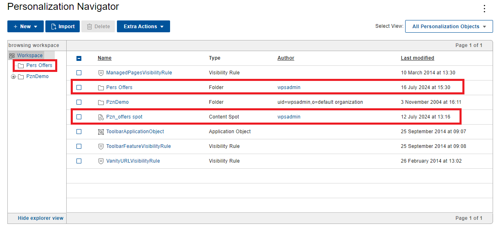
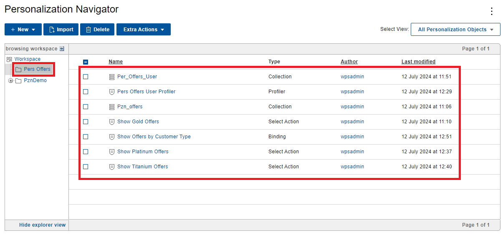

# Importing the Personalization rules into HCL Digital Experience  

In this topic, you will learn how to import the Personalization rules into Portal.

The Pers_Offers sample portlet contains a folder named **rules** that has all the rules created after you complete the steps in [Developing a personalized portlet using IBM Rational Application Developer](../RAD/index.md). You can import these rules into HCL Digital Experience (DX) through the following steps.

1. Extract the **Portal_rules_PznOffers.zip** file located in the **rules** directory to any folder.  
2. Log in to HCL DX as the Portal administrator (wpsadmin).
3. Open the **Applications menu** then go to **Personalization > Business Rules**.
4. Click **New** > **Folder**.  
5. Name the folder **Pers Offers** then click **Save**.
6. In the **Pers Offers** folder, click **Import**.
7. Select one of the following files from the **Portal_rules_PznOffers** folder then click **Import**. You need to import each file one by one.

    1. Per_Offers_User.nodes
    2. Pzn_offers.nodes
    3. Show+Gold+Offers.nodes
    4. Show+Platinum+Offers.nodes
    5. Show+Titanium+Offers.nodes
    6. Show+Offers+by+Customer+Type.nodes
    7. Pers+Offers+User+Profiler.nodes

8. In the **browsing workspace** directory, select **Workspace** then click **Import**.

9. Select the **Pzn_offers+spot.nodes** file then click **Import**.

!!! Note  
       The name of the content spot rule needs to match the `displayName` of the content spot used in the HRF file.  

## Result

See the imported rules under **Workspace**.

See the imported rules under **Pers Offers**.

  
