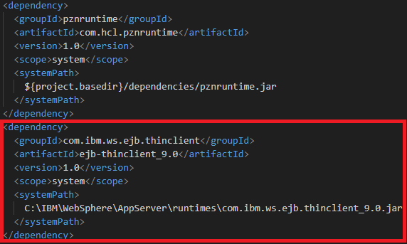
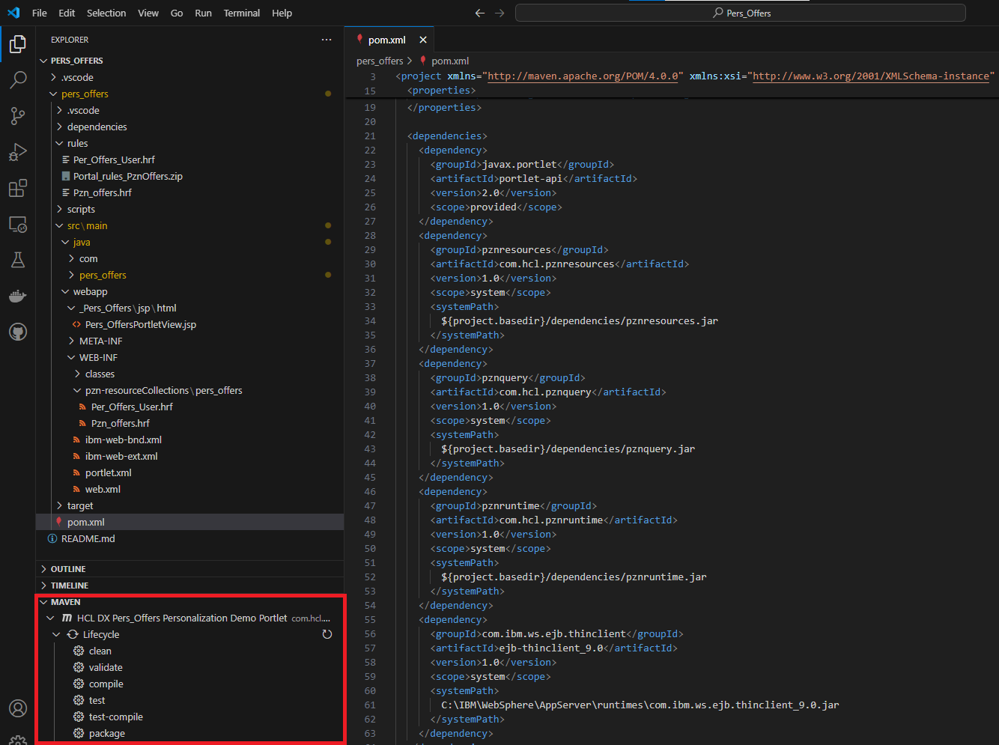

# 2. Install the Pers_Offers portlet  

## Prerequiste

Make sure that you have already installed git or git-bash, Microsoft Visual Studio Code and Maven.
Furthermore, please make sure that you have already run the following two ConfigEngine tasks:

- UNIX™Linux™:  
   `./ConfigEngine.sh create-pzndemo-users -DPortalAdminPwd=<password> -DWasPassword=<password>`  
   `./ConfigEngine.sh install-pzndemo -DPortalAdminPwd=<password> -DWasPassword=<password>`  

- Windows™:  
   `ConfigEngine.bat create-pzndemo-users -DPortalAdminPwd=<password> -DWasPassword=<password>`  
   `ConfigEngine.bat install-pzndemo -DPortalAdminPwd=<password> -DWasPassword=<password>`  

## Detailed steps

1. Clone the git repository [Personalization Example (Pers_Offers)](https://github.com/HCL-TECH-SOFTWARE/dx-portlet-development-utilities/tree/main/personalization/Pers_Offers)  
   `git clone https://github.com/HCL-TECH-SOFTWARE/dx-portlet-development-utilities.git`  

2. start Micorosoft Visual Studio Code and open the folder:  
   `\dx-portlet-development-utilities\personalization\Pers_Offers\pers_offers`

3. add the ejb-thin-client jar dependiencies to the pom.xml file of the pers_offers project.  
   Here is an example:  

      

4. Compile and package the project using the Maven Plugin in Microsoft Visual Studio Code  
     

5. By packaging the project a `\target\pers_offers-1.0-SNAPSHOT\WEB-INF\lib\pers_offers-1.0-SNAPSHOT.jar` file will be created. Modify the jar-file (for example with 7zip) to make sure that it just include the pers_offers folder in it with all its java classes. Remove all other files and directories in that jar-file! That modification is required, because when the other files and folders will be kept, the rule classes can not be loaded correctly by the Portal runtime.  

    Another option is to use the java jar-utility to package all classes of the pers_offers folder into a jar-file. For details, please check: [Java JAR-Tool](https://docs.oracle.com/javase/tutorial/deployment/jar/basicsindex.html)  

6. Copy the modified `pers_offers-1.0-SNAPSHOT.jar` file to `\PortalServer\pzn\prereq.pzn\collections`  

7. restart the portal server  

8. As soon as the server is started the **Pers Offers Portlet** can be installed. That can be done in two different ways.  

    **DX-Client installation**

      1. In Visual Studio Code open the tasks.json file and verify the dxclient command settings, to make sure that it matchs your DX environment settings.  
      2. The portlet can be installed in Microsoft Visual Studio Code, by navigating to **Terminal** > **Run task...**  
      3. Click to the option **deploy_OR_Update_Portlet**. In the terminal window it can be checked, if the deployment is successfully.  
         There is also another task available to undeploy the portlet again. (see task: **undeploy_Portlet**)  

    **Manual installation**

      1. Login as portal admin user to your portal. Navigate to **Administration** > **Applications** > **Web Modules**  
      2. Click to the **Install** button  
      3. Select the `\dx-portlet-development-utilities\personalization\Pers_Offers\pers_offers\target\pers_offers-1.0-SNAPSHOT.war` file and install it.  

9. Create a new page with name **Pers Offers** and add the **Pers Offers** portlet.  

!!!note
    As soon as the Pers Offers portlet is installed, you might still will not see any personalized information in that portlet. This is because the pzn-rules are not installed yet. That will be done in the next steps. Furthermore, personalized information are just shown up for the pzndemo-users (for example username: scott / password: pzndemo) and not for the portal admin user (wpsadmin). That means that it is required to login as such a pzn-demo user to see personalized information.  
