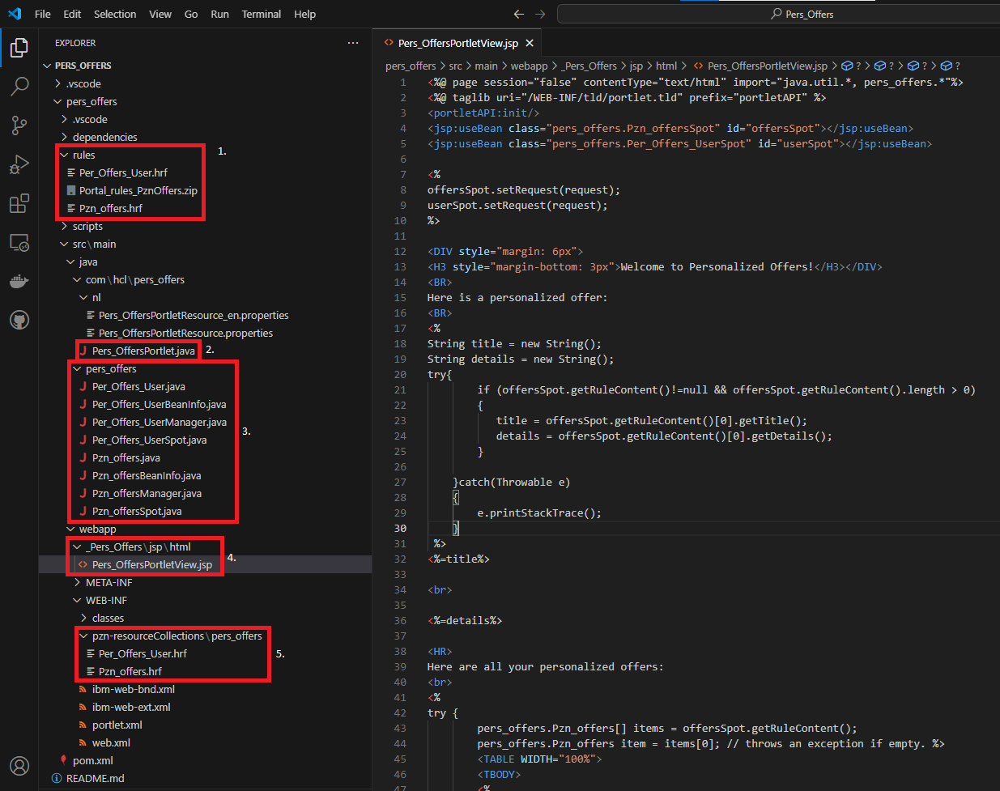
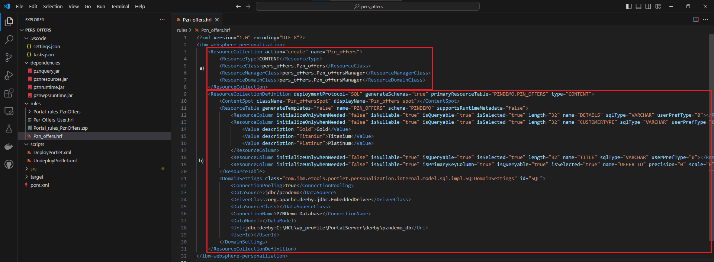

# Reviewing the Pers_Offers project

In this topic, you will learn about the structure of the Pers_Offers project. Upon opening the Pers_Offers project with Microsoft Visual Studio Code (VSC), the following directory structure appears. The highlighted sections will be described in detail below.

  

1. The **rules** folder includes all the required rules needed to run the Pers_Offers project. These rules (HRF files) can be imported into HCL Digital Experience.  

2. The **Pers_OffersPortlet.java** file is a JCR 268 Java Portlet class.

3. All the classes in the **src/main/java/pers_offers** folder are resource collection classes needed to implement the personalization. The source code is based on the instructions mentioned in [Developing a personalized portlet using Rational Application Developer](../RAD/index.md).

4. The **Pers_OffersPortletView.jsp** file is used to display the personalized data.

5. When using IBM Rational Application Developer, a personalization wizard helps you to create the source code of the **pers offers** resource collection classes stored in the **src/main/java/pers_offers** folder. The wizard also automatically creates HRF files that specifies the mapping between the rules, Java classes, and backend databases. This wizard is currently not available in Microsoft VSC. Alternatively, you can use the sample HRF files in **\src\main\webapp\WEB-INF\pzn-resourceCollections\pers_offers** as a guide to create your own classes and rules.

    See the sample **Pzn_offers.hrf** file below.

      

    1. The specification and registration of the Java resource classes in the **src/main/java/pers_offers** folder.  
    2. The resource collection definition in which a content spot, tables, column-values, and db-domains can be specified.  
