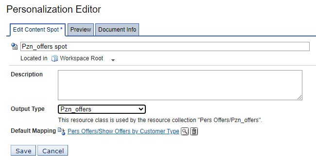

# Changing content spot rule mapping

In this topic, you will learn how to change content spot rule mapping.

Change the default rule mapping to the new binding rule that you created for different customer types who will use the Personalized Offers portlet. Then, test the portlet for use by all customer types and verify that the portlet displays the personalized content specified by the business rule for each user profile.

## Editing the rule mapping  

Before you begin this procedure, ensure you have properly created additional advanced rules.

1. In the Personalization Navigator, select the content spot **Pzn_offersSpot**, located in the **Workspace Root**.

2. In the Personalization Editor portlet, click **Edit**.

3. Change the default rule mapping to the new binding rule and click **Save**.

   

## Testing the portal using different customer types

1. Log in to the Portal as **Scott** (a Gold customer), with the password **pzndemo**.

2. Run the enhanced Personalized portlet.

3. Log out, then log in as **Marge** (a Platinum customer), with the password **pzndemo**.

4. Run the portlet.

!!!note
    If you run the portlet as wpsadmin, it fails because wpsadmin does not exist in the user resource database.

Congratulations! You have finished building a Personalized portlet.

The next topic, **Personalized list portlet**, shows how to use this portlet instead of coding the Rational Application Developer portlet.
