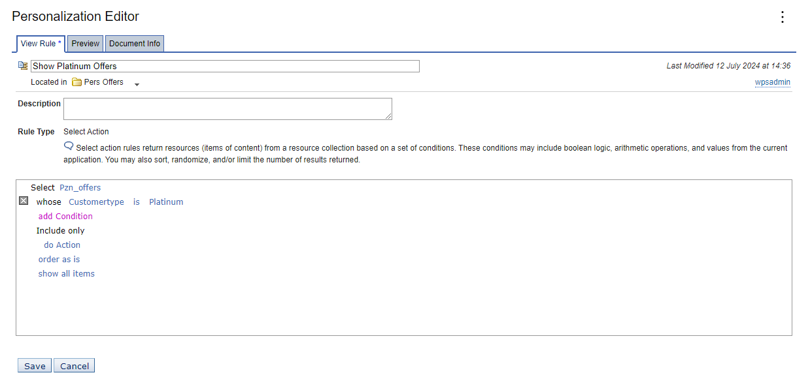
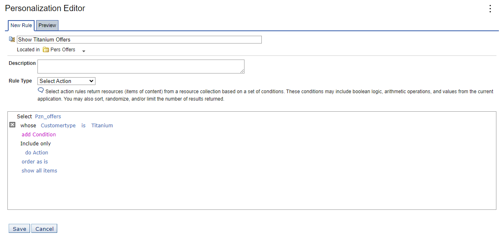
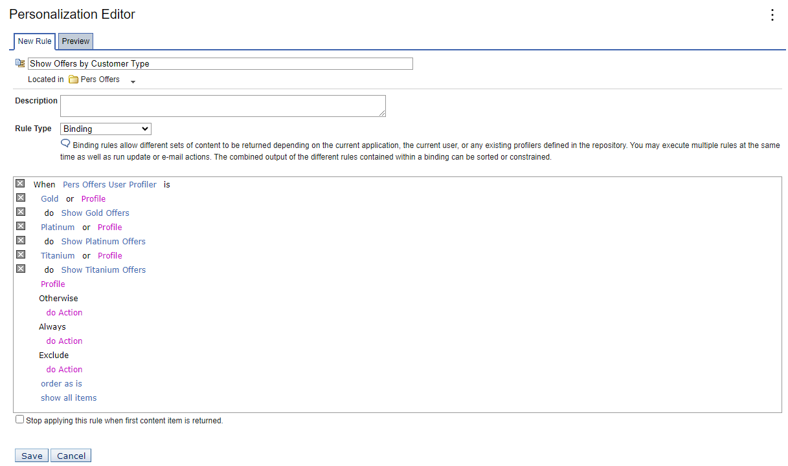

# Creating additional advanced rules

In this topic, you will learn how to create additional advanced rules.

For each customer type specified by a profile, add to the business rule (the profiler) by selecting actions to build the syntax of the rule. Before you begin, ensure you have properly followed the steps in [Create the user profiler rule](pzn_demo_create_user_profiler_rule.md#).

1. In the **Pers Offers** folder, select **New > Rule**.  

2. Type **Show Platinum Offers** in the **New Rule** field.  

3. Choose **Select Action** from the **Rule Type** dropdown list.  

4. Edit the rule so that its Customertype is Platinum, then click **Save**.  

      

5. In the **Pers Offers** folder, create another rule called **Show Titanium Offers**. 
6. Edit the rule so that its Customertype is Titanium, then click **Save**.
      

6. In the same folder, select **New > Rule** .

7. Enter **Show Offers by Customer Type** in the **New Rule** field.  

8. Select **Binding** from the **Rule Type** drop-down list.  

9. Click **Profiler > Select a Profiler...**.  

10. In the Pers Offers folder, select **Pers Offers User Profiler** then click **OK**.  

11. Click **Profile** and select **Gold** from the drop-down list.  

12. Click **do Action > Select Actions...**.  

13. Select **Show Gold Offers** and click **OK**.  

    !!!note "Tip"
        To find **Show Gold Offers**, you may reorder the columns to make navigation easier or page through the list of rules.

14. Click **Profile** and choose **Platinum**.  

15. Click **do Action > Select Actions...**.  

16. Select **Show Platinum Offers** and click **OK**

Do the same steps for Titanium customers.  

## Result

You have successfully created additional advanced rules. In the next topic, you will learn how to [Change content spot rule mapping.](./pzn_demo_change_content_spot_rule_mapping.md)
