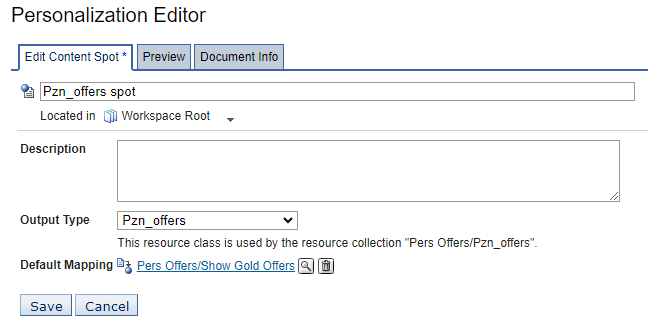
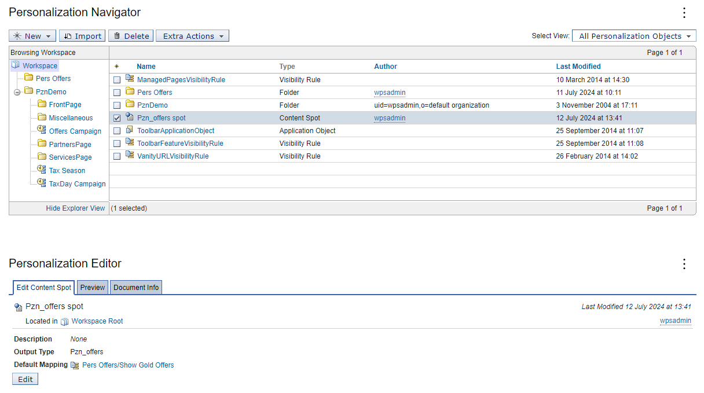
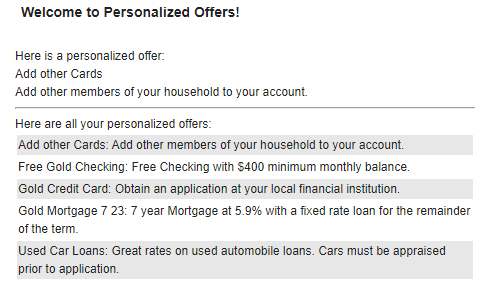

# Creating a content spot

In this topic, you will learn how to create a content spot.

Use the Personalization Editor to create a placeholder called a content spot for the rule that renders the selected content on a Web page. Then, specify which rule to place in the content spot by creating a rule mapping. In this example, the content used is a resource collection.

Before you begin this procedure, ensure you have created the simple content rule **Show Gold Offers** for the Personalized Offers resource collection.

!!!note
    You must use the same name as the original content spot's display name. Do not place the new content spots into a folder unless your display name already includes slashes. Place them directly into the root Workspace.

1. Return to the root directory in the Personalization Navigator.

2. Click **New > Content Spot** to display the Personalization Editor.

3. Type **Pzn_offers spot** in the title field of the content spot.

4. Select **Pzn_offers** from the **Output Type** drop-down list.

5. In the **Default Mapping** section, click the magnifying glass icon.

6. Expand the **Pers Offers** folder in the tree and select **Show Gold Offers**.  

7. Click **OK**.

      

8. Click **Save**.

9. Test the content spot with the Personalization Editor portlet by selecting it in the Personalization Navigator and clicking the **Preview** tab in the Personalization Editor.

      

    !!!note
        If the previous values appear on the Preview tab, the rule and content spot work.

10. View the page with your Pers_Offers portlet.

## Result  

You have successfully created a content spot. In the next topic, you will learn how to [Enhance the Personalized portlet.](./pzn_demo_enhance_personalized_portlet.md)
