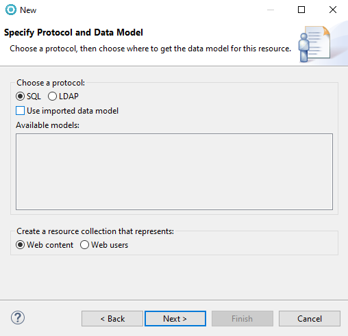
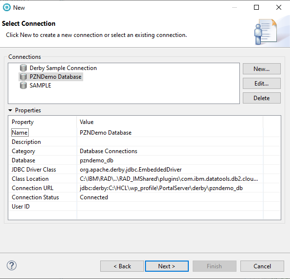
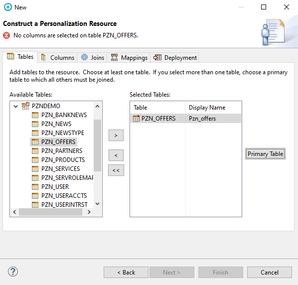
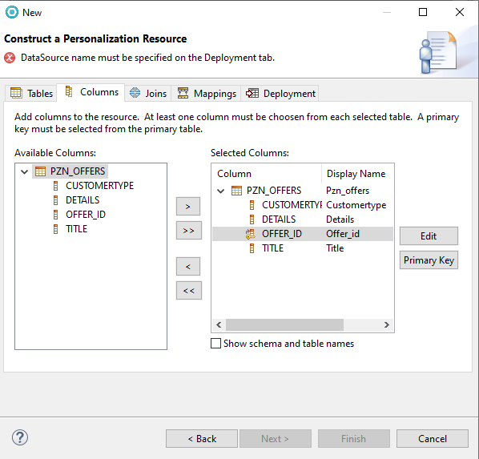
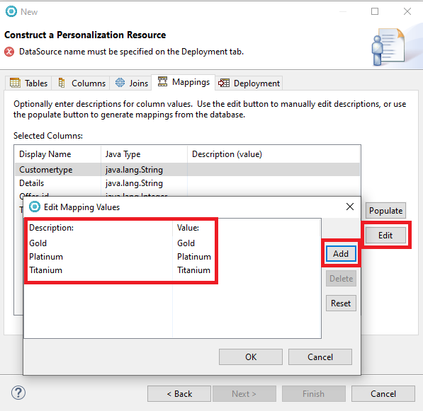
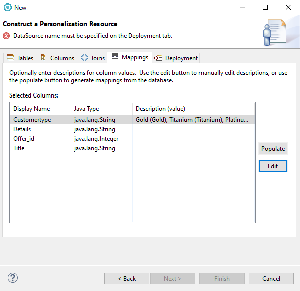
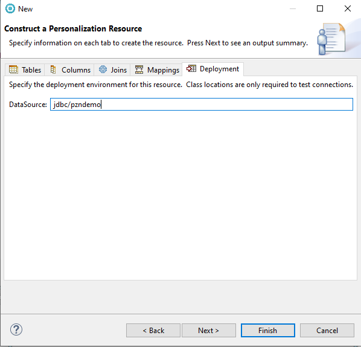
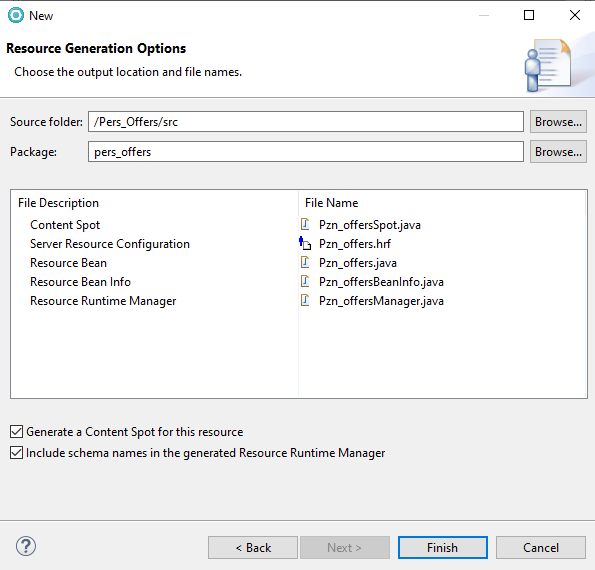
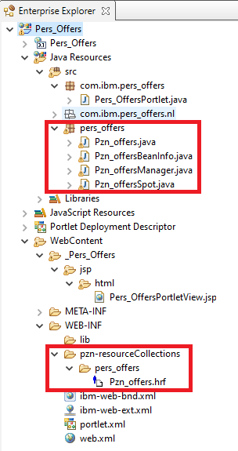
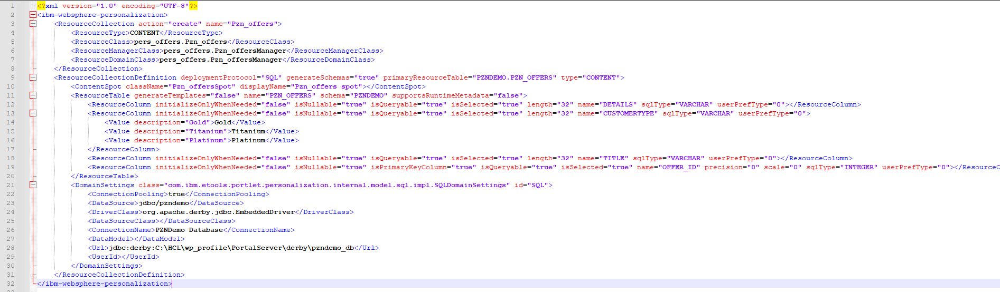

# Creating the Personalization content resource classes and content spot

In this topic, you will learn how to create the Personalization content resource classes and content spot using the IBM Rational Application Developer.

1. In the **Project Explorer** tab of the Rational® Application Developer, right-click on the **Pers_Offers** project and choose **New > Other**.

2. From the **New** window, select **Portal > Personalization > Content or User Resource**.

3. Click **Next**.

4. Under **Choose a protocol**, click the **SQL** radio button.

5. Under **Create a resource collection that represents:**, click the **Web content** radio button.

6. Click **Next**.

      

7. Select **Create a new connection** and click **Next**.

8. Enter the following values:

    1. From the **JDBC driver** drop-down list, select **Derby Embedded JDBC Driver**.

    2. From the **Database location** field, click **Browse** and select ``<wp_profile_root>/PortalServer/derby/pzndemo_db/.``.

    3. From the **Class location** field, click **Browse** and select ``<AppServer_root>/derby/lib/derby.jar``.

         

9. Click **Next**. This will open the Personalization Resource wizard.

10. Under the **Tables** tab, expand the **PZNDEMO** dropdown list.

11. Select **PZN_OFFERS**, and click **>** to add the table to the list of selected tables.  

12. Click **Primary Table** to mark **PZN_OFFERS** as the primary table.

      

13. Under the **Columns** tab, click **>>** to move all columns to the selected columns list. Note that the primary key is the column **Offer_ID**.  

      

14. Under the **Mappings** tab, select **Customertype** and click **Edit**.  

15. Add the following **Descriptions** and **values**:

    |Description|values|
    |-----------|------|
    |Gold|Gold|
    |Titanium|Titanium|
    |Platinum|Platinum|

      

    **Final mappings:**  

      

16. Under the **Deployment** tab, change the datasource to **jdbc/pzndemo**. This datasource is defined in WAS by the Personalization demo program installation.

      

17. Click **Next**.

18. On the **Package:** field, enter **pers_offers**.

19. Select the following checkboxes:
    1. Generate a Content Spot for this resource
    2. Include schema names in the generated Resource Runtime Manager

      

20. Click **Finish**.  

You can now see the new java classes in your project.  

## Result

  

Ensure to also review the Pzn_Offers.hrf file to understand the definitions.

You have successfully created the Personalization content resource classes and content spot. In the next topic, you will learn how to [Creating the Personalization user resource classes and content spot.](./pzn_demo_create_pzn_user_resources.md)
