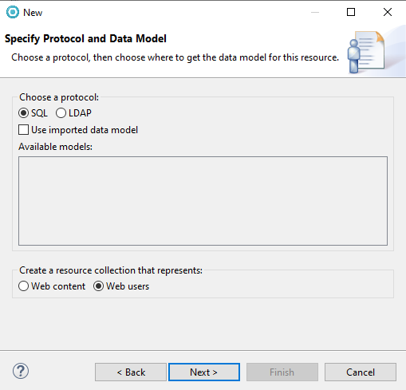
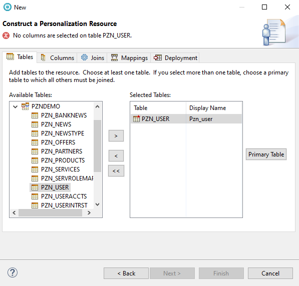
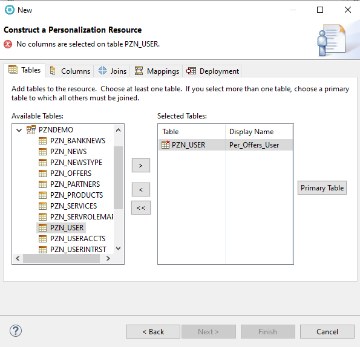
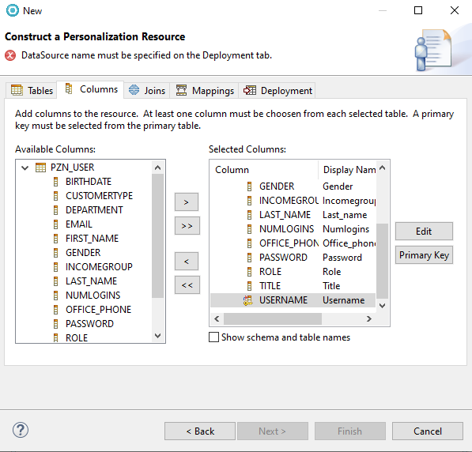
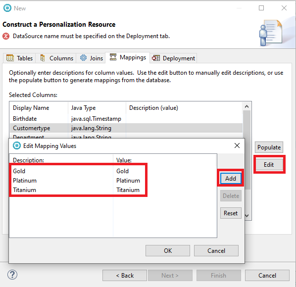
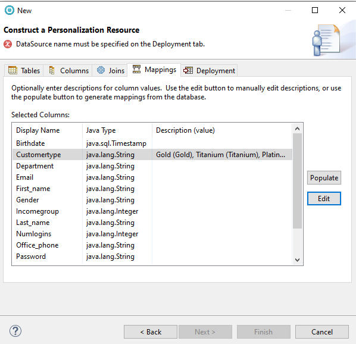
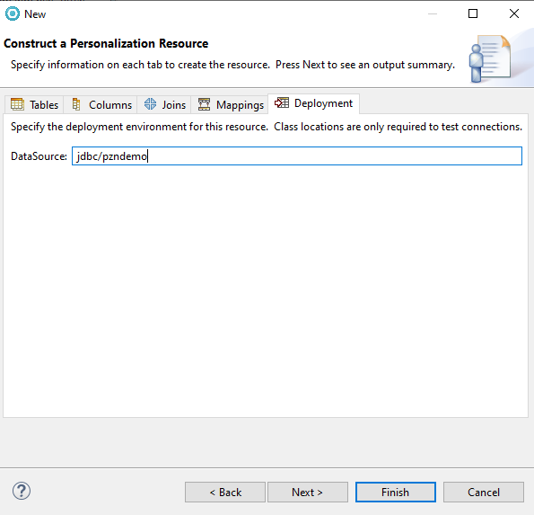
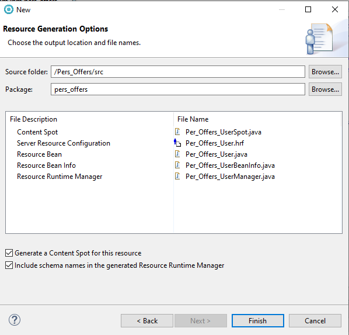
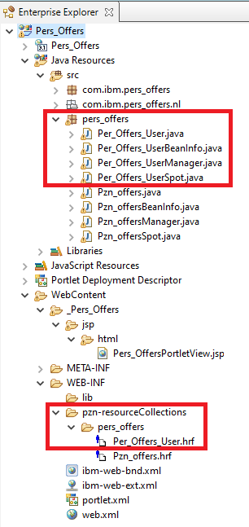

# Creating the Personalization user resource classes and content spot

In this topic, you will learn how to use the Project Explorer of IBM Rational Application Developer to create the user resource classes and content spot for the Personalization demo that creates the Personalized Offers portlet for different customer profiles.

1. In the **Project Explorer** tab of the Rational® Application Developer, right-click on the **Pers_Offers** project and choose **New > Other**.

2. From the **New** window, select **Portal > Personalization > Content or User Resource**.

3. Click **Next**.

4. Under **Choose a protocol**, click the **SQL** radio button.

5. Under **Create a resource collection that represents:**, click the **Web users** radio button.

6. Click **Next**.

      

7. Select **Use an existing connection** and click **PZNDemo Database** from the list of existing connections.

      

8. Click **Next**. This will open the Personalization Resource wizard.

9. Under the **Tables** tab, expand the **PZNDEMO** dropdown list.

10. Select **PZN_USER** and click **>** to add the table to the list of selected tables.  

      

11. Double-click the display name and rename it to **Per_Offers_User** to avoid naming conflicts with the previously installed demo code.  

12. Click **Primary Table** to mark **PZN_USER** as the primary table.

      

13. Under the **Columns** tab, click **>>** to move all columns to the selected columns list. Note that the primary key is the column **USERNAME**.  

      

14. Under the **Mappings** tab, select **Customertype** and click **Edit**.

15. Add the following **Descriptions** and **values**:

    |Description|values|
    |-----------|------|
    |Gold|Gold|
    |Titanium|Titanium|
    |Platinum|Platinum|

      

      

16. Under the **Deployment** tab, change the datasource to **jdbc/pzndemo**. This datasource is defined in WAS by the Personalization demo program installation.

    

17. Click **Next**.

18. Enter **pers_offers** as the package name.  

19. Select the following checkboxes:
    1. Generate a Content Spot for this resource
    2. Include schema names in the generated Resource Runtime Manager

    

20. Click **Finish**.

You can now see the new java classes in your project.

## Result

Ensure to also review the Per_Offers_User.hrf file to understand the definitions.

You have successfully created the Personalization user resource classes and content spot. In the next topic, you will learn how to [Code the JSP portlet.](./pzn_demo_finish_coding_portlet_jsp.md)
