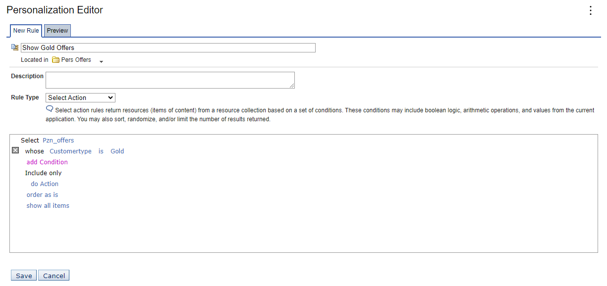
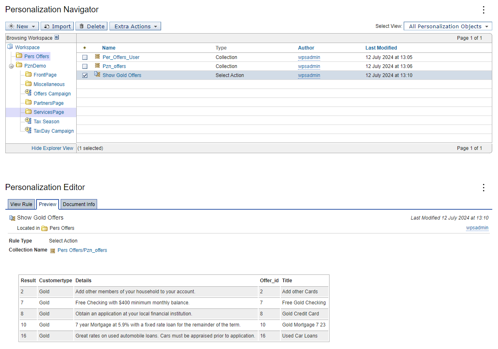

# Creating a simple content rule

In this topic, you will learn how to use the Personalization Editor to create a business rule for a resource collection. Before you begin, ensure you have imported the resource collections into the Personalization Workspace.  

1. Select the **Pers Offers** folder, then click **New > Rule**.  

2. Type **Show Gold Offers** in the New Rule field.  

3. Click  **Select Action** from the **Rule Type** drop-down list.  

4. Click **Web Content** and select **Pzn_offers** from the drop-down list.  

5. Click **attribute** and select **Customertype** in the drop-down list.  

6. Click **value** field and select **Gold** in the drop-down list.  

7. Click **Save**.  

## Result  

  

Back in the list of rules, you can also click **Preview** button to determine if the rule works. For example:

You have successfully created a simple content rule. In the next topic, you will learn how to [Create a content spot.](./pzn_demo_create_content_spot.md)
