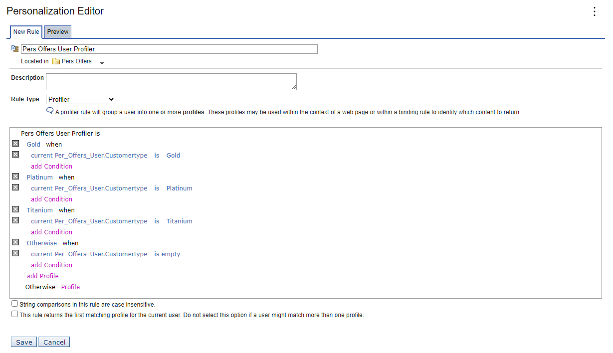

# Creating the user profiler rule

In this topic, you will learn how to use the Personalization Editor to create a profiler rule for users who qualify as customers for Gold Offers in the Personalized Offers resource collection. Before you begin, ensure that you have modified the resource collection properties to specify the Translator Class.

In the Personalization Editor, follow these steps:

1. In the **Pers Offers** folder, click **New > Rule**.

2. In the **New Rule** field, enter **Pers Offers User Profiler**.

3. Select **Profiler** from the **Rule Type** dropdown list.

4. In the **Profile** field, enter **Gold** and click **Submit**.  

5. Click **attribute** and select **Per_Offers_User** from the dropdown list.

6. From the expanded dropdown list, click **Customertype**.  

7. Click **value** and select **Gold** from the dropdown list.

8. Click **add Profile** to add another conditional expression to the profiler rule.

9. Complete the profiler rule by adding profiles that define distinct sets of users. Each profile expresses the conditions of the user type.

10. Click **Save**.  

## Result

You have successfully created the user profiler rule. In the next topic, you will learn how to [Create additional advanced rules.](./pzn_demo_create_additional_advanced_rules.md)
