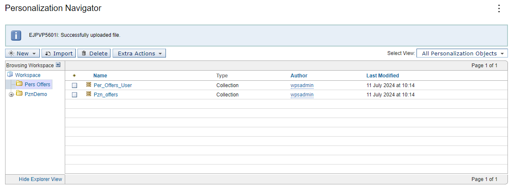

# 8. Import Personalization Workspace resource collections

Use the Personalization Navigator to create Workspace folders for the resource collections. Then import the resource collections into the Workspace of the Personalization Navigator.

Before you can use the content and user resources in the Personalization Navigator, you must place these class files into a directory accessible by that portlet. To do this, please do the following steps:  

1. Open the IBM Rational Application Devleoper Pers Offers project, again.  
2. export the pers_offers folder under **Pers_Offers/Java Resources/JavaSource/src/pers_offers** as a JAR file.  
   Make the target location **PortalServer_root/pzn/prereq.pzn/collections/pers_offers.jar**  
3. Accept the defaults and click **Finish**
4. Restart the server to make sure that the pers_offers.jar file will be loaded.  

Ensure you have properly followed the steps in [Export the WAR file and install the portlet](pzn_demo_export_war_install_portlet.md).

1. Click the **Personalization** tab.

2. In the Personalization Navigator portlet, click **New** \> **Folder**

3. Enter the name Pers Offers and click **Create**.

4. Change to the Pers Offers folder.

5. Click **Import**.

6. Browse to find the **Pzn_offers.hrf** file in your installed Pers_Offers directory under  
    `<wp_profile_root>\installedApps\<cell_name>\PA_Pers_Offers.ear\PersOffers.war\WEB-INF\pzn-resourceCollections\pers_offers.`

7. Click **Import**.

8. See the resource collection in the Workspace.

9. Do the same to import the **Pers_Offers_User.hrf** file.  

## Result  

  

You can now create a simple content rule.  
