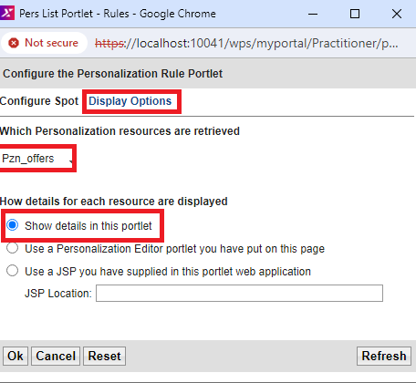
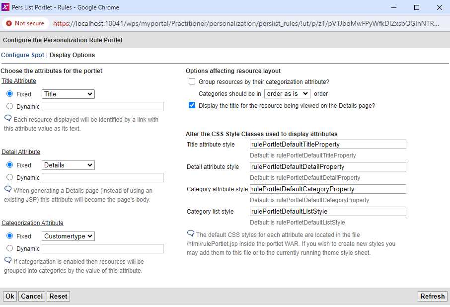
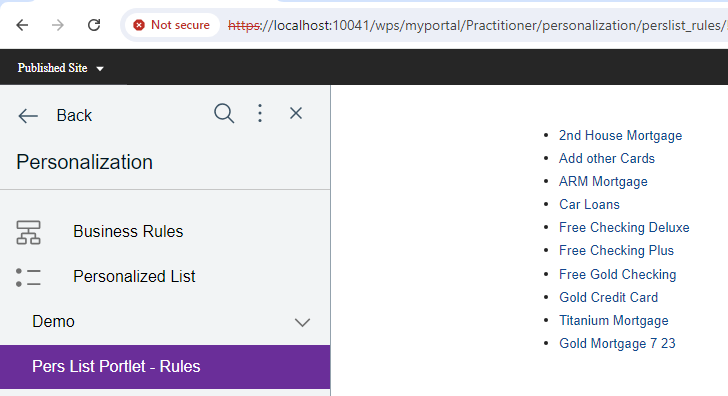

# Using a Personalized List portlet

In this topic, you will learn how to use a Personalized List portlet you built.

The Personalized List portlet provides a ready-to-use portlet for displaying personalized content from rules, content spots, or resources. In many cases, it eliminates the need to code new portlets and JSP files yourself.

This portlet is used to display personalized lists of documents, and can also be used with some generated or custom resource collections.

You can use this portlet instead of coding the Rational Application Developer portlet. The Personalized List portlet is not intended to be used with the Web Content resource collection, or with rules that involve the Web Content resource collection.  

To display Web Content rules, use a Portal Personalization Component in the HCL Web Content Manager.  

!!!note
    - When the Web Content resource collection is used with the Personalized List portlet, certain attributes like authoring template shows raw values from the repository that cannot be translated to a readable form.  
    - The details page of the Personalized List portlet does not show the results of the rendered content.  
    - The details page also shows attributes from the content, such as the creator or last modified date, that are not suitable for the production use of content from Web Content Manager.

1. Copy the pers_offers folder from the `/Pers_Offers.war/WEB-INF/classes` directory under your `Pers_Offers` portlet in the `installedApps` location into wp_profile_root/PortalServer/pzn/collections. You might need to create this classes folder first.

2. Restart HCL Portal.

3. Log in to HCL Portal as the Portal administrator (wpsadmin).  

4. Click the **Administration menu** icon.

5. Click **Portlet Management > Portlets**.

6. Search for the Personalized List portlet.

7. Make a copy of the Personalized List portlet and name it **Personalized List Special Offers**.

8. Set **access control** for the new portlet so **All Authenticated Portal Users** are **Privileged Users**.

9. Add the Personalized List Special Offers portlet to a new page under Personalization called **Pers List Portlet - Rules**.

10. Display the new page with the new portlet. Click the portlet menu on the Personalized List Special Offers portlet, and select **Configure** from the drop-down list.

11. Click the menu icon under **Which Personalization resources are retrieved** and select **Select a Rule, Content Spot or Resource Collection**.

12. In the **Pers Offers** folder, select **Pzn_offers** then click **OK**.

      

13. Click **Display Options**.

14. Select the following options and click **OK**.

      

15. Click **OK** again to see the portlet.

      

16. Click one of the title links to see the details of that resource.

17. Click **Back**.

18. Configure the portlet again to show more personalized offers.

19. From the Personalization Picker, select the content spot **Pzn_offersSpot** under the Workspace Root and click **OK**.

    

20. Click **Display Options**, set the following values, and click **OK**.

    

21. Complete the configuration and see that the Personalized List Special Offers portlet is empty (when logged in as wpsadmin). This is because the administrator did not enter customer details in the pzndemo database for the user resource that is being used.

22. Log in as Scott and view the Personalized List Special Offers portlet. The portlet displays the personalized offers that are based on the rule, **Show Offers By Customer Type**, which is mapped to the content spot **Pzn_offers Spot**.

23. Test this portlet, logging in as each pzndemo user having a different profile. You must get the same content results that you saw previously by using your own custom-built portlet (Pers_Offers), except you do not have to code a portlet or a JSP file.  

You have successfully used the Personalized List portlet. In the next topic, you will learn how to [Uninstall the Personalization sample and database.](./pzn_demouninstall.md)
