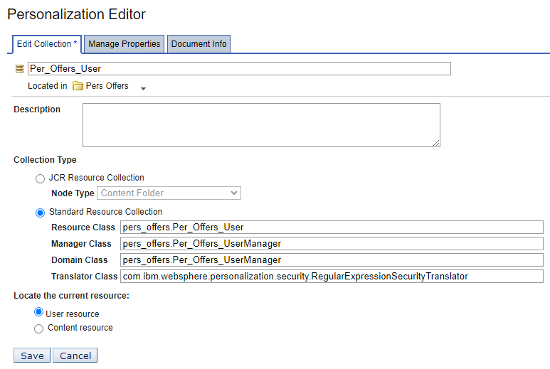

# Modifying resource collection properties

In this topic, you will learn how to modify resource collection properties.  

Use the Personalization Navigator to specify the Translator Class for the resource collection. Before you begin this procedure, ensure that you have inserted the dynamic table code into the Personalized Offers portlet.

1. Open the Personalization Navigator.

2. Navigate to the **Pers_Offers** folder.

3. Select the **Per_Offers_User** resource collection.

4. In the Personalization Editor, click **Edit**.

5. Select **Standard Resource Collection**.

6. Set the **Translator Class** to **com.ibm.websphere.personalization.security.RegularExpressionSecurityTranslator**.  

7. Click **Save**.

## Result

You have successfully modified a resource collection property. In the next topic, you will learn how to [Create the user profiler rule.](./pzn_demo_create_user_profiler_rule.md)
