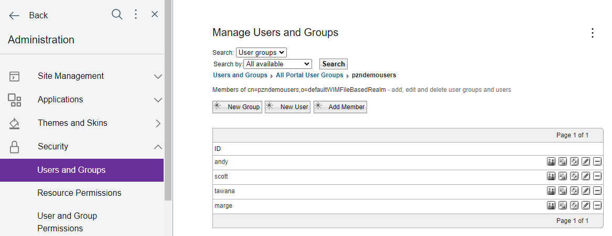
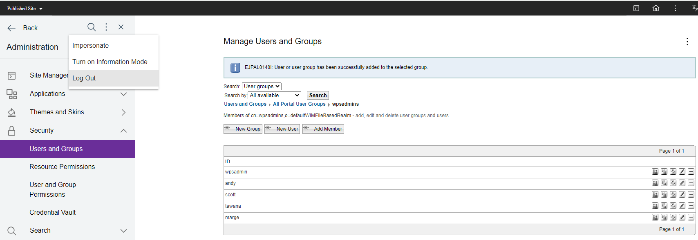

# Installing the Personalization sample

In this exercise, you can install the Portal Personalization sample and configure your database for the sample. No additional database requirements are needed.

1. Start the HCL Digital Experience (DX) server.

2. From a command prompt, navigate to `<wp_profile_root>/ConfigEngine`.

3. Enter the following commands to install the Personalization sample and create the users for this sample:

    - UNIX™Linux™:  
        `./ConfigEngine.sh create-pzndemo-users -DPortalAdminPwd=<password> -DWasPassword=<password>`  
        `./ConfigEngine.sh install-pzndemo -DPortalAdminPwd=<password> -DWasPassword=<password>`  

    - Windows™:  
        `ConfigEngine.bat create-pzndemo-users -DPortalAdminPwd=<password> -DWasPassword=<password>`  
        `ConfigEngine.bat install-pzndemo -DPortalAdminPwd=<password> -DWasPassword=<password>`  

4. Stop and restart the HCL Digital Experience (DX) server.

5. Open your web browser and log in to the Portal as **wpsadmin** user.

6. In the Portal menu, navigate to **Administration > Security > User and Groups > All Portal User Groups > pzndemousers**.

7. Confirm that the following users were created:

    - andy  
    - scott
    - tawana
    - marge  

    **PZN demo users in the Portal**
    

8. Add all pzndemousers to the wpsadmins group.

    1. On the **Manage Users and Groups** page, click the navigation item **All Portal User Groups**.  
    2. Click the user group **wpsadmins**.  
    3. Click **Add Member** and add all four **pzndemousers** to the **wpsadmins** group.  
    4. Click **OK**.  

    !!!note  
        By default standard users do not have permissions to access the Personalization page or resources.
        Access to the demo and resources is, in the simple case, done by adding all the users of the **pzndemousers** to the **wpsadmins** group.  

    **PZN demo users added to the wpsadmins group**
      

9. **Logout** from the Portal  
