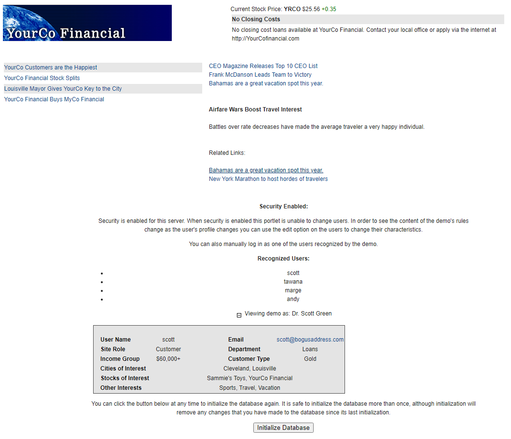
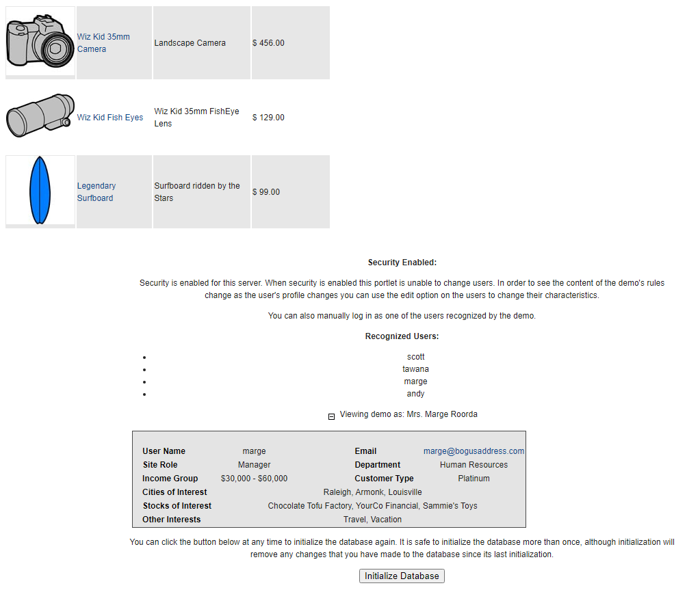
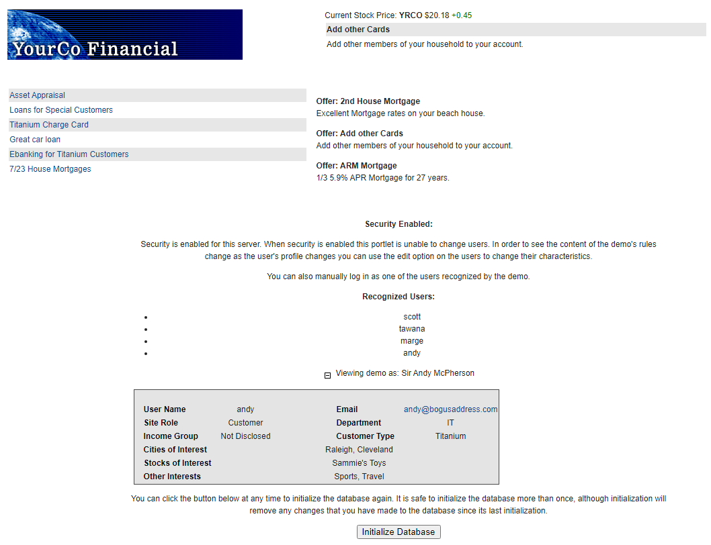

# Test the Personalization Demo

## Find the personalized demo resources on the Portal

By default, when the personalization demo (PZNDemo) will be installed, the following users will be created:  

    -   andy  
    -   scott
    -   tawana
    -   marge 

1. Login as one of these users to your Portal. Use **pzndemo** as password for each user.  
2. Navigate to **Personalization > Demo**, then click through the different pages and portlets for each user. Notice the different information that displays for each user. If you see a button on a personalized page to initialize database, click on it at least once, and wait for the database to be initialized.
Logout and log back in to the server.

    Personalized information should be shown up on the different pages.
    The **initialize the database** button does not have to be clicked again after the database is initialized.

    For example:
  
    **YourCo Main Page sample for user scott:**  

    

    **YourCo Products sample for user marge:**  

    

    **YourCo Services sample for user andy:**  

    

3. **Logout** of HCL Portal.
