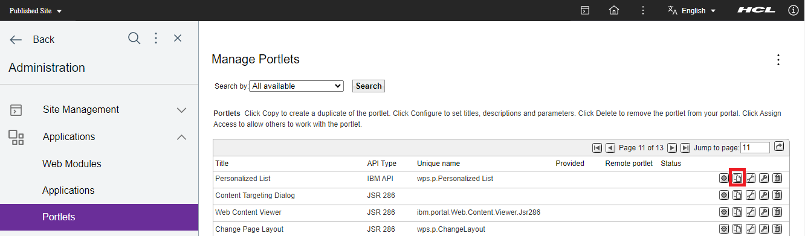
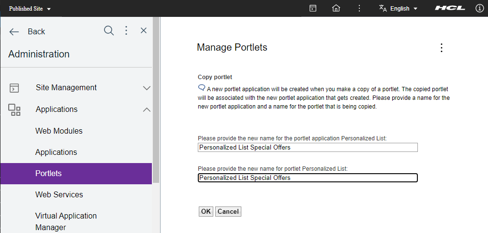
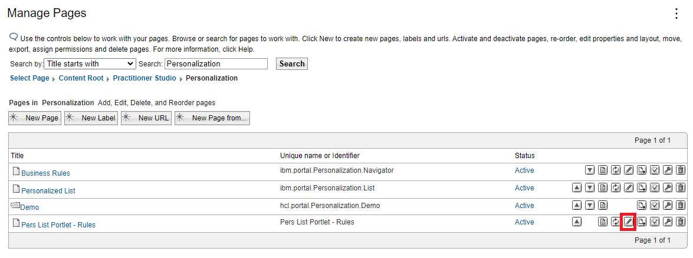
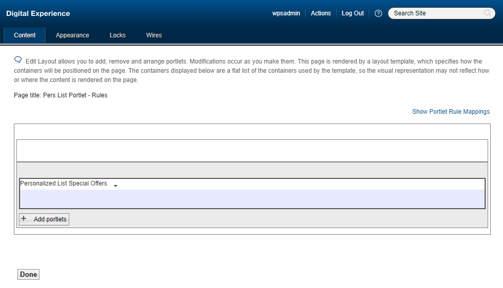
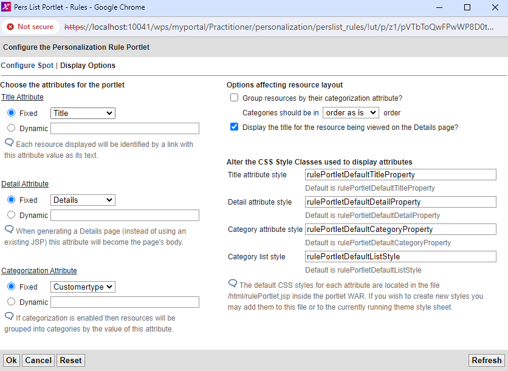
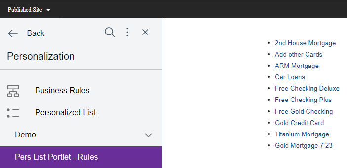
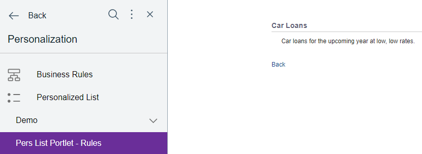
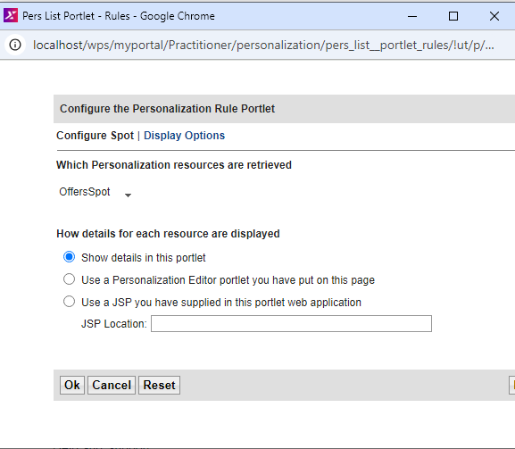
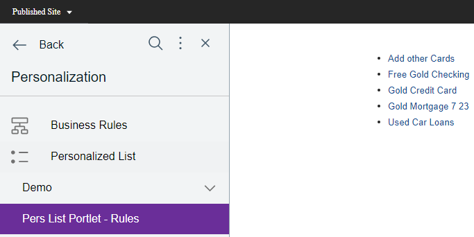

# Using a Personalized List portlet

In this topic, you will learn how to use a Personalized List portlet.

The Personalized List portlet provides a ready-to-use portlet for displaying personalized content from rules, content spots, or resources. In many cases, it eliminates the need to code new portlets and JSP files yourself. This portlet is used to display personalized lists of documents, and can also be used with some generated or custom resource collections.

You can use this portlet instead of coding your own personalized portlet in any Integrated Development Environment (IDE) like Rational Application Developer or Microsoft Visual Studio Code. The Personalized List portlet is not intended to be used with the Web Content resource collection, or with rules that involve the Web Content resource collection.

The Personalized List portlet requires rules and/or custom resource collection classes that need to be defined and installed before personalized information appears in the portlet. Explore the topic [Developing a personalized portlet using IBM Rational Application Developer](./RAD/index.md) to learn more details about developing custom classes and hrf-files. The subsequent steps are based on the Pers Offers sample described in that guide.

!!!note
    - When the Web Content resource collection is used with the Personalized List portlet, certain attributes like authoring template shows raw values from the repository that cannot be translated to a readable form.
    - The details page of the Personalized List portlet does not show the results of the rendered content.
    - The details page also shows attributes from the content, such as the creator or last modified date, that are not suitable for the production use of content from Web Content Manager.
    - To display Web Content rules, use a Portal Personalization Component in the HCL Web Content Manager.

## Prerequistes  

- [PZNDemo resources](./demo/pzn_demoinstall.md) are successfully installed.

## Import custom classes and hrf-files

Based on the Pers Offers sample, complete the following tasks:  

- Install the [resource collection classes](./download/pers_offers.jar) by following the instructions of [Importing Personalization Workspace resource collections](./RAD/pzn_demo_import_resource_collections.md).  
- Import the [rules (hrf-files)](./download/Portal_rules_PznOffers.zip) by following the instructions of [Importing Personalization Workspace resource collections](./RAD/pzn_demo_import_resource_collections.md).  

    !!!note
        If the PersOffers Portlet is not installed yet, you can download it from the [Developing a personalized portlet using IBM Rational Application Developer](./RAD/index.md) page. Then, follow the instructions on how to [Install the portlet on a portal page](./RAD/pzn_demo_export_war_install_portlet.md).

After the import of the hrf-files and resource collection classes, **restart HCL Portal** to ensure that the new resources are loaded.

## Create a Copy of the Personalized List portlet  

To create a copy of the Personalized List portlet called **Personalized List Special Offers**, refer to the following steps:

1. Log in to HCL Portal as the Portal administrator (wpsadmin).  

2. Click **Open applications menu**, then navigate to **Administration**.  

3. Click **Applications > Portlets**.

4. Search for the **Personalized List** portlet.  

5. Click the **Copy portlet** icon.

    

6. Name the new portlet **Personalized List Special Offers**, then click **OK**.

      

## Add the copied Personalized List portlet to a page

1. Click **Site Management > Pages**.

2. Click **Content Root > Practitioner Studio > Personalization**.  

3. Create a new page called **Pers List Portlet - Rules** and configure the permissions of the page to give access to **All authenticated users**:

    a. Click **New Page**.
    b. On the **Title** field, enter **Pers List Portlet - Rules**, then click **OK**.
    c.  Search for the **Pers List Portlet - Rules** portlet and click the **Assign access to portlet** icon.
    d. Click the **Edit Role** icon next to **Privileged Users**.
    e. Click **Add**.
    f. Select the checkbox for **All Authenticated Portal Users**, then click **OK**.
    
4. Go **Site Management > Pages** again, then click the **Edit Page Layout icon** for the **Pers List Portlet - Rules** page.

    
    
5. Select the checkbox for the **Personalized List Special Offers** portlet, then click **OK > Done**.

      

    

4. Then click to the **Add Portlet** button select the portlet **Personalized List Special Offers** and click **OK** to save the changes.  

    **Result**  

      

## Configure content spots and display options

To configure content spots or display options on the **Personalized List Special Offers portlet**, refer to the following steps:

1. Click the **Personalized List Special Offers** dropdown, then select **Configure**.  

2. Click the **Which Personalization resources are retrieved** dropdown and select **Select a Rule, Content Spot or Resource Collection**.  

3. In the **PznDemo** folder, select **Offers**, then click **OK**.  

4. Click **Display Options** and set the following values.

    

5. Click **OK** to save the changes.  

6. Click **Personalization > Pers List Portlet - Rules** to review the page with its portlet.  

    **Sample Result - Showing the list of rules**  

    

7. Click one of the title links to see the details of that resource.  

    **Sample Result - Showing the car loans details**  

    

8. Once you're done reviewing, click **Back**.

## Configure the portlet to show more personalized offers  

To configure the portlet to show more personalized offers based on the rules set per customer type, refer to the following steps:

1. Click **Open applications menu**, then go to **Administration**.  
2. Click **Site Management > Pages**.  
3. Click **Content Root > Practitioner Studio > Personalization**.  

4. Click the **Edit Page Layout icon** for the **Pers List Portlet - Rules** page.  

5. Click the **Pers List Portlet - Rules** dropdown, then select **Configure**.  

    

6. Click **Display Options** and set the following values.  

    

7. Click **OK** to complete the configuration.  

    When logged in as wpsadmin, you will see that the Personalized List Special Offers portlet is empty because the administrator did not enter customer details in the pzndemo database for the user resource that is being used.

8. Log in as **Scott** and view the Personalized List Special Offers portlet. The portlet displays the personalized offers that are based on the rule, **Show Offers By Customer Type**, which is mapped to the content spot **Pzn_offers Spot**.

    **Sample result - Logged in as user Scott**  

      

    !!!note
        If the result is not showing the expected values, check the content spot, its rules, and the default mappings again.

9. Test this portlet by logging in as each pzndemo user having a different profile. You must get the same content results that you see when building your own custom-built portlet (Pers_Offers) using the steps mentioned in [Rational Application Developer](./RAD/index.md), except you do not have to code a portlet or a JSP file.  

You have successfully used the Personalized List portlet. In the next topic, you will learn how to [Uninstall the Personalization sample and database.](./RAD/pzn_demouninstall.md)
