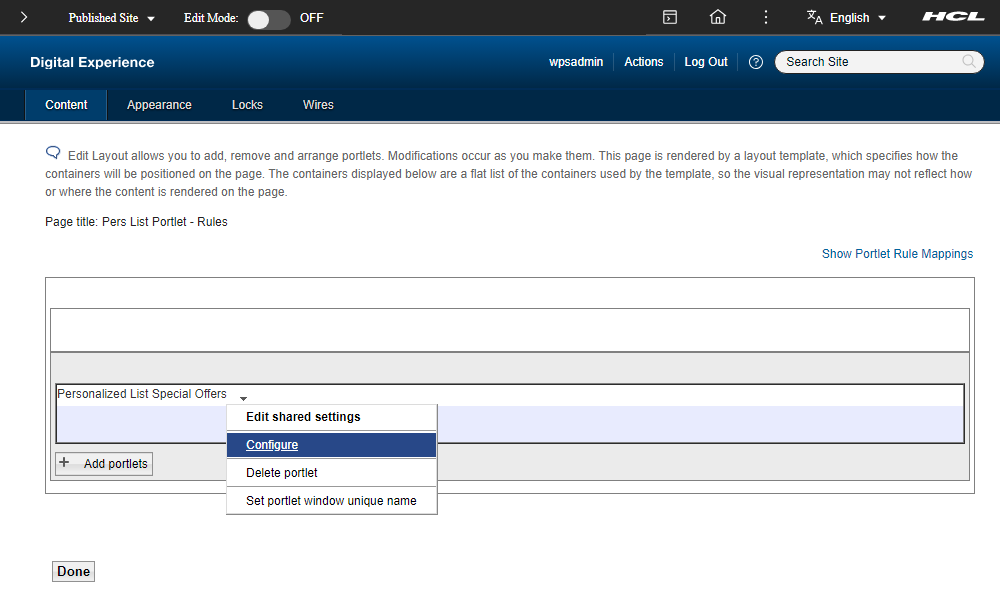
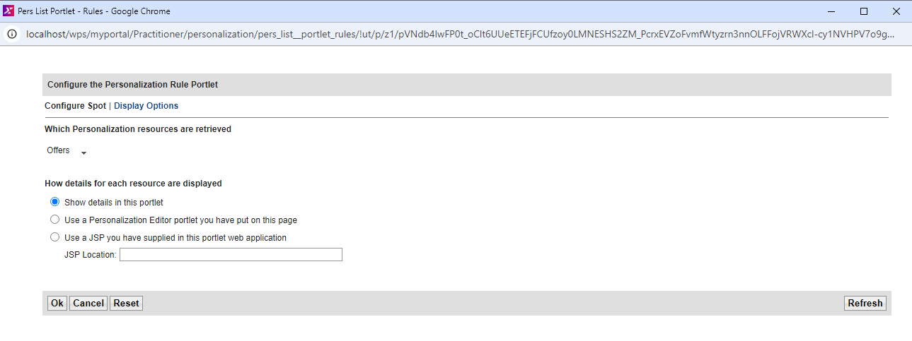

# Using a Personalized List portlet

In this topic, you will learn how to use a Personalized List portlet.

The Personalized List portlet provides a ready-to-use portlet for displaying personalized content from rules, content spots, or resources. In many cases, it eliminates the need to code new portlets and JSP files yourself.

This portlet is used to display personalized lists of documents, and can also be used with some generated or custom resource collections.

You can use this portlet instead of coding your own personalized portlet in any Integrated Development Environment (IDE) like Rational Application Developer or Microsoft Visual Studio Code. The Personalized List portlet is not intended to be used with the Web Content resource collection, or with rules that involve the Web Content resource collection.  

To display Web Content rules, use a Portal Personalization Component in the HCL Web Content Manager.  

!!!note
    - When the Web Content resource collection is used with the Personalized List portlet, certain attributes like authoring template shows raw values from the repository that cannot be translated to a readable form.  
    - The details page of the Personalized List portlet does not show the results of the rendered content.  
    - The details page also shows attributes from the content, such as the creator or last modified date, that are not suitable for the production use of content from Web Content Manager.

## Prerequisites

- Installed the [PZNDemo resources](./demo/pzn_demoinstall.md).  
- Downloaded and installed the [PersOffers.war](./download/PersOffers.war) file (PersOffers Portlet) and followed the instructions on [Install the portlet on a portal page](./RAD/pzn_demo_export_war_install_portlet.md).  
- Installed the [pzn rule classes](./download/pers_offers.jar) by following the instructions of [Importing Personalization Workspace resource collections](./RAD/pzn_demo_import_resource_collections.md).  
- Imported the [PersOffers rules (hrf-files)](./download/Portal_rules_PznOffers.zip) by following the instructions of [Importing Personalization Workspace resource collections](./RAD/pzn_demo_import_resource_collections.md).

## Create the Personalized List Special Offers portlet  

1. Copy the **pers_offers** folder from the directory `<wp_profile_root>/installedApps/<cellname>/PA_Pers_Offers.ear/PersOffers.war/WEB-INF/classes`  into directory `<wp_profile_root>/PortalServer/pzn/collections`. You might need to create this classes folder first.

    !!!note
        If the PersOffers Portlet is not installed yet, you can download it on the [Developing a personalized portlet using IBM Rational Application Developer](./RAD/index.md) page and follow the [Install the portlet on a portal page](./RAD/pzn_demo_export_war_install_portlet.md) instructions to install it.

2. Restart HCL Portal.

3. Log in to HCL Portal as the Portal administrator (wpsadmin).  

4. Click the **Administration menu** icon.

5. Click **Portlet Management > Portlets**.

6. Search for the **Personalized List** portlet.  

7. Make a copy of the Personalized List portlet by doing a click to the **copy portlet** icon in the portlet list

    

8. Name the new portlet **Personalized List Special Offers**.

    

    Click **OK** to copy the portlet.

9. Set access permissions for the new portlet so **All Authenticated Portal Users** are **Privileged Users**:
    a. Search for the Pers_Offers portlet and click the **Assign access to portlet** icon.
    b. Click the **Edit Role** icon next to **Privileged Users**.
    c. Click **Add**.
    d. Select the checkbox for **All Authenticated Portal Users**, then click **OK**.

11. On the Portal Administration page go to **Site Management > Pages (Manage Pages)** and then in the page navigation go to **Content Root > Practitioner Studio > Personalization**.  

12. Create a new page called **Pers List Portlet - Rules** and configure the permissions of the page to give access to **All authenticated users**.

13. Add the **Personalized List Special Offers portlet** to the new page by clicking to the **Edit Page Layout** button of the portlet on the **Manage Pages** list.

    

14. Then click to the **Add Portlet** button select the portlet **Personalized List Special Offers** and click **OK** to save the changes.  

    **Result**  

      

## Display the new page with the new portlet

1. Click the **portlet menu** on the **Personalized List Special Offers portlet** and select **Configure** from the drop-down list.

      

2. Click the **menu icon** under **Which Personalization resources are retrieved** and choose **Select a Rule, Content Spot or Resource Collection**.  

3. In the **PznDemo** folder, select **Offers**, then click **OK**.  

    

4. Click **Display Options** and set the following values.

    

5. Click **OK** to save the changes.  

6. In the Portal Menu click to **Personalization**.  

7. Then on the left side in the side-bar menu, click to **Pers List Portlet - Rules** to review the page with it's portlet.  

    **Sample Result - Showing the list of rules**  

    

8. Click one of the title links to see the details of that resource.  

    **Sample Result - Showing the car loans details**  

    

9. Click **Back**.

## Configure the portlet to show more personalized offers  

1. In the Portal menu go to **Administration > Site Management (Manage Pages)** and then in the page navigation go to **Content Root > Practitioner Studio > Personalization**.  

2. On the **Pers List Portlet - Rules** table row click to the **Edit Page Layout** button to review the portlet setting on the page, again.

3. Click to the **Portlet Menu** icon right to the portlet title and select **Configure**.

4. From the Personalization Picker **(Which Personalization resources are retrieved)**, select the content spot **OffersSpot** under the **PZNDemo** folder and click **OK**.

    

5. Click **Display Options** and set the following values.  

    

6. Click **OK** to complete the configuration.  

    When logged in as wpsadmin, you will see that the Personalized List Special Offers portlet is empty because the administrator did not enter customer details in the pzndemo database for the user resource that is being used.

7. Log in as **Scott** and view the Personalized List Special Offers portlet. The portlet displays the personalized offers that are based on the rule, **Show Offers By Customer Type**, which is mapped to the content spot **Pzn_offers Spot**.

    **Sample result - Logged in as user Scott**  

      

    !!!note
        If the result is not showing the expected values, please check the content spot, it's rule and the default mappings, again.

8. Test this portlet by logging in as each pzndemo user having a different profile. You must get the same content results that you see when building your own custom-built portlet (Pers_Offers) using the steps mentioned in [Rational Application Developer](./RAD/index.md), except you do not have to code a portlet or a JSP file.  

You have successfully used the Personalized List portlet. In the next topic, you will learn how to [Uninstall the Personalization sample and database.](./RAD/pzn_demouninstall.md)
