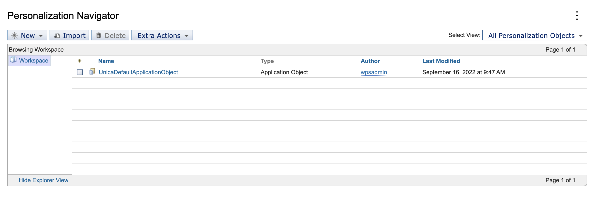

# Out-of-box application object for shipping Unica with PZN
In this document, we outline out-of-box application objects for Unica with steps to integrate Unica segments into PZN rules.

## Unica segments
Unica offers various REST APIs to manage and retrieve campaigns, segments, ...
The API `/Campaign/api/campaign/rest/v3/segments/partitions/{partitionName}/{audienceName}`
With a payload similar to the following:
```
[
  {
    "name": "CUSTOMERID",
    "value": "1"
  }
]
```

## Exploring Unica apis
The Unica api explorer can be reached via ```/Campaign/api/campaign/rest/v3/swagger-ui.html```
For example: https://unicasample.hcl.com/Campaign/api/campaign/rest/v3/swagger-ui.html

## Putting it together
The OOB PZN Application Object provides the possibility to leverage the segment list as retrieved from Unica to use inside rules for decisions on visibility or content selection.

## Out-of-box Application Object for Unica
The Out-of-box method provides automation to create the PZN Application object in order to set up Unica and access segments based on the properties created for the application object

### ConfigEngine task to create the Application Object

- In order to set up the OOB PZN Application Object for Unica, run the following task in the `wp_profile_root/ConfigEngine` directory
```bash
./ConfigEngine.sh setup-unica-default-application-object
                  -DWasPassword=<was-password>
                  -DPortalAdminPwd=<portal-admin-password>
                  -DUnicaHost=<unica-host>
                  -DUnicaCookieName=<unica-cookiename>
                  -DUnicaAuthUser=<unica-user-id>
                  -DUnicaAuthPassword=<unica-user-password>
```
- In the task list for the setup
  - **WasPassword** is the Deployment Manager administrator password
  - **PortalAdminPwd** is the Portal administrator password
  - **UnicaHost** is the Unica host used by the customer
  - **UnicaCookieName** is the Unica cookie configured for the customer
  - **UnicaAuthUser** is the Unica user id
  - **UnicaAuthPassword** is the Unica user password

- Once the task is executed, it creates **UnicaDefaultApplicationObject** in the Personalization Navigator for using it in rules.

- We can use the pattern ***unicaSegments-partitionName-audienceName-audienceIdField*** to customise the property for the application object. For e.g: ***unicaSegments-partition1-Customer-CUSTOMERID***.


!!! note
    Refer to the section [here](#unica-segments) for the sample code that gives more flexibility in defining what is sent to Unica and how the result is being interpreted. The **partitionName**, **audienceName** and example for **audienceIdField** here as ***CUSTOMERID*** can be used in the properties later. The value ***"1"*** is an example of the value for audienceId, which will be configured in the user cookie with the **UnicaCookieName**. The out of the box application object assumes that you create a cookie with that name to hold the ID of the user to be sent to Unica for segmentation - values could be ranging from an actual numeral to a string or some combination.

- Alternatively, to remove the Unica setup and Application Object, run the following task in the `wp_profile_root/ConfigEngine` directory
```bash
./ConfigEngine.sh remove-unica-default-application-object
                  -DWasPassword=<was-password>
                  -DPortalAdminPwd=<portal-admin-password>
```

### Leveraging the Application Object in a rule
- Create a Rule and add the attribute of the Application Object created in the previous step. It shows the variable added in the loaded Application Object

- Add the values to segments that you like to compare it as per rule creation

- Preview the result in the Preview Tab of the navigator for the rule created

